---
# Ähnlichkeit von Job-Stellenausschreibungen mit Word2Vec-Ansatz
by Tobia Ippolito

---

## Table of Content

- [Aufgabenstellung](#Aufgabenstellung)
- [Wann ist eine Stellenausschreibung ähnlich?](#Wann-ist-eine-Stellenausschreibung-ähnlich?)
- [Grundgedanke](#Grundgedanke)
- [Imports](#Imports)
- [Preparations](#Preparation)
- Experimente
    - [Word2Vec Similarity der Jobbeschreibung](#Experiment-1:-Word2Vec-Similarity-der-Jobbeschreibung)
    - [Word2Vec der Jobbeschreibung mit nur wichtigen Wörtern](#Experiment-2:-Word2Vec-der-Jobbeschreibung-mit-nur-wichtigen-Wörtern)
    - [Word2Vec der Jobbeschreibung mit nur Entitäten](#Experiment-3:-Word2Vec-der-Jobbeschreibung-mit-nur-Entitäten)
    - [Word2Vec der Jobbeschreibung mit nur wichtigen Wörtern und anderer Ausrechnungsart 1](#Experiment-4:-Word2Vec-der-Jobbeschreibung-mit-nur-wichtigen-Wörtern-und-anderer-Ausrechnungsart-1)
    - [Word2Vec der Jobbeschreibung mit nur wichtigen Wörtern und anderer Ausrechnungsart 2](#Experiment-5:-Word2Vec-der-Jobbeschreibung-mit-nur-wichtigen-Wörtern-und-anderer-Ausrechnungsart-2)
    - [Ähnlichkeit der Job-Titel mit Word2vec](#Experiment-6:-Ähnlichkeit-der-Job-Titel-mit-Word2vec)
    - [Ähnlichkeit der Job-Kategorien](#Experiment-7:-Ähnlichkeit-der-Job-Kategorien)
    - [Ähnlichkeit der Job-Orte](#Experiment-8:-Ähnlichkeit-der-Job-Orte)
    - [Ähnlichkeit der Job-Art](#Experiment-9:-Ähnlichkeit-der-Job-Art)
    - [Point-Gain-Proceedings](#Experiment-10:-Point-Gain-Proceedings)
    - [Parallelisierung](#Experiment-11:-Paralleles-Ausführen)
- [Evaluation](#Evaluation)
- [Anwendung](#Anwendung)
- [Profiling](#Profiling)
- [Location Runtime Test](#Location-Runtime-Test)
- [Trimmed Category Calc](#Trimmed-Category-Calc)

<br>

> ***Hinweis**: Klicken Sie sich einfach zu den jeweiligen Kapiteln. Dort befinden sich rechts Racketen, welche sie mit einem Klick wieder hier hin bringen, wo Sie von neuem weiter navigieren können.* </img>

<br>

---

### Aufgabenstellung

Finden von ähnlichen Job-Posts
Stellen Sie sich vor, ein/e Bewerber/in hat eine für ihn / sie interessante Stelle gefunden. Nun
würde er/sie gerne automatisch ähnliche Stellen vorgeschlagen bekommen, die auch
interessant sein könnten. Wie könnte eine entsprechende Funktionalität implementiert
werden?

> Definieren Sie zunächst, wann eine Stelle in diesem Szenario als ähnlich gesehen
werden sollte.

> Überlegen Sie dann, mit welchen Ansätzen diese Art von Ähnlichkeit erfasst werden kann.

> Setzen Sie diese anschließend um. Verwenden Sie Experimente und gehen Sie strukturiert vor.

<br>

---

### Wann ist eine Stellenausschreibung ähnlich?

Eigenschaften eine Job-Posts:
- Job Beschreibung
- Job Titel
- Kategorie/Thema
- Ort (Stadt, Land, Unternehmen)
- Plattform
- Berufsart


Arten der Ähnlichkeit bei Job-Posts:
- Ansprüche 
- Fachgebiet
- Spezieller Beruf/Bezeichnung (Ähnlichkeit der Aktivität)
- Gehalt
- Firma
- Plattform
- Ort
- Berufsart (Teilszeit, ...)
- Textlänge
- Grammatik


Tatsächlich ist keine objektive Ähnlichkeit festzulegen. Stattdessen ist es subjektiv, wie ähnlich sich Berufstellenanzeigen sind. So ist für eine Person ein naher/ähnlicher Ort wichtig und für eine andere, dass es Vollzeit ist.<br>
Generell gehe ich jedoch davon aus, dass die wichtigste Eigenschaft der Beruf an sich ist (Berufsbezeichnung).

---
### Grundgedanke

Zum einen soll die Suche flexibel und individuell anpassbar sein, da wir [gerade](#Wann-ist-eine-Stellenausschreibung-ähnlich?) gesehen haben, dass die Ähnlichkeit bei Job-Posts subjektiv ist.<br>
Zum anderen soll das Verfahren Word2Vec zur verwendung kommen. Dieses Verfahren stellt Wörter nämlich so dar, dass ähnliche Wörter mit repräsentiert werden. Dies wollen wir uns in dieser Arbeit zunutze machen.<br>
Ein Job-Post besteht zu einem großen Teil aus Wörtern, welche einen semantischen Sinn haben und welcher auch von großer Bedeutung ist -> Jobbezeichnung + Jobbeschreibung.

---

### Imports


```python
import numpy as np
import pandas as pd
import matplotlib.pyplot as plt
from matplotlib.cm import ScalarMappable
import seaborn as sn

import spacy
from spacy.tokens import Token

from geopy.geocoders import Nominatim
from geopy.distance import geodesic

import multiprocessing as mp

import time
import cProfile
import warnings
```

---

### Preparation
<!--<p style="float:right">Up</p>-->

[</img>](#Table-of-Content)

**Loading Data**


```python
!pip install openpyxl
```

    Requirement already satisfied: openpyxl in c:\users\tobia\anaconda3\envs\ai\lib\site-packages (3.0.10)
    Requirement already satisfied: et-xmlfile in c:\users\tobia\anaconda3\envs\ai\lib\site-packages (from openpyxl) (1.1.0)
    


```python
data = pd.read_excel("../data_scientist_united_states_job_postings_jobspikr.xlsx")
```


```python
data.head()
```


<div>
<style scoped>
    .dataframe tbody tr th:only-of-type {
        vertical-align: middle;
    }

    .dataframe tbody tr th {
        vertical-align: top;
    }

    .dataframe thead th {
        text-align: right;
    }
</style>
<table border="1" class="dataframe">
  <thead>
    <tr style="text-align: right;">
      <th></th>
      <th>crawl_timestamp</th>
      <th>url</th>
      <th>job_title</th>
      <th>category</th>
      <th>company_name</th>
      <th>city</th>
      <th>state</th>
      <th>country</th>
      <th>inferred_city</th>
      <th>inferred_state</th>
      <th>...</th>
      <th>job_description</th>
      <th>job_type</th>
      <th>salary_offered</th>
      <th>job_board</th>
      <th>geo</th>
      <th>cursor</th>
      <th>contact_email</th>
      <th>contact_phone_number</th>
      <th>uniq_id</th>
      <th>html_job_description</th>
    </tr>
  </thead>
  <tbody>
    <tr>
      <th>0</th>
      <td>2019-02-06 06:26:22</td>
      <td>https://www.indeed.com/viewjob?jk=fd83355c2b23...</td>
      <td>Enterprise Data Scientist I</td>
      <td>Accounting/Finance</td>
      <td>Farmers Insurance Group</td>
      <td>Woodland Hills</td>
      <td>CA</td>
      <td>Usa</td>
      <td>Woodland hills</td>
      <td>California</td>
      <td>...</td>
      <td>Read what people are saying about working here...</td>
      <td>Undefined</td>
      <td>NaN</td>
      <td>indeed</td>
      <td>usa</td>
      <td>1549432819114777</td>
      <td>NaN</td>
      <td>NaN</td>
      <td>3b6c6acfcba6135a31c83bd7ea493b18</td>
      <td>NaN</td>
    </tr>
    <tr>
      <th>1</th>
      <td>2019-02-06 06:33:41</td>
      <td>https://www.dice.com/jobs/detail/Data-Scientis...</td>
      <td>Data Scientist</td>
      <td>NaN</td>
      <td>Luxoft USA Inc</td>
      <td>Middletown</td>
      <td>NJ</td>
      <td>Usa</td>
      <td>Middletown</td>
      <td>New jersey</td>
      <td>...</td>
      <td>We have an immediate opening for a Sharp Data ...</td>
      <td>Undefined</td>
      <td>NaN</td>
      <td>dice</td>
      <td>usa</td>
      <td>1549432819122106</td>
      <td>NaN</td>
      <td>NaN</td>
      <td>741727428839ae7ada852eebef29b0fe</td>
      <td>NaN</td>
    </tr>
    <tr>
      <th>2</th>
      <td>2019-02-06 06:33:35</td>
      <td>https://www.dice.com/jobs/detail/Data-Scientis...</td>
      <td>Data Scientist</td>
      <td>NaN</td>
      <td>Cincinnati Bell Technology Solutions</td>
      <td>New York</td>
      <td>NY</td>
      <td>Usa</td>
      <td>New york</td>
      <td>New york</td>
      <td>...</td>
      <td>Candidates should have the following backgroun...</td>
      <td>Full Time</td>
      <td>NaN</td>
      <td>dice</td>
      <td>usa</td>
      <td>1549432819236156</td>
      <td>NaN</td>
      <td>NaN</td>
      <td>cdc9ef9a1de327ccdc19cc0d07dbbb37</td>
      <td>NaN</td>
    </tr>
    <tr>
      <th>3</th>
      <td>2019-02-06 06:33:42</td>
      <td>https://www.indeed.com/viewjob?jk=841edd86ead2...</td>
      <td>Data Scientist, Aladdin Wealth Tech, Associate...</td>
      <td>Accounting/Finance</td>
      <td>BlackRock</td>
      <td>New York</td>
      <td>NY 10055 (Midtown area)</td>
      <td>Usa</td>
      <td>New york</td>
      <td>New york</td>
      <td>...</td>
      <td>Read what people are saying about working here...</td>
      <td>Undefined</td>
      <td>NaN</td>
      <td>indeed</td>
      <td>usa</td>
      <td>1549432819259473</td>
      <td>NaN</td>
      <td>NaN</td>
      <td>1c8541cd2c2c924f9391c7d3f526f64e</td>
      <td>NaN</td>
    </tr>
    <tr>
      <th>4</th>
      <td>2019-02-06 06:48:23</td>
      <td>https://job-openings.monster.com/senior-data-s...</td>
      <td>Senior Data Scientist</td>
      <td>biotech</td>
      <td>CyberCoders</td>
      <td>Charlotte</td>
      <td>NC</td>
      <td>Usa</td>
      <td>Charlotte</td>
      <td>North carolina</td>
      <td>...</td>
      <td>We are seeking an extraordinary Data Scientist...</td>
      <td>Full Time</td>
      <td>NaN</td>
      <td>monster</td>
      <td>usa</td>
      <td>1549436429015957</td>
      <td>NaN</td>
      <td>NaN</td>
      <td>445652a560a5441060857853cf267470</td>
      <td>NaN</td>
    </tr>
  </tbody>
</table>
<p>5 rows × 22 columns</p>
</div>


```python
data.info()
```

    <class 'pandas.core.frame.DataFrame'>
    RangeIndex: 10000 entries, 0 to 9999
    Data columns (total 22 columns):
     #   Column                Non-Null Count  Dtype         
    ---  ------                --------------  -----         
     0   crawl_timestamp       10000 non-null  datetime64[ns]
     1   url                   10000 non-null  object        
     2   job_title             10000 non-null  object        
     3   category              9118 non-null   object        
     4   company_name          9999 non-null   object        
     5   city                  9751 non-null   object        
     6   state                 9584 non-null   object        
     7   country               10000 non-null  object        
     8   inferred_city         8980 non-null   object        
     9   inferred_state        9484 non-null   object        
     10  inferred_country      9505 non-null   object        
     11  post_date             10000 non-null  datetime64[ns]
     12  job_description       10000 non-null  object        
     13  job_type              10000 non-null  object        
     14  salary_offered        597 non-null    object        
     15  job_board             9310 non-null   object        
     16  geo                   9300 non-null   object        
     17  cursor                10000 non-null  int64         
     18  contact_email         0 non-null      float64       
     19  contact_phone_number  416 non-null    object        
     20  uniq_id               10000 non-null  object        
     21  html_job_description  1599 non-null   object        
    dtypes: datetime64[ns](2), float64(1), int64(1), object(18)
    memory usage: 1.7+ MB
    


```python
data.shape
```


    (10000, 22)


---

Download bigger SpaCy train text with:<br>
python -m spacy download en_core_web_lg

Or in Anaconda:<br>
conda install spacy-model-en_core_web_lg

Create an Example:

- job1 = Farmer job    - Accounting/Finance
- job2 = Finance job (investing, black rock)   - Accounting/Finance
- job3 = Data Science (analytics)
- job4 = Data Science (small text, machine learning)
- job5 = Data Science 


```python
job1 = data['job_description'][0]    # farmer
job2 = data['job_description'][3]    # finance -> inevsting, black rock
job3 = data['job_description'][4]    # data science -> analytics / bio
job4 = data['job_description'][2]    # data science -> machine learning
job5 = data['job_description'][1]    # data science -> mathematics

jobs_ = (job1, job2, job3, job4, job5)
```

Evaluation Function for evaulate a result


```python
def eval_similarity(similarity_matrix, labels, heatmap=True, k=1):
    """
    Evaluation function for similarity.
    """
    if not heatmap:
        fig, ax = plt.subplots(nrows=(len(labels)+1)//2, ncols=2, figsize=(15, 15))  #, constrained_layout=True
        #fig.tight_layout()
        plt.subplots_adjust(hspace = 0.3)

        row_ = 0
        col_ = 0

        for i, sim in enumerate(similarity_matrix):
            # create cmap with normalize values
            my_cmap = plt.cm.get_cmap('GnBu')
            colors = my_cmap([x / max(sim) for x in sim])
            # plot one job simiralities
            ax[row_][col_].set_title(f"Similarities from job{i+1}")
            ax[row_][col_].bar(labels, sim, edgecolor='black', color=colors)
            ax[row_][col_].grid()

            # add colorbar
            sm = ScalarMappable(cmap=my_cmap, norm=plt.Normalize(0,max(sim)))
            sm.set_array([])
            cbar = fig.colorbar(sm, ax=ax[row_][col_])
            cbar.set_label('Color', rotation=270,labelpad=25)

            # update col and row for axes indices
            if col_ == 1:
                col_ = 0
                row_ += 1
            else:
                col_ += 1

        plt.plot()
    else:
        # create mask for only half
        mask = np.triu(similarity_matrix, k=k)
        # np.ones_like(similarity_matrix, dtype=bool)
        #print(mask)
        
        df_color_map = pd.DataFrame(similarity_matrix, index=labels, columns=labels)
        plt.figure(figsize = (10,7))
        plt.title("Job Similarities")
        sn.heatmap(df_color_map, annot=True, cmap=sn.cm.rocket_r, mask=mask)
```


```python
def create_similarity_matrix(sim_func, jobs):
    similarity_matrix = []
    for i in jobs:
        cache = []
        for j in jobs:
            cache += [sim_func(i, j)]
        similarity_matrix += [cache]
    return similarity_matrix
```

**Hinweis an den Leser:**

Bei der Evaluierung der folgenden Experimente wäre folgendes Ergebnis ein optimales Ergebnis. Nur um dies besser einordnen zu können.


```python
template = [[1, 0.7, 0.3, 0.3, 0.3], 
           [0.7, 1, 0.3, 0.3, 0.3],
           [0.3, 0.3, 1, 0.95, 0.95],
           [0.3, 0.3, 0.95, 1, 0.95],
           [0.3, 0.3, 0.95, 0.95, 1]]
eval_similarity(template, ["job1", "job2", "job3", "job4", "job5"])
```


    
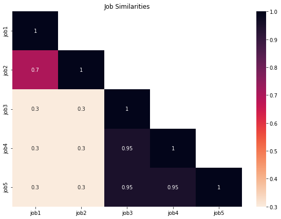
    


Die Jobs 3-5 sind ähnliche Jobs und sonst sind alle verschieden.

---


### **Experiment 1:** Word2Vec Similarity der Jobbeschreibung

In diesem Experiment soll die Ähnlichkeit der Stellenausschreibungen mithilfe des Word2Vec-Distanz der Job-Beschreibungen evaluiert werden.<br>
Die Jobbeschreibung wird in diesem Experiment nicht verändert.

[</img>](#Table-of-Content)


```python
nlp = spacy.load("en_core_web_lg")

doc1 = nlp(job1)
doc2 = nlp(job2)
doc3 = nlp(job3)
doc4 = nlp(job4)
doc5 = nlp(job5)
```


```python
jobs = (doc1, doc2, doc3, doc4, doc5)
job_labels = ["job1", "job2", "job3", "job4", "job5"]
```


```python
nlp(job1)[:].similarity(nlp(job2)[:])
```


    0.9840876460075378


```python
nlp(job1)[:].similarity(nlp(job3)[:])
```


    0.9855178594589233


```python
nlp(job2)[:].similarity(nlp(job3)[:])
```


    0.9882321357727051


```python
nlp(job1)[:].similarity(nlp(job5)[:])
```


    0.9802072644233704


```python
nlp(job3)[:].similarity(nlp(job4)[:])
```


    0.9440867304801941


```python
nlp(job3)[:].similarity(nlp(job5)[:])
```


    0.9785909652709961


```python
nlp(job4)[:].similarity(nlp(job5)[:])
```


    0.9545732736587524


```python
similarity = create_similarity_matrix(lambda x,y: x.similarity(y), jobs)
```


```python
eval_similarity(similarity, job_labels, heatmap=True)
```


    
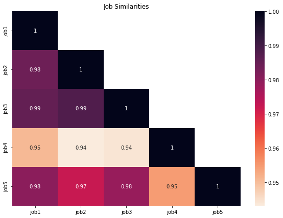
    


**Ergebnis:**

Zunächst fällt auf, dass alle Jobbeschreibungen als sehr ähnlich eingestuft werden, was diesen Ansatz schonmal für nicht so optimal einstuft.<br> 
Nur die 4.te Jobbeschreibung scheint nicht so ähnlich wie die 4 anderen Jobbeschreibungen zu sein. Die Jobbeschreibung dessen ist auch eindeutig kürzer und es könnte sich damit um einen Ausreißer handeln.<br>
<br>
So oder so ist dieser Ansatz nicht zu gebrauchen, da die Jobbeschreibungen sich damit nicht trennen lassen.

---
### **Experiment 2:** Word2Vec der Jobbeschreibung mit nur wichtigen Wörtern

In diesem Experiment soll die Ähnlichkeit der Stellenausschreibungen mithilfe des Word2Vec-Distanz der Job-Beschreibungen evaluiert werden.<br>
Die Jobbeschreibung wird in diesem Experiment auf die wichtigsten Wörter reduziert (Nomen, Adjektiven). Die Auswirkung auf die Ähnlichkeit wird hierbei getestet.

[</img>](#Table-of-Content)


```python
# remove stopwords and unimportant words in Spacy Pipeline
def get_important_words(doc):
    """
    Prepares the job description and removes all words except nouns and verbs
    """
    cache = []
    for token in doc:
        if token.pos_ in ['NOUN', 'PROPN', 'ADJ']:    #'VERB',
            cache += [token.text]
    return cache
```


```python
#[print(i.text, i.pos_) for i in nlp(job3)]
```


```python
# remove nouns and than build a new doc out of these smaller descriptions

nlp = spacy.load("en_core_web_lg")

# remove not important words
prepared_jobs = []
for job in jobs_:
    prepared_jobs += [get_important_words(nlp(job))]
    
# build docs with the reduced text

doc1 = nlp(' '.join(prepared_jobs[0]))
doc2 = nlp(' '.join(prepared_jobs[1]))
doc3 = nlp(' '.join(prepared_jobs[2]))
doc4 = nlp(' '.join(prepared_jobs[3]))
doc5 = nlp(' '.join(prepared_jobs[4]))

jobs = (doc1, doc2, doc3, doc4, doc5)
job_labels = ["job1", "job2", "job3", "job4", "job5"]
```


```python
sim_matrix = create_similarity_matrix(lambda x,y: x.similarity(y), jobs)
```


```python
eval_similarity(sim_matrix, job_labels)
```


    
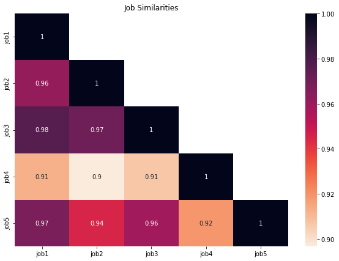
    


**Ergebnis:**

Die Ähnlichkeiten sind sich ziemlich ähnlich, nur die Jobbeschreibung 4 ist zu allen anderen ca. 5-10% unähnlicher.
Die Ergebnisse sind somit fast identisch zu denen des Experiments 1. Einziger Unterschied ist, dass die Werte etwas unterhalb liegen.<br>
<br>
Auch dieser Ansatz ist unbrauchbar, da die Ähnlichkeiten nicht mit der Realität übereinstimmen.

---

### **Experiment 3:** Word2Vec der Jobbeschreibung mit nur Entitäten

In diesem Experiment soll die Ähnlichkeit der Stellenausschreibungen mithilfe des Word2Vec-Distanz der Job-Beschreibungen evaluiert werden.<br>
Die Jobbeschreibung wird in diesem Experiment auf die Entitäten reduziert. Die Auswirkung auf die Ähnlichkeit wird hierbei getestet.

[</img>](#Table-of-Content)


```python
# build nlp of ents

nlp = spacy.load("en_core_web_lg")

# get only entities
ents_ = []
for job in jobs_:
    cache = ""
    for ent in nlp(job).ents:
        cache += f"{ent.text} " 
    ents_ += [cache]
    
# wrap in doc for similarity calculation
jobs = [nlp(ent) for ent in ents_]
job_labels = ["job1", "job2", "job3", "job4", "job5"]
```


```python
similarity = create_similarity_matrix(lambda x,y: x.similarity(y), jobs)
```


```python
eval_similarity(similarity, job_labels, heatmap=True)
```


    
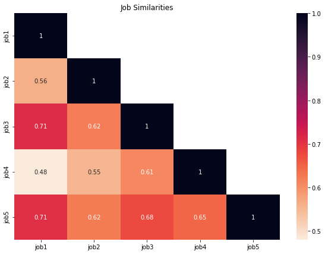
    


**Ergebnis:**

Der Ansatz erzielt keine guten Resultate. Job 2 ist hiernach ähnlich zu den jobs 3 und 5. Genauso verhält es sich bei dem Job 1 und zwar noch extremer und gerade diese sind ja nicht ähnlich. Die Jobs 3-5 werden hierbei auch nur als etwas ähnlich eingestuft.

---
### **Experiment 4:** Word2Vec der Jobbeschreibung mit nur wichtigen Wörtern und anderer Ausrechnungsart 1

In diesem Experiment soll die Ähnlichkeit der Stellenausschreibungen mithilfe des Word2Vec-Distanz der Job-Beschreibungen evaluiert werden.<br>
Dabei wird die Ähnlichkeit so berechnet, dass die Ähnlichkeit von jedem Wort zu jedem Wort summiert wird.

[</img>](#Table-of-Content)


```python
# remove nouns and than build a new doc out of these smaller descriptions
nlp = spacy.load("en_core_web_lg")

# remove not important words
prepared_jobs = []
for job in jobs_:
    prepared_jobs += [get_important_words(nlp(job))]
    
# build docs with the reduced text

doc1 = nlp(' '.join(prepared_jobs[0]))
doc2 = nlp(' '.join(prepared_jobs[1]))
doc3 = nlp(' '.join(prepared_jobs[2]))
doc4 = nlp(' '.join(prepared_jobs[3]))
doc5 = nlp(' '.join(prepared_jobs[4]))

jobs = (doc1, doc2, doc3, doc4, doc5)
job_labels = ["job1", "job2", "job3", "job4", "job5"]
```


```python
# sum of similarities
def job_description_sum_similarity(post1, post2):
    """
    Calculates the similarity between 2 job descriptions.
    Both descriptions should be cleaned (stopword removing)
    and given as list/doc.
    """
    text_similarity = dict()
    # calculate similarity sum
    for token in post1:
        sum_sim = 0
        for token_other in post2:
            sum_sim += token.similarity(token_other)

        # saves similarity sum in dict
        label = token.text
        i = 1
        while label in text_similarity.keys():
            label = f"token.text{i}"
            i += 1
        text_similarity[label] = sum_sim
        
    return sum(text_similarity.values())/((len(post1)+len(post2))*100)
```


```python
sim_matrix = create_similarity_matrix(job_description_sum_similarity, jobs)
```

    C:\Users\tobia\AppData\Local\Temp\ipykernel_10196\869645819.py:13: UserWarning: [W008] Evaluating Token.similarity based on empty vectors.
      sum_sim += token.similarity(token_other)
    


```python
eval_similarity(sim_matrix, job_labels)
```


    
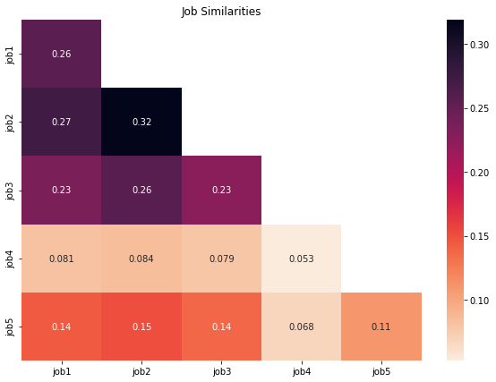
    


**Ergebnis:** 

Dieses Verfahren zeigt bei den gleichen Posts eine Unähnlichkeit an, womit es damit eindeutig unbrauchbar ist und Ähnlichkeit nicht gut berechnen kann. <br>
Auch bei den restlichen Resultate (wie damit dann auch zu erwarten ist) schneidet das verfahren sehr schlecht ab. So Sind die Jobbeschreibungen 1-3 fast gleich ähnlich zu der Jobbeschreibung 5, was in der Realität nicht der Fall ist.

---
### **Experiment 5:** Word2Vec der Jobbeschreibung mit nur wichtigen Wörtern und anderer Ausrechnungsart 2

In diesem Experiment soll die Ähnlichkeit der Stellenausschreibungen mithilfe des Word2Vec-Distanz der Job-Beschreibungen evaluiert werden.<br>
Dabei wird die Ähnlichkeit so berechnet, dass ähnliche Wörter gezählt werden.

[</img>](#Table-of-Content)


```python
# remove nouns and than build a new doc out of these smaller descriptions
nlp = spacy.load("en_core_web_lg")

# remove not important words
prepared_jobs = []
for job in jobs_:
    prepared_jobs += [get_important_words(nlp(job))]
    
# build docs with the reduced text

doc1 = nlp(' '.join(prepared_jobs[0]))
doc2 = nlp(' '.join(prepared_jobs[1]))
doc3 = nlp(' '.join(prepared_jobs[2]))
doc4 = nlp(' '.join(prepared_jobs[3]))
doc5 = nlp(' '.join(prepared_jobs[4]))

jobs = (doc1, doc2, doc3, doc4, doc5)
job_labels = ["job1", "job2", "job3", "job4", "job5"]
```


```python
# Or Count similar words
# go throw tokens and calc similarity
    # full similarity -> sum with all other tokens
def job_description_similarity_counter(post1, post2, sim_lim=0.75):
    """
    Calculates the similarity between 2 job descriptions with counters.
    Both descriptions should be cleaned (stopword removing)
    and given as list/doc.
    Returns a dictionary and the sum of the counts
    """
    text_similarity = dict()
    # calculate similarity counts
    for token in post1:
        counter_sim = 0
        for token_other in post2:
            if token.similarity(token_other) >= sim_lim:
                counter_sim += 1

        # save similarity counts in dict
        label = token.text
        i = 1
        while label in text_similarity.keys():
            label = f"token.text{i}"
            i += 1
        text_similarity[label] = counter_sim
        
    return sum(text_similarity.values())/(len(post1)+len(post2))
```


```python
sim_matrix = create_similarity_matrix(job_description_similarity_counter, jobs)
```

    C:\Users\tobia\AppData\Local\Temp\ipykernel_10196\4255546514.py:16: UserWarning: [W008] Evaluating Token.similarity based on empty vectors.
      if token.similarity(token_other) >= sim_lim:
    


```python
eval_similarity(sim_matrix, job_labels)
```


    
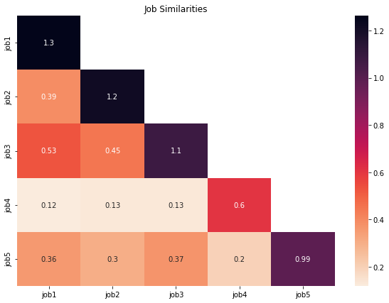
    


**Ergebnis:**

Die Ähnlichkeiten mit diesem Verfahren sind nicht wie gewünscht. Generell sind die Ähnlichkeiten sehr gering.<br>
So werden Job 3 und Job 1 als ähnlich deklariert und die Jobs 3-5 nicht.

---

### **Experiment 6:** Ähnlichkeit der Job-Titel mit Word2vec

In diesem Experiment soll die Ähnlichkeit der Stellenausschreibungen mithilfe des Word2Vec-Distanz der Job-Titeln evaluiert werden. 

[</img>](#Table-of-Content)

Load the title of these jobs


```python
job1_title = data['job_title'][0]    # farmer
job2_title = data['job_title'][3]    # finance -> inevsting, black rock
job3_title = data['job_title'][4]    # data science -> analytics
job4_title = data['job_title'][2]    # data science -> machine learning
job5_title = data['job_title'][1]

titles_ = [job1_title, job2_title, job3_title, job4_title, job5_title]
```

Take in SpaCy Pipeline to get Word2Vec value


```python
nlp = spacy.load("en_core_web_lg")

doc_titles = [nlp(title) for title in titles_]
labels = ["job1", "job2", "job3", "job4", "job5"]
```

Evaluate


```python
sim_matrix = create_similarity_matrix(lambda x,y: x.similarity(y), doc_titles)
```


```python
eval_similarity(sim_matrix, labels)
```


    
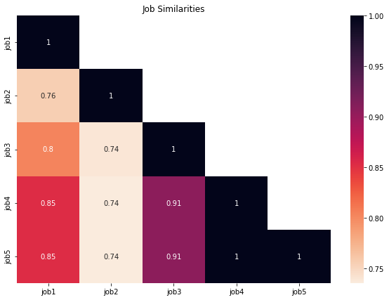
    


**Ergebnis:**

Das Verfahren zeigt recht gute Ergebnisse. Die Jobs 3-5 werden als ähnlich gekennzeichnet. Währendessen ist die Ähnlichkeit zu dem 2.ten Job der Jobs 3-5 merkbar geringer. Ebenso wird die Unähnlichkeit der Jobs 1 und 2 erkannt.<br>
<br>
Die einzige Schwäche ist die Ähnlichkeit von Job 1 und den jobs 3-5. Die Ähnlichkeit ist hier zwar etwas geinger, jedoch nicht so stark.

---

### **Experiment 7:** Ähnlichkeit der Job-Kategorien

In diesem Experiment soll die Ähnlichkeit der Stellenausschreibungen mithilfe der Kategorie des Jobs berechnet werden.

[</img>](#Table-of-Content)

Load the city of these jobs


```python
job1_category = data['category'][0]    # farmer
job2_category = data['category'][3]    # finance -> inevsting, black rock
job3_category = data['category'][4]    # data science -> analytics
job4_category = data['category'][2]    # data science -> machine learning
job5_category = data['category'][1]

categories_ = [job1_category, job2_category, job3_category, job4_category, job5_category]
```


```python
nlp = spacy.load("en_core_web_lg")
```


```python
def get_most_common_noun(nlp, job_description):
    doc = nlp(job_description)
    words = dict()
    for token in doc:
        if token.pos_ in ["NOUN", "PROPN"]:
            if token.text in words.keys():
                words[token.text] += 1
            else:
                words[token.text] = 1
    return sorted(words.items(), key=lambda x:x[0])[0][0]           
```


```python
get_most_common_noun(nlp, jobs_[4])
```


    'Algorithms'


```python
get_most_common_noun(nlp, jobs_[1])
```


    '@blackrock'


```python
# if no category -> find category
# get most common noun
fixed_categories_ = []
for i, category in enumerate(categories_):
    if type(category) == float:
        # overwrite it
        fixed_categories_ += [get_most_common_noun(nlp, jobs_[i])]
    else:
        fixed_categories_ += [category]
```

Take in SpaCy Pipeline to get Word2Vec value


```python
nlp = spacy.load("en_core_web_lg")

doc_categories = [nlp(category) for category in fixed_categories_]
labels = ["job1", "job2", "job3", "job4", "job5"]
```


```python
fixed_categories_
```


    ['Accounting/Finance', 'Accounting/Finance', 'biotech', 'Apache', 'Algorithms']


Evaluate


```python
sim_matrix = create_similarity_matrix(lambda x,y: x.similarity(y), doc_categories)
```


```python
eval_similarity(sim_matrix, labels)
```


    
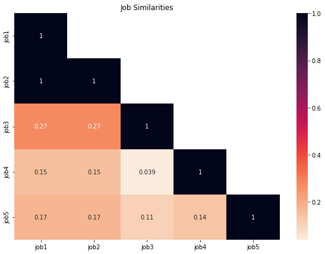
    


**Ergebnis:**

Das Verfahren scheint nicht ganz zu funktionieren. Die Jobs 1 & 2 wurden als ähnlich deklariert, was gut ist. Die 3 Data Science Berufe jedoch gar nicht. Damit ist dieses Verfahren so erstmal nur zum Teil hilfreich.<br>
<br>
Es könnte so implementiert werden, dass bei ähnlicher Job-Kategorie Bonuspunkte vergeben werden (siehe letztes Experiment). Es muss jedoch bedacht werden, dass viele ähnliche Job-Kategorien nicht gefunden werden! Hier sind die Bezeichnungen zu unterschiedlich.

---

### **Experiment 8:** Ähnlichkeit der Job-Orte

In diesem Experiment soll die Ähnlichkeit der Stellenausschreibungen mithilfe der Ortsdistanz berechnet werden.

[</img>](#Table-of-Content)

Load the city of these jobs


```python
job1_city = data['city'][0]    # farmer
job2_city = data['city'][3]    # finance -> inevsting, black rock
job3_city = data['city'][4]    # data science -> analytics
job4_city = data['city'][2]    # data science -> machine learning
job5_city = data['city'][1]

cities_ = [job1_city, job2_city, job3_city, job4_city, job5_city]
labels = ["job1", "job2", "job3", "job4", "job5"]
```


```python
job1_country = data['country'][0]    # farmer
job2_country = data['country'][3]    # finance -> inevsting, black rock
job3_country = data['country'][4]    # data science -> analytics
job4_country = data['country'][2]    # data science -> machine learning
job5_country = data['country'][1]

countries_ = [job1_country, job2_country, job3_country, job4_country, job5_country]
```


```python
def find_pos(city, country):
    # Initialize Nominatim API
    geolocator = Nominatim(user_agent="MyApp")

    location = geolocator.geocode(f"{city} {country}", language="en")
    return location.latitude, location.longitude
```


```python
find_pos("paris", "france")
```


    (48.8588897, 2.3200410217200766)


```python
positions = []
for job in range(5):
    positions += [find_pos(cities_[job], countries_[job])]
```


```python
positions
```


    [(34.1684364, -118.6058382),
     (40.7127281, -74.0060152),
     (35.2272086, -80.8430827),
     (40.7127281, -74.0060152),
     (41.5623178, -72.6509061)]


```python
calc_dist = lambda pos1, pos2:1/(geodesic(pos1, pos2).km+1)
```


```python
sim_matrix = create_similarity_matrix(calc_dist, positions)
```


```python
eval_similarity(sim_matrix, labels, k=0)
```


    
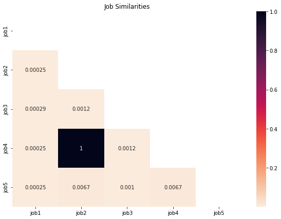
    


Now evaluate it


```python
pos_ = [["freiburg", "germany"], ["emmendingen", "germany"], ["offenburg", "germany"], ["berlin", "germany"]]
labels = ["freiburg", "emmendingen", "offenburg", "berlin"]
pos = []
for city, country in pos_:
    pos += [find_pos(city, country)]
```


```python
sim_matrix = create_similarity_matrix(calc_dist, pos)
```


```python
eval_similarity(sim_matrix, labels, k=0)
```


    
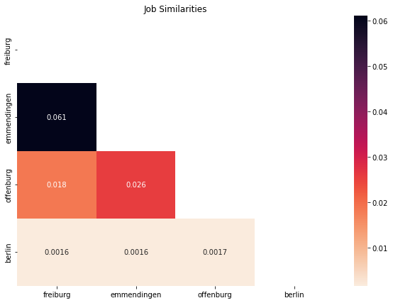
    


**Ergebnis:**

Mit diesem Verfahren lassen sich nun die Distanzen berechnen und so nahe Jobangebote finden, falls das gesucht ist. Dabei scheint das Verfahren so funktionieren, wie erhofft.<br>
<bR>
Die Evaluierung zeigt zudem, dass dieser Prozess auch wiklich funktioniert. Freiburg und Emmendingen sind sich am nähesten. Emmendingen ist näher an Offenburg als Freiburg. Und Berlin ist von allen drein weit weg. 

---

### **Experiment 9:** Ähnlichkeit der Job-Art

In diesem Experiment soll die Ähnlichkeit der Stellenausschreibungen mithilfe der Berufsart festgestellt werden.<br>Umgesetzt durch Regeln.

[</img>](#Table-of-Content)

Load the types.


```python
job1_type = data['job_type'][0]    # farmer
job2_type = data['job_type'][3]    # finance -> inevsting, black rock
job3_type = data['job_type'][4]    # data science -> analytics
job4_type = data['job_type'][2]    # data science -> machine learning
job5_type = data['job_type'][1]

types_ = [job1_type, job2_type, job3_type, job4_type, job5_type]
labels = ["job1", "job2", "job3", "job4", "job5"]
```


```python
data['job_type'].value_counts()
```


    Undefined     6109
    Full Time     3395
    Contract       488
    Part Time        6
    Internship       2
    Name: job_type, dtype: int64


```python
def type_sim(type1, type2):
    res = -1
    if type1 == "Undefined" or type2 == "Undefined":
        res = -1
    elif type1 == type2:
        res = 1.0
    elif (type1 == "Full Time" and type2 == "Contract") or (type2 == "Full Time" and type1 == "Contract"):
        res = -1
    elif (type1 == "Part Time" and type2 == "Full Time") or (type2 == "Part Time" and type1 == "Full Time"):
        res = 0.5
    elif (type1 == "Part Time" and type2 == "Internship") or (type2 == "Part Time" and type1 == "Internship"):
        res = 0.2
    elif (type1 == "Full Time" and type2 == "Internship") or (type2 == "Full Time" and type1 == "Internship"):
        res = 0.0
    elif (type1 == "Contract" and type2 == "Internship") or (type2 == "Contract" and type1 == "Internship"):
        res = -1
    return res
```

Evaluate


```python
sim_matrix = create_similarity_matrix(type_sim, types_)
```


```python
eval_similarity(sim_matrix, labels)
```


    
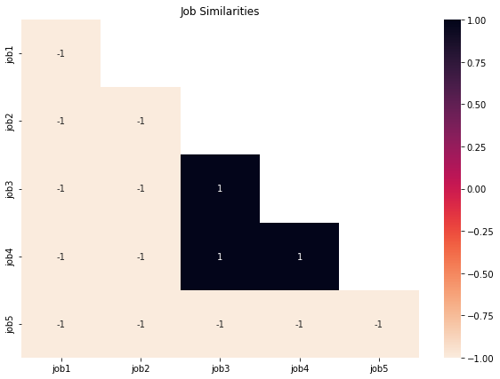
    


**Ergebnis:**

Durch den regelbasierten Ansatz kann man leicht die Berufe mit der Ähnlichkeit ihres Berufstyps bestimmen. Leider sind jedoch nicht viele gelabelt, was bei der Anwendung bedacht werden muss. 

---

### **Experiment 10:** Point-Gain-Proceedings

[</img>](#Table-of-Content)

Es sollen mehere Ansätze gewichtet kombiniert werden. Dies resultiert daraus, dass angenommen wird, dass die Ähnlichkeit subjektiv ist und somit variieren kann (Schwerpunkte festgelegt werden können).<br>
So ein Ansatz soll hier evaluiert werden.<br>
<br>
Bei dem Ansatz werden Punkte vergeben und umso mehr Punkte ein Job hat, desto ähnlicher soll dieser dem Zieljob sein. Dabei ist es nicht so schlimm, dass in manchen Kategorien kein Wert steht, da es hierfür nun einfach keine zusätzlichen Punkte gibt und das Jobausschreibung trotzdem noch als ähnlich gesehen werden kann.<br>
<br>
Außerdem kann man durch dieses Verfahren leicht Schwerpunkte setzen.<br>
<br>
Dieses Experiment wird direkt so programmiert, dass es später leicht einzusetzen ist.
<br>
<br>
> Vorgehen = Jede Kategorie gibt 0-5 Punkte und mithilfe der Parameter kann man diese Punktzahl gewichten um Schwerpunkte zu setzen

Eingabe ist eine Liste mit folgenden Einträgen und die Liste repräsentiert ein Job Post:

</img>

Programmierung der Komponenten und des Algorithmus:


```python
def job_title_points(nlp, title1, title2):
    doc1 = nlp(title1)
    doc2 = nlp(title2)
    sim = doc1.similarity(doc2)
    
    if sim >= 0.95:
        return 5
    elif sim >= 0.9:
        return 4
    elif sim >= 0.8:
        return 2
    elif sim >= 0.7:
        return 1
    else:
        return 0
```


```python
def job_category_points(nlp, category1, category2, description1, description2):
    # fix the category if it nothing
    if type(category1) == float:
        category1 = get_most_common_noun(nlp, description1)
        
    if type(category2) == float:
        category2 = get_most_common_noun(nlp, description2)
        
    # build doc
    doc1 = nlp(category1)
    doc2 = nlp(category2)
    
    # calc similarity
    sim = doc1.similarity(doc2)
    
    if sim >= 0.95:
        return 5
    elif sim >= 0.9:
        return 3
    elif sim >= 0.8:
        return 1
    else:
        return 0
```


```python
def job_type_points(type1, type2):
    res = 0
    if type1 == "Undefined" or type2 == "Undefined":
        res = 0
    elif type1 == type2:
        res = 5
    elif (type1 == "Full Time" and type2 == "Contract") or (type2 == "Full Time" and type1 == "Contract"):
        res = 0
    elif (type1 == "Part Time" and type2 == "Full Time") or (type2 == "Part Time" and type1 == "Full Time"):
        res = 2
    elif (type1 == "Part Time" and type2 == "Internship") or (type2 == "Part Time" and type1 == "Internship"):
        res = 1
    elif (type1 == "Full Time" and type2 == "Internship") or (type2 == "Full Time" and type1 == "Internship"):
        res = 0
    elif (type1 == "Contract" and type2 == "Internship") or (type2 == "Contract" and type1 == "Internship"):
        res = 0
    return res
```


```python
def job_location_points(city1, country1, city2, country2):
    # Initialize Nominatim API
    geolocator = Nominatim(user_agent="MyApp")

    location1 = geolocator.geocode(f"{city1} {country1}", language="en")
    location2 = geolocator.geocode(f"{city2} {country2}", language="en")
    
    if location1 == None or location2 == None:
        return 0
    
    pos1 = (location1.latitude, location1.longitude)
    pos2 = (location2.latitude, location2.longitude)
    
    sim = 1 / (geodesic(pos1, pos2).km+1)
    
    if sim >= 0.1:
        return 5
    elif sim >= 0.07:
        return 4
    elif sim >= 0.03:
        return 3
    elif sim >= 0.01:
        return 1
    else:
        return 0
```


```python
# all categories gets between 0-5 points
def get_similar_job_posts(job_posts:pd.DataFrame, job_post:list, min_points=5, pruning=False, \
                                  title_w=2.0, category_w=1.0, type_w=1.0, pos_w=0.5, printing=True):
    
    # load other job posts 
    #all_job_posts = pd.read_excel("../data_scientist_united_states_job_postings_jobspikr.xlsx")
    all_job_posts = job_posts
    # create score-list
    #all_job_posts['score'] = 0.0
    score = np.array([0]*len(all_job_posts))
    
    # calc points
    nlp = spacy.load("en_core_web_lg")
    for post_idx in range(len(all_job_posts)):
        if printing: print(f"Calculate post {post_idx}...")
        # points for job-title similarity
        if title_w != 0:
            score[post_idx] += job_title_points(nlp, job_post[2], all_job_posts.loc[post_idx, :]['job_title']) * title_w
        
        # pruning -> if 0 points at the first, than skip
        if pruning and score[post_idx] == 0:
            continue
            
        # points for job-category similarity
        if category_w != 0:
            score[post_idx] += job_category_points(nlp, job_post[3], all_job_posts['category'][post_idx], \
                                               job_post[12], all_job_posts['job_description'][post_idx]) * category_w
        
        # points for job-type similarity  
        if type_w != 0:
            score[post_idx] += job_type_points(job_post[13], all_job_posts['job_type'][post_idx]) * type_w
        
        
        # points for job-location similarity  
        if pos_w != 0:
            score[post_idx] += job_location_points(job_post[5], job_post[7], all_job_posts['city'][post_idx], \
                                               all_job_posts['country'][post_idx]) * pos_w
        
    
    
    
    # return all posts with more than x points
    all_job_posts.loc[:, ['score']] = score
    return all_job_posts[all_job_posts['score'] >= min_points].sort_values(by="score", ascending=False)
```

**Evaluation**


```python
#post_id = np.random.randint(0, len(data))
post_id = 33
post = data.values.tolist()[post_id]
post
```


    [Timestamp('2019-02-06 08:30:12'),
     'https://www.careerbuilder.com/job/J3M2F963CC5895ZY3P0',
     'Senior Data Scientist - Tallahassee, FL - $150k-$170k',
     'business and financial operations',
     'Jefferson Frank',
     'Tallahassee',
     'FL',
     'Usa',
     'Tallahassee',
     'Florida',
     'Usa',
     Timestamp('2019-02-05 00:00:00'),
     'My client is a leader in the Manufacturing vertical and has operations in multiple states across the US. They are seeking to hire a full-time Senior Data Scientist to collaborate and work with their R&D, IT, Product Support, and Sales teams. Ideal Candidates Will Have: -Multiple years of Business Intelligence with the ability to work with structured and unstructured data -Multiple years of programming with C, C++, Java, or JavaScript languages -Experience working with AWS Services such as Redshift, S3, Athena, Kinesis My client has already begun interviewing candidates and is seeking to hire quickly. If interested call Mike @ 813-437-6882 and email your CV to m.greco@jeffersonfrank.com Jefferson Frank is the global leader for niche IT recruitment, advertising more Technology jobs than any other agency. We deal with both Partners & End Users throughout North America. By specializing solely in placing niche IT candidates in the market I have built relationships with most of the key employers in North America and have an unrivalled understanding of where the best opportunities and Microsoft jobs are. I understand the need for discretion and would welcome the opportunity to speak to any IT candidates that are considering a new career or job either now or in the future. Confidentiality is of course guaranteed. For information on the market and some of the opportunities that are available I can be contacted on 813-437-6882.',
     'Full Time',
     nan,
     'careerbuilder',
     'usa',
     1549440025100072,
     nan,
     '813 437 6882',
     'd33577ea9ae09c58d77e1fab2c012ba2',
     nan]


```python
#data.sample(n=50, replace=False)
res = get_similar_job_posts(data.head(50), post, title_w=2.0, category_w=1.0, type_w=1.0, pos_w=0.5)
```

    Calculate post 0...
    Calculate post 1...
    Calculate post 2...
    Calculate post 3...
    Calculate post 4...
    Calculate post 5...
    Calculate post 6...
    Calculate post 7...
    

    C:\Users\tobia\AppData\Local\Temp\ipykernel_10196\1465696467.py:14: UserWarning: [W008] Evaluating Doc.similarity based on empty vectors.
      sim = doc1.similarity(doc2)
    

    Calculate post 8...
    Calculate post 9...
    Calculate post 10...
    Calculate post 11...
    Calculate post 12...
    Calculate post 13...
    Calculate post 14...
    Calculate post 15...
    Calculate post 16...
    Calculate post 17...
    Calculate post 18...
    Calculate post 19...
    Calculate post 20...
    Calculate post 21...
    Calculate post 22...
    Calculate post 23...
    Calculate post 24...
    Calculate post 25...
    Calculate post 26...
    Calculate post 27...
    Calculate post 28...
    Calculate post 29...
    Calculate post 30...
    Calculate post 31...
    Calculate post 32...
    Calculate post 33...
    Calculate post 34...
    Calculate post 35...
    Calculate post 36...
    Calculate post 37...
    Calculate post 38...
    Calculate post 39...
    Calculate post 40...
    Calculate post 41...
    Calculate post 42...
    Calculate post 43...
    Calculate post 44...
    Calculate post 45...
    Calculate post 46...
    Calculate post 47...
    Calculate post 48...
    Calculate post 49...
    

    C:\Users\tobia\AppData\Local\Temp\ipykernel_10196\3918599366.py:43: SettingWithCopyWarning: 
    A value is trying to be set on a copy of a slice from a DataFrame.
    Try using .loc[row_indexer,col_indexer] = value instead
    
    See the caveats in the documentation: https://pandas.pydata.org/pandas-docs/stable/user_guide/indexing.html#returning-a-view-versus-a-copy
      all_job_posts.loc[:, ['score']] = score
    


```python
res.head()
```


<div>
<style scoped>
    .dataframe tbody tr th:only-of-type {
        vertical-align: middle;
    }

    .dataframe tbody tr th {
        vertical-align: top;
    }

    .dataframe thead th {
        text-align: right;
    }
</style>
<table border="1" class="dataframe">
  <thead>
    <tr style="text-align: right;">
      <th></th>
      <th>crawl_timestamp</th>
      <th>url</th>
      <th>job_title</th>
      <th>category</th>
      <th>company_name</th>
      <th>city</th>
      <th>state</th>
      <th>country</th>
      <th>inferred_city</th>
      <th>inferred_state</th>
      <th>...</th>
      <th>job_type</th>
      <th>salary_offered</th>
      <th>job_board</th>
      <th>geo</th>
      <th>cursor</th>
      <th>contact_email</th>
      <th>contact_phone_number</th>
      <th>uniq_id</th>
      <th>html_job_description</th>
      <th>score</th>
    </tr>
  </thead>
  <tbody>
    <tr>
      <th>33</th>
      <td>2019-02-06 08:30:12</td>
      <td>https://www.careerbuilder.com/job/J3M2F963CC58...</td>
      <td>Senior Data Scientist - Tallahassee, FL - $150...</td>
      <td>business and financial operations</td>
      <td>Jefferson Frank</td>
      <td>Tallahassee</td>
      <td>FL</td>
      <td>Usa</td>
      <td>Tallahassee</td>
      <td>Florida</td>
      <td>...</td>
      <td>Full Time</td>
      <td>NaN</td>
      <td>careerbuilder</td>
      <td>usa</td>
      <td>1549440025100072</td>
      <td>NaN</td>
      <td>813 437 6882</td>
      <td>d33577ea9ae09c58d77e1fab2c012ba2</td>
      <td>NaN</td>
      <td>22</td>
    </tr>
    <tr>
      <th>38</th>
      <td>2019-02-06 08:31:04</td>
      <td>https://www.careerbuilder.com/job/J3V7V35YMD61...</td>
      <td>Data Scientist Tampa, FL $110-130K</td>
      <td>business and financial operations</td>
      <td>Jefferson Frank</td>
      <td>Tampa</td>
      <td>FL</td>
      <td>Usa</td>
      <td>Tampa</td>
      <td>Florida</td>
      <td>...</td>
      <td>Full Time</td>
      <td>NaN</td>
      <td>careerbuilder</td>
      <td>usa</td>
      <td>1549440025192604</td>
      <td>NaN</td>
      <td>813 437 6899 (ext 6899)</td>
      <td>acfd50bf4d44eb476ec69b38348355be</td>
      <td>NaN</td>
      <td>14</td>
    </tr>
    <tr>
      <th>34</th>
      <td>2019-02-06 08:28:00</td>
      <td>https://www.careerbuilder.com/job/J2Y3W15X0M6C...</td>
      <td>Data Scientist</td>
      <td>business and financial operations</td>
      <td>5 Star Global Recruitment Partners, LLC</td>
      <td>Dallas</td>
      <td>TX</td>
      <td>Usa</td>
      <td>Dallas</td>
      <td>Texas</td>
      <td>...</td>
      <td>Full Time</td>
      <td>NaN</td>
      <td>careerbuilder</td>
      <td>usa</td>
      <td>1549440025102978</td>
      <td>NaN</td>
      <td>256-651-8116</td>
      <td>09378ddde9b997b1acbf519c2b9ddf03</td>
      <td>NaN</td>
      <td>10</td>
    </tr>
    <tr>
      <th>36</th>
      <td>2019-02-06 08:27:40</td>
      <td>https://www.careerbuilder.com/job/J3N45J6TDR75...</td>
      <td>Data Scientist</td>
      <td>business and financial operations</td>
      <td>Grant Thornton LLP</td>
      <td>Alexandria</td>
      <td>VA</td>
      <td>Usa</td>
      <td>Alexandria</td>
      <td>Virginia</td>
      <td>...</td>
      <td>Full Time</td>
      <td>NaN</td>
      <td>careerbuilder</td>
      <td>usa</td>
      <td>1549440025120561</td>
      <td>NaN</td>
      <td>NaN</td>
      <td>1b148bd2e730d37c7afd2cbf0e7e7824</td>
      <td>NaN</td>
      <td>10</td>
    </tr>
    <tr>
      <th>40</th>
      <td>2019-02-06 08:29:24</td>
      <td>https://www.careerbuilder.com/job/J3P8GK6Q0NNR...</td>
      <td>Clinical Data Scientist</td>
      <td>business and financial operations</td>
      <td>Aerotek</td>
      <td>Waltham</td>
      <td>MA</td>
      <td>Usa</td>
      <td>Waltham</td>
      <td>Massachusetts</td>
      <td>...</td>
      <td>Full Time</td>
      <td>NaN</td>
      <td>careerbuilder</td>
      <td>usa</td>
      <td>1549440025277619</td>
      <td>NaN</td>
      <td>NaN</td>
      <td>674c331993a36bb28fd4cf302ce66e9d</td>
      <td>NaN</td>
      <td>10</td>
    </tr>
  </tbody>
</table>
<p>5 rows × 23 columns</p>
</div>


**Ergebnis:**

Das Punktesystem scheint zu funktionieren und es ist möglich seine Auswahl zu gewichten und damit andere optimale Jobangebote zu finden. <br>
Im obigen Beispiel wurden ebenfalls erst Data Science Stellenanzeigen gezeigt, welche im Bereich der Finanzen sind. Und bei Reduzierung der Gewichtung, war dies nicht mehr so. Somit hat der Ansatz funktioniert.<br>
<br>
An dieser Variante ist ebenfalls schön, dass sie leicht zu erweitern ist.<br>
<br>
Leider hat sich das Verfahren als sehr unperformant erwiesen. Im Experiment wurde ersichtlich, dass dies nicht nur an den Berechnungen an sich liegt, sondern vor allem an der großen Anzahl an Job-Posts.

---

### Experiment 11: Paralleles Ausführen
[</img>](#Table-of-Content)
Ziel ist es die Ausführung performanter zu gestalten. Hierzu 2 Gedanken:
- Reduzierung der Daten (random Wahl)
- Paralleles Ausführen

In diesem Experiment wird die Performancesteigerung durch Threading evaluiert.

Folgendes wurde probiert, hat jedoch nicht funktioniert:
- multiprocessing -> windows collaps -> memory out of memory
- dask apply -> nein, dafür zu viele funktionen
- threading -> ja


```python
import sys
import time

import numpy as np
import pandas as pd
import matplotlib.pyplot as plt
from matplotlib.cm import ScalarMappable
import seaborn as sn

import spacy
from spacy.tokens import Token

from geopy.geocoders import Nominatim
from geopy.distance import geodesic

import multiprocessing as mp
from threading import Thread


def get_most_common_noun(job_description):
    nlp = spacy.load("en_core_web_lg")
    doc = nlp(job_description)
    words = dict()
    for token in doc:
        if token.pos_ in ["NOUN", "PROPN"]:
            if token.text in words.keys():
                words[token.text] += 1
            else:
                words[token.text] = 1
    return sorted(words.items(), key=lambda x:x[0])[0][0]           


def job_title_points(nlp, title1, title2):
    doc1 = nlp(title1)
    doc2 = nlp(title2)
    sim = doc1.similarity(doc2)
    
    if sim >= 0.95:
        return 5
    elif sim >= 0.9:
        return 4
    elif sim >= 0.8:
        return 2
    elif sim >= 0.7:
        return 1
    else:
        return 0


def job_category_points(nlp, category1, category2, description1, description2):
    # fix the category if it nothing
    if type(category1) == float:
        category1 = get_most_common_noun(description1)
        
    if type(category2) == float:
        category2 = get_most_common_noun(description2)
        
    # build doc
    doc1 = nlp(category1)
    doc2 = nlp(category2)
    
    # calc similarity
    sim = doc1.similarity(doc2)
    
    if sim >= 0.95:
        return 5
    elif sim >= 0.9:
        return 3
    elif sim >= 0.8:
        return 1
    else:
        return 0


def job_type_points(type1, type2):
    res = 0
    if type1 == "Undefined" or type2 == "Undefined":
        res = 0
    elif type1 == type2:
        res = 5
    elif (type1 == "Full Time" and type2 == "Contract") or (type2 == "Full Time" and type1 == "Contract"):
        res = 0
    elif (type1 == "Part Time" and type2 == "Full Time") or (type2 == "Part Time" and type1 == "Full Time"):
        res = 2
    elif (type1 == "Part Time" and type2 == "Internship") or (type2 == "Part Time" and type1 == "Internship"):
        res = 1
    elif (type1 == "Full Time" and type2 == "Internship") or (type2 == "Full Time" and type1 == "Internship"):
        res = 0
    elif (type1 == "Contract" and type2 == "Internship") or (type2 == "Contract" and type1 == "Internship"):
        res = 0
    return res


def job_location_points(city1, country1, city2, country2):
    # Initialize Nominatim API
    geolocator = Nominatim(user_agent="MyApp")

    location1 = geolocator.geocode(f"{city1} {country1}", language="en", timeout=10000)
    location2 = geolocator.geocode(f"{city2} {country2}", language="en", timeout=10000)
    
    if location1 == None or location2 == None:
        return 0
    
    pos1 = (location1.latitude, location1.longitude)
    pos2 = (location2.latitude, location2.longitude)
    
    sim = 1 / (geodesic(pos1, pos2).km+1)
    
    if sim >= 0.1:
        return 5
    elif sim >= 0.07:
        return 4
    elif sim >= 0.03:
        return 3
    elif sim >= 0.01:
        return 1
    else:
        return 0


def log(txt:str, should_show=False):
    if should_show: print("\n"+txt+"\n")


def calc_points(result, job_posts:pd.DataFrame, job_post, progress, total, nlp, pruning, title_w, category_w, type_w, pos_w, printing):
    
    # create score-list
    score = np.array([0]*len(job_posts))

    offset = job_posts.index.start
    
    for post_idx in range(len(job_posts)):
        #if printing: print(f"Calculate post {post_idx}...")
        # points for job-title similarity
        if title_w != 0:
            score[post_idx] += job_title_points(nlp, job_post[2], job_posts.loc[post_idx+offset, :]['job_title']) * title_w

        # pruning -> if 0 points at the first, than skip
        if pruning and score[post_idx] == 0:
            continue

        # points for job-category similarity
        if category_w != 0:
            score[post_idx] += job_category_points(nlp, job_post[3], job_posts['category'][post_idx+offset], \
                                            job_post[12], job_posts['job_description'][post_idx+offset]) * category_w

        # points for job-type similarity  
        if type_w != 0:
            score[post_idx] += job_type_points(job_post[13], job_posts['job_type'][post_idx+offset]) * type_w


        # points for job-location similarity  
        if pos_w != 0:
            score[post_idx] += job_location_points(job_post[5], job_post[7], job_posts['city'][post_idx+offset], \
                                            job_posts['country'][post_idx+offset]) * pos_w

        progress[0] += 1
        progress_bar(progress[0], total)

    # return all posts with more than x points
    job_posts.loc[:, ['score']] = score
    log(f"One Process finished!", printing)
    result += [job_posts]
    #return job_posts


# all categories gets between 0-5 points
def get_similar_job_posts_parallel(job_posts:pd.DataFrame, job_post:list, min_points=5, pruning=False, \
                                  title_w=2.0, category_w=1.0, type_w=1.0, pos_w=0.5, printing=True, thread_amount=2):
    log_sym = "x"
    # load other job posts 
    all_job_posts = job_posts
    
    # split
    n = thread_amount   #mp.cpu_count()
    log(f"Splitting data into {n} portions...", printing)
    max_ = len(all_job_posts)//n
    job_post_portions = []
    pointer = 0
    for i in range(n):
        job_post_portions += [all_job_posts.iloc[pointer:pointer+max_, :]]
        pointer += len(all_job_posts)//n
    log(log_sym, printing)
    log(f"Each portion contains {max_} jobposts...", printing)
     
    
    # calc points
    log(f"Loading SpaCy en_core_web_lg corpus...", printing)
    nlp = spacy.load("en_core_web_lg")
    log(log_sym, printing)
    
    # start processes / calc parallel the points / similarity
    log(f"Starts parallel calculation of the similarity/points with {n} Threads...", printing)
    progress = [0]    # use this for changing
    total = job_posts.shape[0]
    args = (job_post, progress, total, nlp, pruning, title_w, category_w, type_w, pos_w, printing)
    results = []
    threads = []
    for jobs in job_post_portions:
        t = Thread(target=calc_points, args=(results, jobs,)+args)
        threads += [t]
        t.start()
    #log(log_sym, printing)
    #log(f"Created Threads and they running...\n", printing)

    # wait until finishes
    #log(f"Waiting for finishing tasks...", printing)
    for t in threads: 
        t.join()
    log(log_sym, printing)
    log(f"Finished with the parallel calculation of the similarity/points...\n", printing)
    
    # merge
    log(f"Merging scored job posts...", printing)
    if len(results) > 0:
        scored_job_posts = results[0]
        for result in results[1:]:
            scored_job_posts.append(result, ignore_index=True)
        log(log_sym, printing)
        
        # take only important results and sort them
        log(f"Sorting scored job posts...", printing)
        r = scored_job_posts[scored_job_posts['score'] >= min_points].sort_values(by="score", ascending=False)
        log(log_sym, printing)
        return r


def get_number_input(msg:str, min=None, max=None):
    wrong_input = True
    while wrong_input:
        #addition = ""
        #if min != None:
        #    addition += f"(min={min})"
        #if max != None:
        #    if min != None:
        #        addition += ", "
        #    addition += f"(max={max})"
        user_input = input(f"{msg}:")#+addition

        if user_input == "exit":
            sys.exit()

        try:
            result = int(user_input)
            if min != None and max != None:
                if result >= min and result <= max:
                    wrong_input = False
                else:
                    print("Try again. Type a number.")# + addition)
            elif min != None and max == None:
                if result >= min:
                    wrong_input = False
                else:
                    print("Try again. Type a number.")
            elif min == None and max != None:
                if result <= max:
                    wrong_input = False
                else:
                    print("Try again. Type a number.")
        except ValueError:
            pass
    return result


def print_job_post(job_post):
    width = 64
    job_str = f"\n{'-'*width}\n{' '*((width//2)-8)}>>> Job Post <<<\n{'-'*width}\n"
    job_str += f"\n\nTitle: {job_post[2]}\n"
    job_str += f"\nCategory: {job_post[3]}\n"
    job_str += f"\nLocation: {job_post[5]} in {job_post[7]}\n"
    job_str += f"\nType: {job_post[13]}\n"
    job_str += f"\nDespription:\n\n {'-'*width}{job_post[12]}\n{'-'*width}\n\n"
    print(job_str)


def progress_bar(progress, total):
    percentage = 100 * (progress/float(total))
    bar = '#'*int(percentage) + '-'*(100-int(percentage))
    print(f"\r[{bar}] {percentage:.2f}%", end="\r")


def calc_points_experiment(result, job_posts:pd.DataFrame, job_post, time_, progress, total, nlp, pruning, title_w, category_w, type_w, pos_w, printing):
    
    # create score-list
    score = np.array([0]*len(job_posts))

    offset = job_posts.index.start
    
    for post_idx in range(len(job_posts)):
        #if printing: print(f"Calculate post {post_idx}...")
        # points for job-title similarity
        start = time.time()
        if title_w != 0:
            score[post_idx] += job_title_points(nlp, job_post[2], job_posts.loc[post_idx+offset, :]['job_title']) * title_w
        duration = round(time.time() - start, 2)
        time_['title'] += duration

        # pruning -> if 0 points at the first, than skip
        if pruning and score[post_idx] == 0:
            continue

        # points for job-category similarity
        start = time.time()
        if category_w != 0:
            score[post_idx] += job_category_points(nlp, job_post[3], job_posts['category'][post_idx+offset], \
                                            job_post[12], job_posts['job_description'][post_idx+offset]) * category_w
        duration = round(time.time() - start, 2)
        time_['category'] += duration

        # points for job-type similarity  
        start = time.time()
        if type_w != 0:
            score[post_idx] += job_type_points(job_post[13], job_posts['job_type'][post_idx+offset]) * type_w
        duration = round(time.time() - start, 2)
        time_['type'] += duration

        # points for job-location similarity  
        start = time.time()
        if pos_w != 0:
            score[post_idx] += job_location_points(job_post[5], job_post[7], job_posts['city'][post_idx+offset], \
                                            job_posts['country'][post_idx+offset]) * pos_w
        duration = round(time.time() - start, 2)
        time_['location'] += duration


        progress[0] += 1
        progress_bar(progress[0], total)

    # return all posts with more than x points
    job_posts.loc[:, ['score']] = score
    log(f"One Process finished!", printing)
    result += [job_posts]


# all categories gets between 0-5 points
def get_similar_job_posts_experiment(job_posts:pd.DataFrame, job_post:list, min_points=5, pruning=False, \
                                  title_w=2.0, category_w=1.0, type_w=1.0, pos_w=0.5, printing=True, thread_amount=2):
    time_ = {'title':0, 'location':0, 'type':0, 'category':0}
    # load other job posts 
    all_job_posts = job_posts
    
    # split
    n = thread_amount   
    max_ = len(all_job_posts)//n
    job_post_portions = []
    pointer = 0
    for i in range(n):
        job_post_portions += [all_job_posts.iloc[pointer:pointer+max_, :]]
        pointer += len(all_job_posts)//n
     
    # calc points
    nlp = spacy.load("en_core_web_lg")

    # start processes / calc parallel the points / similarity
    progress = [0]    # use this for changing
    total = job_posts.shape[0]
    args = (job_post, time_, progress, total, nlp, pruning, title_w, category_w, type_w, pos_w, printing)
    results = []
    threads = []
    for jobs in job_post_portions:
        t = Thread(target=calc_points_experiment, args=(results, jobs,)+args)
        threads += [t]
        t.start()

    # wait until finishes
    for t in threads: 
        t.join()
    
    # merge
    if len(results) > 0:
        scored_job_posts = results[0]
        for result in results[1:]:
            scored_job_posts.append(result, ignore_index=True)
        
        # take only important results and sort them
        r = scored_job_posts[scored_job_posts['score'] >= min_points].sort_values(by="score", ascending=False)
    return f"   title: {time_['title']} seconds<br>\n   location: {time_['location']} seconds\n   type: {time_['type']} seconds\n   category: {time_['category']} seconds"


def time_experiment():
    data = pd.read_excel("./data_scientist_united_states_job_postings_jobspikr.xlsx")
    post = data.values.tolist()[33]

    results = ""

    for i in [10, 100, 1000, 10000]:
        print(f"Startet {i} samples...")
        results += f"{'-'*64}\nSample Size = {i}\n{'-'*64}\n"
        for n in [1, 2, 5, 10]:
            print("Waiting for geopy...")
            time.sleep(10)
            print(f"Try on {n} Threads...")
            start = time.time()
            output = get_similar_job_posts_experiment(data.head(i), post, title_w=2.0, category_w=0.0, type_w=1.0, pos_w=0.5, printing=False, thread_amount=n)
            duration = time.time()-start
            results += f"\nThreads: {n} needed {duration:.2f} seconds\n{output}\n"
            print(f"\nThreads: {n} needed {duration:.2f} seconds")
        print(f"\n------------\n")

    # saving in file
    with open("./time_experiment_reults.txt", "w") as file:
        file.write(results)
    

def main():
    data = pd.read_excel("./data_scientist_united_states_job_postings_jobspikr.xlsx")
    choose_a_post = False
    while not choose_a_post:
        post_id = get_number_input(f"Type a number between 0 and {data.shape[0]} to choose a job post", 0, data.shape[0]-1)
        
        post = data.values.tolist()[post_id]
        print_job_post(post)
        answer = get_number_input("Is this ok? (1=yes / 0=no)", 0, 1)
        if answer == 1:
            choose_a_post = True


    posts = get_similar_job_posts_parallel(data.head(2), post, title_w=2.0, category_w=0.0, \
                                            type_w=1.0, pos_w=0.5, printing=False)


    cur_idx = 0
    offset = posts.index[0]
    print("-----\nNavigate with 'next', 'prev', 'exit'\n-----")
    while True:
        print_job_post(posts[cur_idx+offset])
        user_input = input("User:")
        if user_input == "next":
            if cur_idx < posts.shape[0]-1:
                cur_idx += 1
        elif user_input == "prev":
            if cur_idx > 0:
                cur_idx -= 1
        elif user_input == "exit":
            print("bye")
            break
```

**Evaluation**

Es wurde oben ein umfangreiches Experiment der Performance angefertigt und durchgeführt. Dabei wurden verschiedene Größen an Daten mit unterschiedlicher Anzahl an Threads verglichen. 

Folgende Ergbnisse kamen dabei heraus:


----------------------------------------------------------------
Sample Size = 10

----------------------------------------------------------------
<br>
Threads: 1 needed 11.29 seconds<br>
   title: 0.09999999999999999 seconds<br>
   location: 9.540000000000001 seconds<br>
   type: 0.0 seconds<br>
   category: 0.0 seconds<br>
<br>
Threads: 2 needed 10.95 seconds<br>
   title: 0.11999999999999998 seconds<br>
   location: 18.689999999999998 seconds<br>
   type: 0.0 seconds<br>
   category: 0.0 seconds<br>
<br>
Threads: 5 needed 10.97 seconds<br>
   title: 0.32000000000000006 seconds<br>
   location: 43.14 seconds<br>
   type: 0.0 seconds<br>
   category: 0.0 seconds<br>
<br>
Threads: 10 needed 11.14 seconds<br>
   title: 1.1500000000000004 seconds<br>
   location: 69.10999999999999 seconds<br>
   type: 0.0 seconds<br>
   category: 0.0 seconds<br>
<br>

----------------------------------------------------------------
Sample Size = 100

----------------------------------------------------------------
<br>
Threads: 1 needed 101.38 seconds<br>
   title: 1.0000000000000007 seconds<br>
   location: 98.57999999999994 seconds<br>
   type: 0.0 seconds<br>
   category: 0.0 seconds<br>

Threads: 2 needed 100.93 seconds<br>
   title: 1.0200000000000007 seconds<br>
   location: 197.66000000000005 seconds<br>
   type: 0.0 seconds<br>
   category: 0.0 seconds<br>
<br>
Threads: 5 needed 100.94 seconds<br>
   title: 1.2300000000000009 seconds<br>
   location: 491.9500000000004 seconds<br>
   type: 0.0 seconds<br>
   category: 0.0 seconds<br>
<br>
Threads: 10 needed 101.42 seconds<br>
   title: 5.389999999999981 seconds<br>
   location: 969.7200000000006 seconds<br>
   type: 0.0 seconds<br>
   category: 0.0 seconds<br>

----------------------------------------------------------------
Sample Size = 1000

----------------------------------------------------------------
<br>
Threads: 1 needed 1000.94 seconds<br>
   title: 10.03999999999983 seconds<br>
   location: 988.9200000000056 seconds<br>
   type: 0.0 seconds<br>
   category: 0.0 seconds<br>
<br>
Threads: 2 needed 1000.92 seconds<br>
   title: 10.01999999999983 seconds<br>
   location: 1986.7700000000077 seconds<br>
   type: 0.0 seconds<br>
   category: 0.0 seconds<br>
<br>
Threads: 5 needed 1001.33 seconds<br>
   title: 11.799999999999793 seconds<br>
   location: 4980.899999999963 seconds<br>
   type: 0.0 seconds<br>
   category: 0.0 seconds<br>
<br>
Threads: 10 needed 1000.99 seconds<br>
   title: 10.839999999999813 seconds<br>
   location: 9959.869999999924 seconds<br>
   type: 0.0 seconds<br>
   category: 0.0 seconds<br>


**Ergebnis:**

Die Experimente zeigen, dass die zeitliche Differenz bei 1, 2, 5 oder 10 Threads lediglich beica. 1 Sekunde liegen. Dabei ist auch kein Muster zu erkennen. So brauchen die 5 Threads bei 1000 Daten ca. 1 Sekunde länger als die anderen 3 Verfahren. Bei 100 Daten gehört es jedoch zu den Schnellsten. Die kleinen Differenzen scheinen in keiner Kausalität mit dem Threading zu stehen.

Wie nach der Theorie her vermutet, bringt das Threading also keinen zeitlichen Vorteil. Die zeitlichen Fluktuationen stammen wahrscheinlich von der schwankenden Rechenpower des Laptops.

Jedoch ist etwas anderes sehr schön zu sehen. Die Berechnung für den Ort bzw. dessen Abstand beträgt ca. 99% der Laufzeit bei 1000 Daten. Der Vergleich der Titel beträgt etwa 10 Sekunden, unabhängig von der Anzahl an Daten. <br>
Ohne den Ort wäre der Algorithmus also immer etwa 10 Sekunden schnell, was das Problem löst.

### Evaluation

[</img>](#Table-of-Content)

Die Berechnung der Ähnlichlichkeit über die Ähnlichkeit der Jobbeschreibung hat nicht so funktioniert wie gewünscht. Selbst mit Anpassungen scheint es nicht gut die Ähnlichkeit berechnen zu können.<br>
Dafür hat dies über den Job-Titel und der Word2Vec-Technik sehr gut funktioniert.<br>
<br>
Wie das Experiment 10 gezeigt hat, kann man dieses Verfahren in Verbindung mit anderen Ähnlichkeiten einsetzen, um so ein individuelles Ähnlickeitsmaß herstellen zu können. <br>
<br>
Ein größeres Problem ist die Performance. Es existieren nämlich sehr viele Job-Posts und um alle zu verwenden, wird viel Zeit in Anspruch genommen.<br>
Als Lösungsansatz werden nicht alle Daten verwenden (zufällig 1000 der Daten). Multiprocessing/Threading scheinen keine Lösung zu sein.

---
### Anwendung

[</img>](#Table-of-Content)


```python
import sys
import time

import numpy as np
import pandas as pd
import matplotlib.pyplot as plt
from matplotlib.cm import ScalarMappable
import seaborn as sn

import spacy
from spacy.tokens import Token

from geopy.geocoders import Nominatim
from geopy.distance import geodesic

import multiprocessing as mp
from threading import Thread


def get_most_common_noun(job_description, nlp):
    #nlp = spacy.load("en_core_web_lg")
    doc = nlp(job_description)
    words = dict()
    for token in doc:
        if token.pos_ in ["NOUN", "PROPN"]:
            if token.text in words.keys():
                words[token.text] += 1
            else:
                words[token.text] = 1
    return sorted(words.items(), key=lambda x:x[0])[0][0]           


def job_title_points(nlp, title1, title2):
    doc1 = nlp(title1)
    doc2 = nlp(title2) 

    if (doc1.vector_norm) and (doc2.vector_norm):
        try:
            sim = doc1.similarity(doc2)
        except Exception:
            sim = 0.0
    else:
        #print("Title Vector is empty...")
        sim = 0.0
    
    if sim >= 0.95:
        return 5
    elif sim >= 0.9:
        return 4
    elif sim >= 0.8:
        return 2
    elif sim >= 0.7:
        return 1
    else:
        return 0


def job_category_points(nlp, category1, category2, description1, description2):
    if type(category1) == float or type(category2) == float:
        return 0
    # fix the category if it nothing
    #if type(category1) == float:
    #    category1 = get_most_common_noun(description1, nlp)
        
    #if type(category2) == float:
    #    category2 = get_most_common_noun(description2, nlp)
        
    # build doc
    doc1 = nlp(category1)
    doc2 = nlp(category2)
    
    # calc similarity
    sim = doc1.similarity(doc2)
    
    if sim >= 0.95:
        return 5
    elif sim >= 0.9:
        return 3
    elif sim >= 0.8:
        return 1
    else:
        return 0


def job_type_points(type1, type2):
    res = 0
    if type1 == "Undefined" or type2 == "Undefined":
        res = 0
    elif type1 == type2:
        res = 5
    elif (type1 == "Full Time" and type2 == "Contract") or (type2 == "Full Time" and type1 == "Contract"):
        res = 0
    elif (type1 == "Part Time" and type2 == "Full Time") or (type2 == "Part Time" and type1 == "Full Time"):
        res = 2
    elif (type1 == "Part Time" and type2 == "Internship") or (type2 == "Part Time" and type1 == "Internship"):
        res = 1
    elif (type1 == "Full Time" and type2 == "Internship") or (type2 == "Full Time" and type1 == "Internship"):
        res = 0
    elif (type1 == "Contract" and type2 == "Internship") or (type2 == "Contract" and type1 == "Internship"):
        res = 0
    return res


def job_location_points(city1, country1, city2, country2):
    # Initialize Nominatim API
    geolocator = Nominatim(user_agent="MyApp")

    location1 = geolocator.geocode(f"{city1} {country1}", language="en", timeout=10000)
    location2 = geolocator.geocode(f"{city2} {country2}", language="en", timeout=10000)
    
    if location1 == None or location2 == None:
        return 0
    
    pos1 = (location1.latitude, location1.longitude)
    pos2 = (location2.latitude, location2.longitude)
    
    sim = 1 / (geodesic(pos1, pos2).km+1)
    
    if sim >= 0.1:
        return 5
    elif sim >= 0.07:
        return 4
    elif sim >= 0.03:
        return 3
    elif sim >= 0.01:
        return 1
    else:
        return 0


def log(txt:str, should_show=False):
    if should_show: print("\n"+txt+"\n")


def calc_points(job_posts:pd.DataFrame, job_post, progress, total, nlp, pruning, title_w, category_w, type_w, pos_w, printing, show_progress):
    
    # create score-list
    score = np.array([0]*len(job_posts))

    warning_called = False
    
    for post_idx in range(len(job_posts)):  #
        #if printing: print(f"Calculate post {post_idx}...")
        # points for job-title similarity
        # old: job_posts['job_description'][post_idx]
        if title_w != 0:
            score[post_idx] += job_title_points(nlp, job_post[2], job_posts.iloc[post_idx, 2]) * title_w

        # pruning -> if 0 points at the first, than skip
        if pruning and score[post_idx] == 0:
            continue

        # points for job-category similarity
        if category_w != 0:
            score[post_idx] += job_category_points(nlp, job_post[3], job_posts.iloc[post_idx, 3], \
                                            job_post[12], job_posts.iloc[post_idx, 12]) * category_w

        # points for job-type similarity  
        if type_w != 0:
            score[post_idx] += job_type_points(job_post[13], job_posts.iloc[post_idx, 13]) * type_w


        # points for job-location similarity  
        if pos_w != 0:
            if not warning_called:
                print("\nWARNING: CALC LOCATION IS EXPENSIVE!\n")
                warning_called = True
            score[post_idx] += job_location_points(job_post[5], job_post[7], job_posts.iloc[post_idx, 5], \
                                           job_posts.iloc[post_idx, 7]) * pos_w

        if show_progress:
            progress[0] += 1
            progress_bar(progress[0], total)

    # return all posts with more than x points
    job_posts.loc[:, ['score']] = score
    log(f"One Process finished!", printing)
    return job_posts


# all categories gets between 0-5 points
def get_similar_job_posts(job_posts:pd.DataFrame, job_post:list, min_points=5, pruning=False, \
                                  title_w=2.0, category_w=1.0, type_w=1.0, pos_w=0.5, printing=True, show_progress=True):

    warnings.filterwarnings("ignore", message=r"\[W008\]", category=UserWarning)

    log_sym = "x"
    # load other job posts 
    all_job_posts = job_posts
    
    # calc points
    log(f"Loading SpaCy en_core_web_lg corpus...", printing)
    nlp = spacy.load("en_core_web_lg")
    log(log_sym, printing)
    
    # start processes / calc parallel the points / similarity
    log(f"Starts calculation of the similarity/points...", printing)
    progress = [0]    # use this for changing
    total = job_posts.shape[0]
    args = (job_post, progress, total, nlp, pruning, title_w, category_w, type_w, pos_w, printing, show_progress)
    scored_job_posts = calc_points(all_job_posts, *args)
    log(log_sym, printing)
    
    # sort and return
    if len(scored_job_posts) > 0:
        # take only important results and sort them
        log(f"Sorting scored job posts...", printing)
        r = scored_job_posts[scored_job_posts['score'] >= min_points].sort_values(by="score", ascending=False)
        log(log_sym, printing)
        return r


def get_number_input(msg:str, min, max):
    wrong_input = True
    while wrong_input:
        #addition = ""
        #if min != None:
        #    addition += f"(min={min})"
        #if max != None:
        #    if min != None:
        #        addition += ", "
        #    addition += f"(max={max})"
        user_input = input(f"{msg}:")#+addition

        if user_input == "exit":
            sys.exit()

        try:
            result = int(user_input)
            if result >= min and result <= max:
                wrong_input = False
            else:
                print("Try again. Type a number.")# + addition)
        except ValueError:
            pass
    return result

def get_float_number_input(msg:str, min:float, max:float):
    wrong_input = True
    while wrong_input:
        user_input = input(f"{msg}:")

        if user_input == "exit":
            sys.exit()
        elif user_input == "":
            return None

        try:
            result = float(user_input)
            if result >= min and result <= max:
                wrong_input = False
            else:
                print("Try again. Type a float number.")
        except ValueError:
            pass
    return result


def get_bool_input(msg:str):
    wrong_input = True
    while wrong_input:
        user_input = input(f"{msg}:")

        if user_input == "exit":
            sys.exit()
        elif user_input in ["y", "", "yes", "1"]:
            result = 1
            wrong_input = False
        elif user_input in ["no", "0", "n"]:
            result = 0
            wrong_input = False

    return result


def print_job_post(job_post, with_r=False):
    width = 64
    job_str = ""
    if with_r:
        job_str += "\r"
    job_str += f"\n{'-'*width}\n{' '*((width//2)-8)}>>> Job Post <<<\n{'-'*width}\n"
    job_str += f"\n\nTitle: {job_post[2]}\n"
    job_str += f"\nCategory: {job_post[3]}\n"
    job_str += f"\nLocation: {job_post[5]} in {job_post[7]}\n"
    job_str += f"\nType: {job_post[13]}\n"
    job_str += f"\nDespription:\n\n {'-'*width}\n\n{job_post[12]}\n{'-'*width}\n"
    if with_r:
        print(job_str, end="\r")
    else:
        print(job_str)


def progress_bar(progress, total):
    percentage = 100 * (progress/float(total))
    bar = '#'*int(percentage) + '-'*(100-int(percentage))
    print(f"\r[{bar}] {percentage:.2f}%", end="\r")
    

def main():
    # supress warnings
    warnings.filterwarnings("ignore", message=r"\[W008\]", category=UserWarning)

    # load data
    data = pd.read_excel("./data_scientist_united_states_job_postings_jobspikr.xlsx")
    choose_a_post = False

    # choose a post
    while not choose_a_post:
        post_id = get_number_input(f"Type a number between 0 and {data.shape[0]} to choose a job post", 0, data.shape[0]-1)
        
        post = data.values.tolist()[post_id]
        print_job_post(post)
        answer = get_bool_input("Is this ok? (y/n)")
        if answer == 1:
            choose_a_post = True

    # choose weights
    title_w = get_float_number_input(f"How important is the title? Type a number between 0.0 and 3.0 or pass/enter", 0.0, 3.0)
    title_w = 2.0 if title_w == None else title_w
    category_w = get_float_number_input(f"How important is the category? Type a number between 0.0 and 3.0 or pass/enter", 0.0, 3.0)
    category_w = 1.0 if category_w == None else category_w
    type_w = get_float_number_input(f"How important is the type? Type a number between 0.0 and 3.0 or pass/enter", 0.0, 3.0)
    type_w = 0.0 if type_w == None else type_w
    pos_w = get_float_number_input(f"How important is the location? Type a number between 0.0 and 3.0 or pass/enter", 0.0, 3.0)
    pos_w = 0.0 if pos_w == None else pos_w

    # calc scores -> get similar job posts
    start = time.time()
    #data.sample(n=2000, replace=False)
    posts = get_similar_job_posts(data.sample(n=1000, replace=False), post, title_w=title_w, category_w=category_w, \
                                            type_w=type_w, pos_w=pos_w, printing=False)
    duration = time.time() - start
    print(f"\n\nFounded similiar posts in {duration:.2f} seconds")


    # navigate in example
    cur_idx = 0
    print("-----\nNavigate with 'next', 'prev', 'exit'\n-----")
    while True:
        print_job_post(posts.iloc[cur_idx, :], False)
        user_input = input("User:")
        if user_input == "next" or user_input == "":
            if cur_idx < posts.shape[0]-1:
                cur_idx += 1
        elif user_input == "prev":
            if cur_idx > 0:
                cur_idx -= 1
        elif user_input == "exit":
            print("bye")
            break
```


```python
#main()
```

---

### Profiling
[</img>](#Table-of-Content)

In diesem Abschnitt wird die Laufzeit genauer analysiert.


```python
data = pd.read_excel("../data_scientist_united_states_job_postings_jobspikr.xlsx")
sample = data.sample(n=1000, replace=False)
post = data.values.tolist()[33]
```

### [With cProfile](https://docs.python.org/3/library/profile.html#instant-user-s-manual)


```python

cProfile.run('get_similar_job_posts(sample, post, title_w=2.0, category_w=1.0, type_w=0.0, pos_w=0.0, printing=False, show_progress=False)',\
         sort = 'cumtime')
```

             17210002 function calls (16350020 primitive calls) in 27.041 seconds
    
       Ordered by: cumulative time
    
       ncalls  tottime  percall  cumtime  percall filename:lineno(function)
            1    0.000    0.000   27.073   27.073 {built-in method builtins.exec}
            1    0.000    0.000   27.070   27.070 2466562680.py:185(get_similar_job_posts)
            1    0.038    0.038   25.496   25.496 2466562680.py:138(calc_points)
         4089    0.100    0.000   24.877    0.006 language.py:984(__call__)
        16356    2.289    0.000   21.649    0.001 trainable_pipe.pyx:40(__call__)
        16356    0.105    0.000   18.101    0.001 model.py:311(predict)
    576549/32712    0.440    0.000   17.535    0.001 model.py:288(__call__)
    200361/16356    0.539    0.000   16.755    0.001 chain.py:48(forward)
         1000    0.008    0.000   14.802    0.015 2466562680.py:61(job_category_points)
        28623    0.074    0.000   13.942    0.000 with_array.py:28(forward)
         1000    0.009    0.000   10.416    0.010 2466562680.py:35(job_title_points)
         8178    0.220    0.000    9.687    0.001 tb_framework.py:32(forward)
        12267    0.076    0.000    9.272    0.001 with_array.py:69(_list_forward)
        32712    0.115    0.000    8.634    0.000 residual.py:27(forward)
         4089    0.044    0.000    8.182    0.002 tok2vec.py:112(predict)
        40890    0.516    0.000    6.589    0.000 maxout.py:42(forward)
        69513    5.793    0.000    5.869    0.000 numpy_ops.pyx:82(gemm)
           89    0.031    0.000    5.352    0.060 2466562680.py:21(get_most_common_noun)
        16356    0.055    0.000    4.421    0.000 with_array.py:86(_ragged_forward)
    16356/8178    0.060    0.000    4.035    0.000 concatenate.py:43(forward)
    16356/8178    0.042    0.000    3.786    0.000 concatenate.py:44(<listcomp>)
        40890    0.437    0.000    3.086    0.000 layernorm.py:24(forward)
        40890    0.177    0.000    2.256    0.000 layernorm.py:74(_get_moments)
            1    0.000    0.000    1.572    1.572 __init__.py:30(load)
            1    0.000    0.000    1.572    1.572 util.py:397(load_model)
            1    0.000    0.000    1.571    1.571 util.py:430(load_model_from_package)
            1    0.000    0.000    1.571    1.571 __init__.py:9(load)
            1    0.000    0.000    1.571    1.571 util.py:591(load_model_from_init_py)
            1    0.000    0.000    1.570    1.570 util.py:456(load_model_from_path)
         4089    0.010    0.000    1.399    0.000 attributeruler.py:133(__call__)
         8178    0.288    0.000    1.381    0.000 staticvectors.py:36(forward)
            1    0.000    0.000    1.360    1.360 language.py:1991(from_disk)
          9/1    0.011    0.001    1.359    1.359 util.py:1294(from_disk)
        40890    0.635    0.000    1.310    0.000 hashembed.py:58(forward)
        40890    0.041    0.000    1.128    0.000 {method 'var' of 'numpy.ndarray' objects}
        40890    0.744    0.000    1.087    0.000 _methods.py:195(_var)
         4089    0.899    0.000    1.033    0.000 attributeruler.py:149(match)
            1    0.000    0.000    1.021    1.021 language.py:2017(deserialize_vocab)
            1    0.000    0.000    1.021    1.021 {method 'from_disk' of 'spacy.vocab.Vocab' objects}
            1    0.672    0.672    1.021    1.021 vocab.pyx:476(from_disk)
        40890    0.951    0.000    0.955    0.000 numpy_ops.pyx:144(maxout)
         4089    0.097    0.000    0.953    0.000 lemmatizer.py:121(__call__)
        59734    0.549    0.000    0.833    0.000 lemmatizer.py:196(rule_lemmatize)
         8178    0.065    0.000    0.792    0.000 _precomputable_affine.py:19(forward)
        40890    0.039    0.000    0.745    0.000 {method 'mean' of 'numpy.ndarray' objects}
       163580    0.741    0.000    0.741    0.000 {method 'reduce' of 'numpy.ufunc' objects}
        40890    0.321    0.000    0.707    0.000 _methods.py:162(_mean)
        32712    0.024    0.000    0.702    0.000 expand_window.py:19(forward)
         8178    0.180    0.000    0.680    0.000 model.py:824(set_dropout_rate)
        32712    0.103    0.000    0.675    0.000 expand_window.py:26(_expand_window_floats)
         5211    0.092    0.000    0.620    0.000 tokenizer.pyx:160(_tokenize_affixes)
         4089    0.007    0.000    0.615    0.000 language.py:1090(_ensure_doc)
         4089    0.014    0.000    0.606    0.000 language.py:1078(make_doc)
         4089    0.006    0.000    0.591    0.000 tokenizer.pyx:147(__call__)
    112363/63291    0.381    0.000    0.556    0.000 {built-in method numpy.core._multiarray_umath.implement_array_function}
        32712    0.169    0.000    0.528    0.000 numpy_ops.pyx:190(seq2col)
       286230    0.299    0.000    0.511    0.000 model.py:211(get_param)
         4089    0.025    0.000    0.457    0.000 tagger.pyx:129(predict)
       327535    0.258    0.000    0.434    0.000 model.py:370(_walk_bfs)
         8178    0.409    0.000    0.412    0.000 {method 'find' of 'spacy.vectors.Vectors' objects}
         9730    0.006    0.000    0.404    0.000 tokenizer.pyx:388(_tokenize)
        40890    0.249    0.000    0.394    0.000 layernorm.py:60(_begin_update_scale_shift)
        61341    0.047    0.000    0.390    0.000 <__array_function__ internals>:2(concatenate)
       126936    0.383    0.000    0.383    0.000 numpy_ops.pyx:63(asarray)
           19    0.003    0.000    0.366    0.019 tokenizer.pyx:570(_load_special_cases)
         4149    0.014    0.000    0.363    0.000 tokenizer.pyx:594(add_special_case)
         4089    0.151    0.000    0.353    0.000 attributeruler.py:158(set_annotations)
        40891    0.033    0.000    0.333    0.000 {method 'sum' of 'numpy.ndarray' objects}
        36801    0.111    0.000    0.328    0.000 ops.py:228(flatten)
        16356    0.015    0.000    0.311    0.000 <__array_function__ internals>:2(hstack)
        40891    0.017    0.000    0.300    0.000 _methods.py:46(_sum)
         8178    0.057    0.000    0.284    0.000 linear.py:32(forward)
         9730    0.029    0.000    0.281    0.000 tokenizer.pyx:445(_attach_tokens)
        61335    0.065    0.000    0.266    0.000 ops.py:526(asarray1i)
        16356    0.035    0.000    0.264    0.000 shape_base.py:285(hstack)
            1    0.000    0.000    0.245    0.245 language.py:2029(<lambda>)
            1    0.000    0.000    0.245    0.245 tokenizer.pyx:761(from_disk)
            1    0.000    0.000    0.244    0.244 tokenizer.pyx:797(from_bytes)
         6459    0.085    0.000    0.240    0.000 vocab.pyx:176(_new_lexeme)
         3000    0.022    0.000    0.235    0.000 indexing.py:954(__getitem__)
         9780    0.075    0.000    0.229    0.000 doc.pyx:665(__get__)
        81780    0.200    0.000    0.227    0.000 _methods.py:66(_count_reduce_items)
         8178    0.030    0.000    0.215    0.000 concatenate.py:78(_ragged_forward)
        14402    0.011    0.000    0.213    0.000 vocab.pyx:142(get)
         8178    0.021    0.000    0.206    0.000 concatenate.py:53(_array_forward)
            1    0.000    0.000    0.204    0.204 util.py:494(load_model_from_config)
            1    0.000    0.000    0.204    0.204 language.py:1664(from_config)
        40890    0.056    0.000    0.203    0.000 ops.py:518(asarray_f)
         4089    0.025    0.000    0.192    0.000 softmax.py:56(forward)
       122670    0.087    0.000    0.190    0.000 ops.py:480(reshape)
         8178    0.033    0.000    0.186    0.000 featureextractor.py:13(forward)
       196272    0.133    0.000    0.183    0.000 ops.py:573(as_contig)
    406244/406055    0.110    0.000    0.181    0.000 doc.pyx:443(__getitem__)
        38188    0.056    0.000    0.179    0.000 typing.py:271(inner)
         8180    0.012    0.000    0.178    0.000 <__array_function__ internals>:2(vstack)
        16356    0.011    0.000    0.175    0.000 {method 'to_array' of 'spacy.tokens.doc.Doc' objects}
         8178    0.034    0.000    0.175    0.000 list2ragged.py:21(forward)
        16356    0.006    0.000    0.165    0.000 doc.pyx:921(to_array (wrapper))
        43813    0.067    0.000    0.164    0.000 lemmatizer.py:8(is_base_form)
         3000    0.007    0.000    0.163    0.000 frame.py:3592(_get_value)
        16356    0.158    0.000    0.158    0.000 doc.pyx:921(to_array)
        32712    0.024    0.000    0.157    0.000 numpy_ops.pyx:381(check_seq2col_lengths)
         7780    0.059    0.000    0.154    0.000 doc.pyx:637(__get__)
         3003    0.018    0.000    0.145    0.000 frame.py:3411(_ixs)
         2000    0.002    0.000    0.143    0.000 {method 'similarity' of 'spacy.tokens.doc.Doc' objects}
        73602    0.142    0.000    0.142    0.000 numpy_ops.pyx:79(alloc)
         2000    0.029    0.000    0.141    0.000 doc.pyx:576(similarity)
         8180    0.022    0.000    0.141    0.000 shape_base.py:222(vstack)
         4149    0.106    0.000    0.139    0.000 vocab.pyx:267(make_fused_token)
         8178    0.024    0.000    0.138    0.000 list2array.py:21(forward)
         4089    0.022    0.000    0.136    0.000 ops.py:220(affine)
            2    0.000    0.000    0.136    0.068 tokenizer.pyx:121(__set__)
         8377    0.082    0.000    0.136    0.000 model.py:66(__init__)
       220895    0.134    0.000    0.134    0.000 {method 'reshape' of 'numpy.ndarray' objects}
            1    0.000    0.000    0.133    0.133 language.py:130(__init__)
            1    0.000    0.000    0.132    0.132 language.py:85(tokenizer_factory)
            2    0.000    0.000    0.132    0.066 _msgpack_api.py:43(read_msgpack)
            1    0.000    0.000    0.132    0.132 tokenizer.pyx:35(__init__)
            2    0.000    0.000    0.130    0.065 __init__.py:58(unpack)
            2    0.129    0.065    0.129    0.065 {srsly.msgpack._unpacker.unpack}
       286230    0.128    0.000    0.128    0.000 _param_server.py:39(has_param)
        40890    0.094    0.000    0.126    0.000 types.py:846(__init__)
        25194    0.047    0.000    0.123    0.000 typing.py:932(__hash__)
            1    0.000    0.000    0.123    0.123 npyio.py:284(load)
            1    0.000    0.000    0.122    0.122 format.py:699(read_array)
            1    0.122    0.122    0.122    0.122 {built-in method numpy.fromfile}
        20445    0.114    0.000    0.122    0.000 ops.py:255(unflatten)
         9730    0.023    0.000    0.113    0.000 tokenizer.pyx:400(_split_affixes)
        40890    0.031    0.000    0.109    0.000 ops.py:451(reshape2f)
        40890    0.057    0.000    0.109    0.000 numpy_ops.pyx:224(hash)
       646329    0.106    0.000    0.106    0.000 model.py:116(attrs)
       147204    0.068    0.000    0.105    0.000 stringsource:657(memoryview_cwrapper)
    16364/12275    0.028    0.000    0.105    0.000 {built-in method builtins.sum}
           16    0.000    0.000    0.104    0.006 tokenizer.pyx:620(_reload_special_cases)
       324400    0.055    0.000    0.103    0.000 doc.pyx:476(__iter__)
       605575    0.103    0.000    0.103    0.000 model.py:105(layers)
            2    0.000    0.000    0.102    0.051 tokenizer.pyx:133(__set__)
         4089    0.085    0.000    0.100    0.000 tagger.pyx:158(set_annotations)
       710238    0.100    0.000    0.100    0.000 token.pxd:21(cinit)
       649236    0.082    0.000    0.098    0.000 {built-in method builtins.isinstance}
         4149    0.098    0.000    0.098    0.000 tokenizer.pyx:576(_validate_special_case)
         5211    0.040    0.000    0.096    0.000 doc.pyx:177(__init__)
        40890    0.029    0.000    0.095    0.000 ops.py:448(reshape1f)
        25687    0.026    0.000    0.092    0.000 doc.pyx:647(genexpr)
         4089    0.006    0.000    0.089    0.000 tok2vec.py:256(get_batch_id)
            7    0.003    0.000    0.085    0.012 language.py:2037(<lambda>)
       286230    0.084    0.000    0.084    0.000 _param_server.py:45(get_param)
        43813    0.084    0.000    0.084    0.000 {method 'to_dict' of 'spacy.tokens.morphanalysis.MorphAnalysis' objects}
         4093    0.024    0.000    0.084    0.000 language.py:323(pipeline)
            9    0.000    0.000    0.083    0.009 _json_api.py:42(read_json)
        17132    0.079    0.000    0.081    0.000 tokenizer.pyx:556(find_suffix)
         8178    0.021    0.000    0.079    0.000 ragged2list.py:18(forward)
        40890    0.025    0.000    0.078    0.000 ops.py:454(reshape3f)
        91470    0.036    0.000    0.078    0.000 lookups.py:109(get)
            9    0.075    0.008    0.078    0.009 {built-in method srsly.ujson.ujson.load}
         8178    0.010    0.000    0.078    0.000 tok2vec.py:261(<genexpr>)
        40890    0.066    0.000    0.076    0.000 array_getitem.py:37(forward)
        16356    0.017    0.000    0.075    0.000 <__array_function__ internals>:2(atleast_1d)
    49081/49079    0.026    0.000    0.073    0.000 typing.py:755(__hash__)
        40890    0.057    0.000    0.070    0.000 dropout.py:26(forward)
       196327    0.068    0.000    0.068    0.000 model.py:168(get_dim)
         3003    0.012    0.000    0.067    0.000 frame.py:3906(_box_col_values)
         4089    0.063    0.000    0.066    0.000 attributeruler.py:152(<listcomp>)
        98136    0.057    0.000    0.066    0.000 stringsource:999(memoryview_fromslice)
        66159    0.021    0.000    0.063    0.000 {spacy.tokens._retokenize.set_token_attrs}
         8178    0.005    0.000    0.063    0.000 staticvectors.py:44(<listcomp>)
         4089    0.040    0.000    0.063    0.000 doc.pyx:752(set_ents)
        40890    0.039    0.000    0.060    0.000 types.py:855(dataXd)
       608344    0.059    0.000    0.059    0.000 {method 'append' of 'list' objects}
            5    0.000    0.000    0.057    0.011 model.py:584(from_bytes)
          134    0.000    0.000    0.056    0.000 _msgpack_api.py:17(msgpack_loads)
            7    0.000    0.000    0.056    0.008 language.py:730(add_pipe)
          134    0.000    0.000    0.056    0.000 __init__.py:70(unpackb)
            7    0.000    0.000    0.056    0.008 language.py:617(create_pipe)
         5211    0.014    0.000    0.056    0.000 _dict_proxies.py:25(__init__)
        12299    0.052    0.000    0.053    0.000 tokenizer.pyx:528(find_infix)
    437116/436794    0.050    0.000    0.053    0.000 {built-in method builtins.len}
        21789    0.029    0.000    0.053    0.000 vocab.pyx:386(get_vector)
           15    0.000    0.000    0.053    0.004 config.py:765(_make)
        72/15    0.004    0.000    0.052    0.003 config.py:812(_fill)
    123376/74298    0.033    0.000    0.050    0.000 {built-in method builtins.hash}
        39610    0.050    0.000    0.050    0.000 {built-in method numpy.ascontiguousarray}
        32712    0.017    0.000    0.049    0.000 {method 'get_error_handler' of 'spacy.pipeline.pipe.Pipe' objects}
       630712    0.049    0.000    0.049    0.000 typing.py:1374(cast)
         4089    0.039    0.000    0.048    0.000 arc_eager.pyx:743(set_annotations)
       642943    0.046    0.000    0.046    0.000 {built-in method builtins.id}
        88686    0.046    0.000    0.046    0.000 {built-in method builtins.hasattr}
        16356    0.034    0.000    0.045    0.000 shape_base.py:23(atleast_1d)
            5    0.001    0.000    0.044    0.009 model.py:605(from_dict)
       319455    0.043    0.000    0.043    0.000 {method 'extend' of 'list' objects}
          139    0.028    0.000    0.043    0.000 __init__.py:100(get_all)
        66159    0.043    0.000    0.043    0.000 _retokenize.pyx:455(set_token_attrs)
            3    0.000    0.000    0.042    0.014 {method 'from_disk' of 'spacy.pipeline.trainable_pipe.TrainablePipe' objects}
            3    0.000    0.000    0.042    0.014 trainable_pipe.pyx:320(from_disk)
         5211    0.009    0.000    0.042    0.000 __init__.py:1043(__init__)
       212628    0.041    0.000    0.041    0.000 stringsource:345(__cinit__)
            3    0.004    0.001    0.040    0.013 trainable_pipe.pyx:331(load_model)
        24536    0.016    0.000    0.040    0.000 shape_base.py:218(_vhstack_dispatcher)
         9312    0.002    0.000    0.039    0.000 vocab.pyx:162(get_by_orth)
        49068    0.039    0.000    0.039    0.000 pipe.pyx:133(get_error_handler)
           57    0.020    0.000    0.039    0.001 config.py:1030(make_promise_schema)
       320154    0.038    0.000    0.039    0.000 {method 'add' of 'set' objects}
          124    0.000    0.000    0.038    0.000 functools.py:883(wrapper)
          124    0.000    0.000    0.038    0.000 model.py:799(deserialize_attr)
         8180    0.009    0.000    0.037    0.000 <__array_function__ internals>:2(atleast_2d)
         6459    0.026    0.000    0.036    0.000 lex_attrs.py:118(word_shape)
         4114    0.019    0.000    0.036    0.000 errors.py:5(__getattribute__)
       100702    0.035    0.000    0.035    0.000 {spacy.strings.get_string_id}
         4089    0.003    0.000    0.035    0.000 nonproj.pyx:145(deprojectivize (wrapper))
         3003    0.025    0.000    0.034    0.000 managers.py:1016(iget)
         5211    0.011    0.000    0.033    0.000 _collections_abc.py:933(update)
        16559    0.024    0.000    0.033    0.000 __init__.py:129(get_current_ops)
         8178    0.012    0.000    0.033    0.000 concatenate.py:82(<listcomp>)
         4089    0.029    0.000    0.033    0.000 nonproj.pyx:145(deprojectivize)
        51937    0.022    0.000    0.031    0.000 util.py:66(get_array_module)
            8    0.000    0.000    0.030    0.004 config.py:737(resolve)
         8178    0.014    0.000    0.030    0.000 ops.py:531(asarray2i)
        61073    0.022    0.000    0.029    0.000 tokenizer.pyx:359(_try_specials_and_cache)
         4091    0.009    0.000    0.028    0.000 tok2vec.py:66(listeners)
         3004    0.007    0.000    0.028    0.000 series.py:323(__init__)
         6459    0.018    0.000    0.027    0.000 lex_attrs.py:22(like_num)
         8178    0.019    0.000    0.026    0.000 tok2vec.py:286(forward)
        17592    0.024    0.000    0.026    0.000 tokenizer.pyx:542(find_prefix)
         8178    0.009    0.000    0.026    0.000 util.py:1070(get_cuda_stream)
         3006    0.017    0.000    0.025    0.000 generic.py:5525(__finalize__)
        39507    0.014    0.000    0.024    0.000 {built-in method builtins.any}
        87433    0.024    0.000    0.024    0.000 lookups.py:220(get_table)
        24536    0.012    0.000    0.024    0.000 shape_base.py:207(_arrays_for_stack_dispatcher)
         4089    0.016    0.000    0.023    0.000 doc.pyx:101(values)
       230290    0.023    0.000    0.023    0.000 {method 'get' of 'dict' objects}
        49076    0.017    0.000    0.023    0.000 typing.py:573(__hash__)
            7    0.000    0.000    0.022    0.003 config.py:751(fill)
         8180    0.017    0.000    0.022    0.000 shape_base.py:81(atleast_2d)
         1122    0.007    0.000    0.021    0.000 phrasematcher.pyx:156(add)
        21789    0.020    0.000    0.021    0.000 vocab.pyx:430(has_vector)
       196280    0.021    0.000    0.021    0.000 {built-in method numpy.asanyarray}
            3    0.000    0.000    0.021    0.007 config.py:375(from_str)
         3006    0.015    0.000    0.020    0.000 generic.py:239(__init__)
       164649    0.020    0.000    0.020    0.000 {built-in method builtins.issubclass}
         3006    0.008    0.000    0.020    0.000 indexing.py:2474(check_deprecated_indexers)
         8245    0.020    0.000    0.020    0.000 util.py:425(partial)
         4089    0.019    0.000    0.019    0.000 tagger.pyx:149(_scores2guesses)
       406181    0.019    0.000    0.019    0.000 doc.pyx:42(bounds_check)
         8457    0.019    0.000    0.019    0.000 {method 'format' of 'str' objects}
    12120/6459    0.008    0.000    0.017    0.000 util.py:1147(_get_attr_unless_lookup)
         4089    0.013    0.000    0.017    0.000 tok2vec.py:131(set_annotations)
         3000    0.008    0.000    0.017    0.000 indexing.py:1419(_is_scalar_access)
        81780    0.016    0.000    0.016    0.000 {built-in method numpy.core._multiarray_umath.normalize_axis_index}
         6459    0.013    0.000    0.016    0.000 lex_attrs.py:90(like_url)
       212628    0.016    0.000    0.016    0.000 stringsource:372(__dealloc__)
       143930    0.016    0.000    0.016    0.000 {method 'lower' of 'str' objects}
         1941    0.003    0.000    0.016    0.000 <__array_function__ internals>:2(dot)
         6285    0.005    0.000    0.016    0.000 abc.py:117(__instancecheck__)
            2    0.000    0.000    0.015    0.008 lookups.py:297(from_disk)
        29951    0.006    0.000    0.015    0.000 {built-in method builtins.all}
         6006    0.010    0.000    0.015    0.000 base.py:5023(__getitem__)
        16356    0.014    0.000    0.014    0.000 {built-in method numpy.zeros}
         4089    0.014    0.000    0.014    0.000 {method 'sort' of 'list' objects}
          134    0.012    0.000    0.014    0.000 {srsly.msgpack._unpacker.unpackb}
         4095    0.013    0.000    0.014    0.000 tok2vec.py:73(listening_components)
         3003    0.003    0.000    0.014    0.000 series.py:1238(_set_as_cached)
            2    0.000    0.000    0.013    0.007 config.py:448(from_disk)
            2    0.002    0.001    0.013    0.007 lookups.py:267(from_bytes)
         8178    0.013    0.000    0.013    0.000 tok2vec.py:263(receive)
        36801    0.013    0.000    0.013    0.000 ops.py:240(<listcomp>)
         8178    0.013    0.000    0.013    0.000 _beam_utils.pyx:199(collect_states)
       147204    0.012    0.000    0.012    0.000 stringsource:663(memoryview_check)
         4089    0.010    0.000    0.012    0.000 tokenizer.pyx:238(_apply_special_cases)
        16356    0.006    0.000    0.012    0.000 staticvectors.py:39(<genexpr>)
         4093    0.012    0.000    0.012    0.000 language.py:331(<listcomp>)
         8178    0.004    0.000    0.012    0.000 doc.pyx:1587(set_children_from_heads)
         3003    0.003    0.000    0.012    0.000 series.py:687(_values)
           22    0.002    0.000    0.012    0.001 {built-in method io.open}
            3    0.001    0.000    0.011    0.004 config.py:201(interpret_config)
         4089    0.008    0.000    0.011    0.000 util.py:546(from_array)
            1    0.000    0.000    0.011    0.011 config.py:193(interpolate)
           20    0.000    0.000    0.011    0.001 pathlib.py:1246(open)
         6285    0.011    0.000    0.011    0.000 {built-in method _abc._abc_instancecheck}
         3010    0.011    0.000    0.011    0.000 generic.py:5585(__setattr__)
        41748    0.011    0.000    0.011    0.000 {method 'startswith' of 'str' objects}
       133842    0.010    0.000    0.010    0.000 doc.pyx:489(__len__)
          399    0.000    0.000    0.010    0.000 inspect.py:3111(signature)
          399    0.000    0.000    0.010    0.000 inspect.py:2859(from_callable)
         8178    0.005    0.000    0.010    0.000 staticvectors.py:66(<listcomp>)
         8377    0.010    0.000    0.010    0.000 _param_server.py:17(__init__)
           20    0.000    0.000    0.010    0.000 pathlib.py:1118(_opener)
           20    0.010    0.000    0.010    0.000 {built-in method nt.open}
          399    0.002    0.000    0.010    0.000 inspect.py:2246(_signature_from_callable)
        61341    0.009    0.000    0.009    0.000 multiarray.py:148(concatenate)
         3003    0.008    0.000    0.009    0.000 managers.py:1848(internal_values)
         6459    0.006    0.000    0.009    0.000 lex_attrs.py:33(is_ascii)
            1    0.000    0.000    0.009    0.009 lemmatizer.py:289(from_disk)
        62910    0.006    0.000    0.009    0.000 doc.pyx:897(__pyx_fuse_0push_back)
            1    0.000    0.000    0.009    0.009 lemmatizer.py:302(<lambda>)
        55304    0.009    0.000    0.009    0.000 util.py:100(is_cupy_array)
        12267    0.007    0.000    0.009    0.000 with_array.py:74(<listcomp>)
         9000    0.006    0.000    0.009    0.000 indexing.py:958(<genexpr>)
        65424    0.008    0.000    0.008    0.000 stringsource:594(__get__)
         4106    0.008    0.000    0.008    0.000 util.py:219(__init__)
         1122    0.001    0.000    0.008    0.000 vocab.pyx:243(__getitem__)
         4167    0.007    0.000    0.008    0.000 tokenizer.pyx:220(_flush_cache)
         8180    0.008    0.000    0.008    0.000 doc.pyx:1620(_set_lr_kids_and_edges)
            3    0.000    0.000    0.008    0.003 configparser.py:720(read_string)
            3    0.000    0.000    0.008    0.003 configparser.py:705(read_file)
            3    0.004    0.001    0.008    0.003 configparser.py:996(_read)
         8180    0.008    0.000    0.008    0.000 numpy_ops.pyx:50(__init__)
            1    0.000    0.000    0.008    0.008 language.py:2024(<lambda>)
       121869    0.008    0.000    0.008    0.000 vocab.pyx:87(__get__)
          211    0.004    0.000    0.008    0.000 {built-in method builtins.sorted}
         8178    0.007    0.000    0.007    0.000 concatenate.py:56(<listcomp>)
         6459    0.005    0.000    0.007    0.000 lex_attrs.py:26(is_punct)
        54491    0.007    0.000    0.007    0.000 __init__.py:111(<genexpr>)
       127412    0.007    0.000    0.007    0.000 vocab.pxd:28(__get__)
        33118    0.007    0.000    0.007    0.000 {method 'get' of 'ContextVar' objects}
         8178    0.004    0.000    0.007    0.000 tok2vec.py:121(<genexpr>)
         5687    0.004    0.000    0.007    0.000 lookups.py:119(__contains__)
        65424    0.007    0.000    0.007    0.000 stringsource:976(__dealloc__)
         4091    0.006    0.000    0.007    0.000 tagger.pyx:113(labels)
         4090    0.007    0.000    0.007    0.000 enum.py:443(__members__)
       3455/5    0.003    0.000    0.006    0.001 util.py:294(convert_recursive)
       219/20    0.000    0.000    0.006    0.000 util.py:315(<listcomp>)
            1    0.000    0.000    0.006    0.006 util.py:629(load_config)
            1    0.000    0.000    0.006    0.006 attributeruler.py:324(from_disk)
            1    0.000    0.000    0.006    0.006 attributeruler.py:336(load_patterns)
          399    0.002    0.000    0.006    0.000 inspect.py:2152(_signature_from_function)
         5610    0.005    0.000    0.006    0.000 doc.pyx:405(has_annotation)
         6459    0.003    0.000    0.006    0.000 lex_attrs.py:86(like_email)
         8178    0.005    0.000    0.006    0.000 list2array.py:22(<listcomp>)
        12871    0.004    0.000    0.006    0.000 lex_attrs.py:145(lower)
         4089    0.006    0.000    0.006    0.000 dep_parser.pyx:294(__get__)
         8178    0.004    0.000    0.005    0.000 list2ragged.py:25(<listcomp>)
         8216    0.005    0.000    0.005    0.000 model.py:355(walk)
         4091    0.005    0.000    0.005    0.000 tok2vec.py:71(<listcomp>)
         3006    0.005    0.000    0.005    0.000 flags.py:47(__init__)
         4089    0.004    0.000    0.005    0.000 tagger.pyx:137(genexpr)
           38    0.000    0.000    0.005    0.000 config.py:310(copy)
        18743    0.005    0.000    0.005    0.000 {built-in method builtins.setattr}
     2678/206    0.002    0.000    0.004    0.000 copy.py:128(deepcopy)
           15    0.000    0.000    0.004    0.000 config.py:322(merge)
    1420/1050    0.001    0.000    0.004    0.000 configparser.py:765(get)
            1    0.000    0.000    0.004    0.004 util.py:1248(from_bytes)
            6    0.000    0.000    0.004    0.001 {built-in method builtins.next}
         9000    0.003    0.000    0.004    0.000 indexing.py:957(<genexpr>)
         9730    0.004    0.000    0.004    0.000 tokenizer.pyx:507(_save_cached)
         6008    0.003    0.000    0.004    0.000 common.py:160(cast_scalar_indexer)
            1    0.000    0.000    0.004    0.004 attributeruler.py:249(add_patterns)
        65424    0.004    0.000    0.004    0.000 stringsource:559(__get__)
         8358    0.004    0.000    0.004    0.000 model.py:157(has_dim)
           18    0.002    0.000    0.004    0.000 tokenizer.pyx:230(_flush_specials)
          180    0.000    0.000    0.004    0.000 attributeruler.py:225(add)
        50122    0.004    0.000    0.004    0.000 {method 'isalpha' of 'str' objects}
            2    0.000    0.000    0.004    0.002 parser.py:13(build_tb_parser_model)
         8157    0.004    0.000    0.004    0.000 {method 'match' of 're.Pattern' objects}
        16988    0.004    0.000    0.004    0.000 {method 'endswith' of 'str' objects}
         3004    0.004    0.000    0.004    0.000 managers.py:1700(__init__)
         9000    0.002    0.000    0.004    0.000 indexing.py:1432(<genexpr>)
         4089    0.004    0.000    0.004    0.000 <string>:2(__init__)
            4    0.000    0.000    0.004    0.001 lookups.py:64(__init__)
           93    0.004    0.000    0.004    0.000 {method 'copy' of 'numpy.ndarray' objects}
         6459    0.003    0.000    0.004    0.000 lex_attrs.py:78(is_currency)
            4    0.001    0.000    0.004    0.001 {method 'update' of 'collections.OrderedDict' objects}
          807    0.000    0.000    0.004    0.000 _collections_abc.py:849(__iter__)
            4    0.000    0.000    0.004    0.001 __init__.py:118(use_ops)
            2    0.000    0.000    0.004    0.002 contextlib.py:114(__enter__)
          118    0.000    0.000    0.004    0.000 config.py:335(_sort)
         6459    0.003    0.000    0.003    0.000 lex_attrs.py:181(is_stop)
            2    0.000    0.000    0.003    0.002 __init__.py:88(get_ops)
           38    0.000    0.000    0.003    0.000 copy.py:258(_reconstruct)
         3006    0.003    0.000    0.003    0.000 flags.py:83(allows_duplicate_labels)
         3001    0.003    0.000    0.003    0.000 indexing.py:130(iloc)
           73    0.003    0.000    0.003    0.000 {built-in method nt.stat}
        46427    0.003    0.000    0.003    0.000 {method 'isupper' of 'str' objects}
        64985    0.003    0.000    0.003    0.000 trainable_pipe.pxd:5(__get__)
      392/283    0.001    0.000    0.003    0.000 copy.py:226(_deepcopy_dict)
         9003    0.002    0.000    0.003    0.000 indexing.py:2479(<genexpr>)
          525    0.000    0.000    0.003    0.000 configparser.py:1255(__getitem__)
         3002    0.003    0.000    0.003    0.000 generic.py:660(ndim)
          114    0.000    0.000    0.003    0.000 config.py:159(__init__)
            6    0.000    0.000    0.003    0.000 <frozen importlib._bootstrap>:1002(_find_and_load)
         4405    0.002    0.000    0.003    0.000 data_classes.py:223(deserialize_transformer_data)
            2    0.000    0.000    0.003    0.001 __init__.py:77(_import_extra_cpu_backends)
        17067    0.003    0.000    0.003    0.000 {method 'items' of 'dict' objects}
        19961    0.003    0.000    0.003    0.000 {method 'keys' of 'dict' objects}
         8178    0.003    0.000    0.003    0.000 concatenate.py:83(<listcomp>)
          645    0.001    0.000    0.003    0.000 config.py:343(<lambda>)
         3003    0.003    0.000    0.003    0.000 blocks.py:358(iget)
         3519    0.002    0.000    0.003    0.000 lookups.py:81(__setitem__)
        42289    0.003    0.000    0.003    0.000 {built-in method builtins.ord}
         6459    0.002    0.000    0.003    0.000 lex_attrs.py:157(is_alpha)
         6005    0.002    0.000    0.003    0.000 common.py:346(apply_if_callable)
            4    0.000    0.000    0.003    0.001 <frozen importlib._bootstrap>:967(_find_and_load_unlocked)
            4    0.000    0.000    0.003    0.001 <frozen importlib._bootstrap>:901(_find_spec)
           11    0.000    0.000    0.003    0.000 codecs.py:319(decode)
            1    0.000    0.000    0.003    0.003 config.py:397(to_str)
         9003    0.002    0.000    0.003    0.000 indexing.py:2490(<genexpr>)
           11    0.002    0.000    0.002    0.000 {built-in method _codecs.utf_8_decode}
            4    0.000    0.000    0.002    0.001 <frozen importlib._bootstrap_external>:1406(find_spec)
            4    0.000    0.000    0.002    0.001 <frozen importlib._bootstrap_external>:1374(_get_spec)
         6459    0.002    0.000    0.002    0.000 lex_attrs.py:165(is_lower)
          419    0.002    0.000    0.002    0.000 doc.pyx:1003(_realloc)
        16356    0.002    0.000    0.002    0.000 shape_base.py:19(_atleast_1d_dispatcher)
        13368    0.002    0.000    0.002    0.000 {built-in method unicodedata.category}
            3    0.000    0.000    0.002    0.001 trainable_pipe.pyx:340(lambda8)
            3    0.000    0.000    0.002    0.001 pipe.pyx:145(deserialize_config)
           36    0.000    0.000    0.002    0.000 <frozen importlib._bootstrap_external>:1505(find_spec)
         6459    0.002    0.000    0.002    0.000 lex_attrs.py:161(is_digit)
         6459    0.001    0.000    0.002    0.000 lex_attrs.py:173(is_title)
         3455    0.001    0.000    0.002    0.000 util.py:95(is_xp_array)
        13407    0.002    0.000    0.002    0.000 {method 'replace' of 'str' objects}
        12012    0.002    0.000    0.002    0.000 {pandas._libs.lib.is_integer}
           19    0.002    0.000    0.002    0.000 phrasematcher.pyx:31(__init__)
         6459    0.002    0.000    0.002    0.000 lex_attrs.py:169(is_space)
        35184    0.002    0.000    0.002    0.000 tokenizer.pyx:94(__get__)
         6459    0.002    0.000    0.002    0.000 lex_attrs.py:59(is_quote)
         6459    0.001    0.000    0.002    0.000 lex_attrs.py:177(is_upper)
           30    0.000    0.000    0.002    0.000 pathlib.py:1227(stat)
            3    0.000    0.000    0.002    0.001 tok2vec.py:266(MaxoutWindowEncoder)
          180    0.002    0.000    0.002    0.000 {method 'add' of 'spacy.matcher.matcher.Matcher' objects}
           28    0.000    0.000    0.002    0.000 pathlib.py:1419(exists)
          826    0.001    0.000    0.002    0.000 inspect.py:2498(__init__)
        162/3    0.001    0.000    0.002    0.001 config.py:247(replace_section_refs)
          645    0.001    0.000    0.002    0.000 config.py:462(_mask_positional_args)
         6459    0.002    0.000    0.002    0.000 lex_attrs.py:54(is_bracket)
         6287    0.002    0.000    0.002    0.000 {method 'count' of 'str' objects}
         8393    0.002    0.000    0.002    0.000 {method '__exit__' of '_thread.lock' objects}
        34264    0.002    0.000    0.002    0.000 tokenizer.pyx:102(__get__)
         4091    0.002    0.000    0.002    0.000 softmax.py:106(validate_temperature)
          350    0.000    0.000    0.002    0.000 config.py:53(before_get)
            8    0.000    0.000    0.002    0.000 util.py:1386(copy_config)
         7677    0.002    0.000    0.002    0.000 {method 'join' of 'str' objects}
            3    0.000    0.000    0.002    0.001 clone.py:13(clone)
         3007    0.002    0.000    0.002    0.000 managers.py:156(blknos)
         6459    0.002    0.000    0.002    0.000 lex_attrs.py:66(is_left_punct)
          664    0.001    0.000    0.002    0.000 inspect.py:1878(_signature_is_functionlike)
         56/7    0.000    0.000    0.002    0.000 model.py:459(copy)
         6459    0.002    0.000    0.002    0.000 lex_attrs.py:153(suffix)
         6008    0.002    0.000    0.002    0.000 {pandas._libs.lib.is_iterator}
         8180    0.002    0.000    0.002    0.000 shape_base.py:77(_atleast_2d_dispatcher)
          350    0.000    0.000    0.001    0.000 config.py:59(interpolate)
         3006    0.001    0.000    0.001    0.000 generic.py:328(attrs)
        16060    0.001    0.000    0.001    0.000 {method 'isdigit' of 'str' objects}
            1    0.000    0.000    0.001    0.001 indexing.py:705(__setitem__)
          456    0.001    0.000    0.001    0.000 inspect.py:2781(__init__)
         6459    0.001    0.000    0.001    0.000 lex_attrs.py:73(is_right_punct)
         56/7    0.000    0.000    0.001    0.000 model.py:476(<listcomp>)
      642/525    0.000    0.000    0.001    0.000 config.py:262(_interpret_value)
          180    0.000    0.000    0.001    0.000 {spacy.tokens._retokenize.normalize_token_attrs}
          188    0.001    0.000    0.001    0.000 configparser.py:1243(__init__)
         1420    0.001    0.000    0.001    0.000 configparser.py:1142(_unify_values)
          285    0.001    0.000    0.001    0.000 functools.py:35(update_wrapper)
         6459    0.001    0.000    0.001    0.000 lex_attrs.py:149(prefix)
          180    0.001    0.000    0.001    0.000 _retokenize.pyx:439(normalize_token_attrs)
            3    0.000    0.000    0.001    0.000 tok2vec.py:111(MultiHashEmbed)
        22057    0.001    0.000    0.001    0.000 tokenizer.pyx:78(__get__)
         2228    0.001    0.000    0.001    0.000 typing.py:1521(get_origin)
           28    0.001    0.000    0.001    0.000 tokenizer.pyx:298(_prepare_special_spans)
            1    0.000    0.000    0.001    0.001 indexing.py:638(_get_setitem_indexer)
        16356    0.001    0.000    0.001    0.000 doc.pxd:44(__get__)
         4089    0.001    0.000    0.001    0.000 dep_parser.pyx:340(_ensure_labels_are_added)
        24598    0.001    0.000    0.001    0.000 tokenizer.pyx:110(__get__)
         6012    0.001    0.000    0.001    0.000 generic.py:349(flags)
         4089    0.001    0.000    0.001    0.000 doc.pxd:44(__set__)
         1120    0.001    0.000    0.001    0.000 vocab.pyx:286(__get__)
         8183    0.001    0.000    0.001    0.000 trainable_pipe.pxd:7(__get__)
            1    0.000    0.000    0.001    0.001 util.py:849(get_model_meta)
            1    0.000    0.000    0.001    0.001 util.py:806(load_meta)
         8189    0.001    0.000    0.001    0.000 trainable_pipe.pxd:6(__get__)
         3003    0.001    0.000    0.001    0.000 managers.py:1792(_block)
         3006    0.001    0.000    0.001    0.000 flags.py:51(allows_duplicate_labels)
         6459    0.001    0.000    0.001    0.000 vocab.pyx:208(_add_lex_to_vocab)
          279    0.000    0.000    0.001    0.000 _collections_abc.py:805(__len__)
            3    0.000    0.000    0.001    0.000 frame.py:3463(__getitem__)
         6829    0.001    0.000    0.001    0.000 {built-in method builtins.getattr}
          180    0.001    0.000    0.001    0.000 <frozen importlib._bootstrap_external>:91(_path_join)
           57    0.000    0.000    0.001    0.000 abc.py:105(__new__)
        17216    0.001    0.000    0.001    0.000 tokenizer.pyx:86(__get__)
         6009    0.001    0.000    0.001    0.000 {pandas._libs.lib.is_float}
            1    0.000    0.000    0.001    0.001 language.py:2009(deserialize_meta)
           36    0.000    0.000    0.001    0.000 <frozen importlib._bootstrap_external>:135(_path_stat)
            1    0.000    0.000    0.001    0.001 frame.py:3530(_getitem_bool_array)
         4405    0.001    0.000    0.001    0.000 _msgpack_numpy.py:65(decode_numpy)
         3006    0.001    0.000    0.001    0.000 managers.py:172(blklocs)
            1    0.000    0.000    0.001    0.001 generic.py:3720(_take_with_is_copy)
         4167    0.001    0.000    0.001    0.000 tokenizer.pyx:223(_reset_cache)
         1398    0.001    0.000    0.001    0.000 <frozen importlib._bootstrap>:398(parent)
          943    0.000    0.000    0.001    0.000 typing.py:847(__subclasscheck__)
            1    0.001    0.001    0.001    0.001 util.py:1267(from_dict)
            1    0.000    0.000    0.001    0.001 generic.py:3621(take)
         3455    0.001    0.000    0.001    0.000 util.py:110(is_numpy_array)
            3    0.000    0.000    0.001    0.000 configparser.py:1118(_join_multiline_values)
           39    0.000    0.000    0.001    0.000 pathlib.py:974(__truediv__)
            1    0.000    0.000    0.001    0.001 util.py:859(is_package)
            1    0.000    0.000    0.001    0.001 metadata.py:527(distribution)
            1    0.000    0.000    0.001    0.001 metadata.py:171(from_name)
         6459    0.001    0.000    0.001    0.000 {method 'istitle' of 'str' objects}
           39    0.000    0.000    0.001    0.000 pathlib.py:736(_make_child)
          414    0.000    0.000    0.001    0.000 configparser.py:1278(_options)
            1    0.000    0.000    0.001    0.001 indexing.py:668(_ensure_listlike_indexer)
          887    0.001    0.000    0.001    0.000 enum.py:358(__call__)
            8    0.000    0.000    0.001    0.000 __init__.py:893(<genexpr>)
        10678    0.001    0.000    0.001    0.000 2466562680.py:31(<lambda>)
         6459    0.001    0.000    0.001    0.000 {method 'islower' of 'str' objects}
         1346    0.001    0.000    0.001    0.000 {built-in method fromkeys}
          396    0.000    0.000    0.001    0.000 typing.py:718(__instancecheck__)
         1420    0.001    0.000    0.001    0.000 __init__.py:935(__getitem__)
          399    0.000    0.000    0.001    0.000 inspect.py:494(unwrap)
            7    0.000    0.000    0.001    0.000 __init__.py:785(search)
          174    0.001    0.000    0.001    0.000 {built-in method __new__ of type object at 0x00007FFCDDC9D670}
          609    0.000    0.000    0.001    0.000 config.py:276(_get_section_ref)
          642    0.000    0.000    0.001    0.000 config.py:476(try_load_json)
         8178    0.001    0.000    0.001    0.000 doc.pxd:39(__get__)
         5610    0.001    0.000    0.001    0.000 doc.pyx:441(genexpr)
          276    0.000    0.000    0.001    0.000 configparser.py:1272(__len__)
         7106    0.001    0.000    0.001    0.000 {built-in method builtins.callable}
            3    0.000    0.000    0.001    0.000 managers.py:634(reindex_indexer)
           86    0.000    0.000    0.001    0.000 util.py:122(get)
         3519    0.001    0.000    0.001    0.000 {method 'add' of 'preshed.bloom.BloomFilter' objects}
         1941    0.001    0.000    0.001    0.000 multiarray.py:736(dot)
           46    0.000    0.000    0.001    0.000 chain.py:20(chain)
           41    0.000    0.000    0.001    0.000 pathlib.py:682(_parse_args)
          819    0.000    0.000    0.001    0.000 _json_api.py:30(json_loads)
         6461    0.001    0.000    0.001    0.000 lex_attrs.py:185(get_lang)
            4    0.000    0.000    0.001    0.000 config.py:143(get_configparser)
            1    0.000    0.000    0.001    0.001 language.py:1650(_link_components)
            3    0.000    0.000    0.001    0.000 tok2vec.py:159(<listcomp>)
         6459    0.001    0.000    0.001    0.000 {method 'isspace' of 'str' objects}
           72    0.000    0.000    0.001    0.000 config.py:936(_update_from_parsed)
           15    0.000    0.000    0.001    0.000 tok2vec.py:154(make_hash_embed)
          414    0.000    0.000    0.001    0.000 configparser.py:670(options)
            4    0.000    0.000    0.001    0.000 configparser.py:601(__init__)
            1    0.000    0.000    0.001    0.001 generic.py:5654(_consolidate_inplace)
            1    0.000    0.000    0.001    0.001 generic.py:5640(_protect_consolidate)
           15    0.000    0.000    0.001    0.000 hashembed.py:16(HashEmbed)
           87    0.000    0.000    0.001    0.000 __init__.py:81(get)
            1    0.000    0.000    0.001    0.001 generic.py:5658(f)
          175    0.000    0.000    0.001    0.000 configparser.py:1200(set)
            2    0.000    0.000    0.001    0.000 managers.py:875(take)
         1122    0.000    0.000    0.001    0.000 phrasematcher.pyx:338(_convert_to_array)
            1    0.000    0.000    0.001    0.001 managers.py:618(consolidate)
          258    0.000    0.000    0.001    0.000 model.py:179(set_dim)
      417/243    0.000    0.000    0.001    0.000 typing.py:285(_eval_type)
            1    0.000    0.000    0.001    0.001 managers.py:1683(_consolidate_inplace)
           12    0.000    0.000    0.000    0.000 typing.py:1140(__instancecheck__)
            1    0.000    0.000    0.000    0.000 managers.py:2074(_consolidate)
            7    0.000    0.000    0.000    0.000 __init__.py:788(mtime)
         1420    0.000    0.000    0.000    0.000 __init__.py:925(__init__)
            4    0.000    0.000    0.000    0.000 configparser.py:1320(__init__)
          333    0.000    0.000    0.000    0.000 config.py:993(is_promise)
         4086    0.000    0.000    0.000    0.000 {method 'strip' of 'str' objects}
            1    0.000    0.000    0.000    0.000 indexing.py:787(_convert_tuple)
            2    0.000    0.000    0.000    0.000 indexing.py:1223(_convert_to_indexer)
            2    0.000    0.000    0.000    0.000 managers.py:692(<listcomp>)
            4    0.000    0.000    0.000    0.000 base.py:3706(get_indexer)
          955    0.000    0.000    0.000    0.000 {method 'search' of 're.Pattern' objects}
           15    0.000    0.000    0.000    0.000 {method '__exit__' of '_io._IOBase' objects}
            1    0.000    0.000    0.000    0.000 configparser.py:905(write)
            1    0.000    0.000    0.000    0.000 base.py:3058(union)
          175    0.000    0.000    0.000    0.000 config.py:484(try_dump_json)
            1    0.000    0.000    0.000    0.000 indexing.py:1301(_get_listlike_indexer)
            1    0.000    0.000    0.000    0.000 base.py:5768(_get_indexer_strict)
           11    0.000    0.000    0.000    0.000 util.py:20(force_path)
            5    0.000    0.000    0.000    0.000 managers.py:2091(_merge_blocks)
        63/15    0.000    0.000    0.000    0.000 config.py:505(deep_merge_configs)
            1    0.000    0.000    0.000    0.000 _decorators.py:302(wrapper)
           28    0.000    0.000    0.000    0.000 tokenizer.pyx:318(_retokenize_special_spans)
           41    0.000    0.000    0.000    0.000 pathlib.py:64(parse_parts)
            1    0.000    0.000    0.000    0.000 frame.py:6263(sort_values)
          819    0.000    0.000    0.000    0.000 {built-in method srsly.ujson.ujson.loads}
          187    0.000    0.000    0.000    0.000 _json_api.py:10(json_dumps)
           46    0.000    0.000    0.000    0.000 configparser.py:1206(add_section)
          114    0.000    0.000    0.000    0.000 config.py:1005(get_constructor)
            6    0.000    0.000    0.000    0.000 {method 'read' of '_io.BufferedReader' objects}
           18    0.000    0.000    0.000    0.000 nonproj.pyx:208(_find_new_head)
          511    0.000    0.000    0.000    0.000 copy.py:242(_keep_alive)
         1787    0.000    0.000    0.000    0.000 {method 'split' of 'str' objects}
         4149    0.000    0.000    0.000    0.000 tokenizer.pyx:130(__get__)
            1    0.000    0.000    0.000    0.000 format.py:570(_read_array_header)
           10    0.000    0.000    0.000    0.000 blocks.py:1098(take_nd)
            3    0.000    0.000    0.000    0.000 tokenizer.pyx:97(__set__)
           46    0.000    0.000    0.000    0.000 configparser.py:925(_write_section)
           24    0.000    0.000    0.000    0.000 typing.py:1064(_get_protocol_attrs)
           33    0.000    0.000    0.000    0.000 config.py:273(<listcomp>)
        14/12    0.000    0.000    0.000    0.000 take.py:57(take_nd)
            1    0.000    0.000    0.000    0.000 base.py:87(reindex_axis)
            6    0.000    0.000    0.000    0.000 maxout.py:17(Maxout)
           46    0.000    0.000    0.000    0.000 configparser.py:649(add_section)
          243    0.000    0.000    0.000    0.000 dataclasses.py:1047(is_dataclass)
           21    0.000    0.000    0.000    0.000 config.py:662(copy_model_field)
           81    0.000    0.000    0.000    0.000 copy.py:200(_deepcopy_list)
          175    0.000    0.000    0.000    0.000 configparser.py:891(set)
          795    0.000    0.000    0.000    0.000 {method 'group' of 're.Match' objects}
          138    0.000    0.000    0.000    0.000 configparser.py:1275(__iter__)
         1438    0.000    0.000    0.000    0.000 {method 'rpartition' of 'str' objects}
          525    0.000    0.000    0.000    0.000 configparser.py:877(has_option)
            3    0.000    0.000    0.000    0.000 tokenizer.pyx:89(__set__)
          173    0.000    0.000    0.000    0.000 {built-in method srsly.ujson.ujson.dumps}
            3    0.000    0.000    0.000    0.000 tokenizer.pyx:105(__set__)
          175    0.000    0.000    0.000    0.000 config.py:42(before_read)
            3    0.000    0.000    0.000    0.000 tokenizer.pyx:113(__set__)
           32    0.000    0.000    0.000    0.000 re.py:250(compile)
          4/3    0.000    0.000    0.000    0.000 base.py:397(__new__)
           33    0.000    0.000    0.000    0.000 config.py:256(<listcomp>)
           37    0.000    0.000    0.000    0.000 re.py:289(_compile)
           87    0.000    0.000    0.000    0.000 __init__.py:176(_get)
         1065    0.000    0.000    0.000    0.000 {method 'update' of 'dict' objects}
           57    0.000    0.000    0.000    0.000 {built-in method _abc._abc_init}
            1    0.000    0.000    0.000    0.000 util.py:691(is_compatible_version)
            2    0.000    0.000    0.000    0.000 base.py:4109(reindex)
           73    0.000    0.000    0.000    0.000 pathlib.py:752(__fspath__)
          798    0.000    0.000    0.000    0.000 inspect.py:159(isfunction)
            1    0.000    0.000    0.000    0.000 format.py:535(_filter_header)
      278/180    0.000    0.000    0.000    0.000 typing.py:294(<genexpr>)
           12    0.000    0.000    0.000    0.000 typing.py:1081(_is_callable_members_only)
            2    0.000    0.000    0.000    0.000 tokenizer.pyx:81(__set__)
            1    0.000    0.000    0.000    0.000 managers.py:713(_slice_take_blocks_ax0)
            2    0.000    0.000    0.000    0.000 __init__.py:794(lookup)
            2    0.000    0.000    0.000    0.000 __init__.py:800(__init__)
            4    0.000    0.000    0.000    0.000 {built-in method builtins.dir}
            1    0.000    0.000    0.000    0.000 base.py:3189(_union)
           96    0.000    0.000    0.000    0.000 typing.py:705(__getattr__)
          125    0.000    0.000    0.000    0.000 config.py:1000(<listcomp>)
            2    0.000    0.000    0.000    0.000 specifiers.py:621(__init__)
            7    0.000    0.000    0.000    0.000 base.py:6987(ensure_index)
           57    0.000    0.000    0.000    0.000 config.py:1016(parse_args)
          313    0.000    0.000    0.000    0.000 abc.py:121(__subclasscheck__)
            2    0.000    0.000    0.000    0.000 base.py:672(_with_infer)
          114    0.000    0.000    0.000    0.000 config.py:1007(<listcomp>)
           75    0.000    0.000    0.000    0.000 pathlib.py:742(__str__)
            3    0.000    0.000    0.000    0.000 warnings.py:130(filterwarnings)
           28    0.000    0.000    0.000    0.000 util.py:174(has)
           12    0.000    0.000    0.000    0.000 take.py:120(_take_nd_ndarray)
            1    0.000    0.000    0.000    0.000 base.py:5744(get_indexer_for)
           30    0.000    0.000    0.000    0.000 model.py:279(set_ref)
          664    0.000    0.000    0.000    0.000 inspect.py:73(isclass)
          887    0.000    0.000    0.000    0.000 enum.py:670(__new__)
           57    0.000    0.000    0.000    0.000 inspect.py:2564(replace)
            5    0.000    0.000    0.000    0.000 tok2vec.py:97(find_listeners)
            9    0.000    0.000    0.000    0.000 version.py:261(__init__)
            7    0.000    0.000    0.000    0.000 {built-in method builtins.compile}
            1    0.000    0.000    0.000    0.000 common.py:55(new_method)
            1    0.000    0.000    0.000    0.000 language.py:203(meta)
            1    0.000    0.000    0.000    0.000 base.py:3560(_convert_can_do_setop)
            2    0.000    0.000    0.000    0.000 __init__.py:771(children)
            1    0.000    0.000    0.000    0.000 arraylike.py:58(__ge__)
           21    0.000    0.000    0.000    0.000 tokenize.py:429(_tokenize)
          139    0.000    0.000    0.000    0.000 __init__.py:117(get_entry_points)
          175    0.000    0.000    0.000    0.000 configparser.py:459(before_set)
            1    0.000    0.000    0.000    0.000 series.py:5613(_cmp_method)
            1    0.000    0.000    0.000    0.000 indexing.py:1553(_setitem_with_indexer)
          399    0.000    0.000    0.000    0.000 inspect.py:514(_is_wrapper)
            4    0.000    0.000    0.000    0.000 specifiers.py:124(__hash__)
           63    0.000    0.000    0.000    0.000 util.py:1204(normalize_slice)
           88    0.000    0.000    0.000    0.000 __init__.py:127(get_entry_point)
            4    0.000    0.000    0.000    0.000 specifiers.py:120(_canonical_spec)
           22    0.000    0.000    0.000    0.000 __init__.py:183(dumps)
            1    0.000    0.000    0.000    0.000 indexing.py:1692(_setitem_with_indexer_split_path)
         1592    0.000    0.000    0.000    0.000 {method 'rstrip' of 'str' objects}
            4    0.000    0.000    0.000    0.000 utils.py:38(canonicalize_version)
            1    0.000    0.000    0.000    0.000 language.py:245(config)
         2167    0.000    0.000    0.000    0.000 copy.py:182(_deepcopy_atomic)
            2    0.000    0.000    0.000    0.000 tagger.py:9(build_tagger_model)
            6    0.000    0.000    0.000    0.000 typing.py:524(__init__)
            2    0.000    0.000    0.000    0.000 {method 'read' of '_io.TextIOWrapper' objects}
           50    0.000    0.000    0.000    0.000 __init__.py:42(__contains__)
           11    0.000    0.000    0.000    0.000 with_array.py:12(with_array)
          285    0.000    0.000    0.000    0.000 functools.py:65(wraps)
            8    0.000    0.000    0.000    0.000 _json_api.py:142(is_json_serializable)
          138    0.000    0.000    0.000    0.000 typing.py:1544(get_args)
          221    0.000    0.000    0.000    0.000 configparser.py:1169(_validate_value_types)
           88    0.000    0.000    0.000    0.000 model.py:225(set_param)
            1    0.000    0.000    0.000    0.000 indexing.py:1848(_setitem_single_column)
         1312    0.000    0.000    0.000    0.000 inspect.py:2548(name)
            2    0.000    0.000    0.000    0.000 _mixins.py:147(take)
          313    0.000    0.000    0.000    0.000 {built-in method _abc._abc_subclasscheck}
            4    0.000    0.000    0.000    0.000 base.py:6293(_maybe_cast_listlike_indexer)
           15    0.000    0.000    0.000    0.000 array_getitem.py:29(ints_getitem)
          124    0.000    0.000    0.000    0.000 functools.py:817(dispatch)
            2    0.000    0.000    0.000    0.000 __init__.py:109(import_module)
            6    0.000    0.000    0.000    0.000 <frozen importlib._bootstrap>:156(__enter__)
           10    0.000    0.000    0.000    0.000 language.py:313(component_names)
          838    0.000    0.000    0.000    0.000 {method 'isidentifier' of 'str' objects}
          180    0.000    0.000    0.000    0.000 <frozen importlib._bootstrap_external>:114(<listcomp>)
            5    0.000    0.000    0.000    0.000 algorithms.py:1352(take)
         1023    0.000    0.000    0.000    0.000 inspect.py:2560(kind)
            5    0.000    0.000    0.000    0.000 {pandas._libs.lib.maybe_convert_objects}
            2    0.000    0.000    0.000    0.000 <frozen importlib._bootstrap>:1018(_gcd_import)
           56    0.000    0.000    0.000    0.000 model.py:128(grad_names)
           41    0.000    0.000    0.000    0.000 pathlib.py:715(_from_parsed_parts)
            1    0.000    0.000    0.000    0.000 sre_compile.py:759(compile)
          180    0.000    0.000    0.000    0.000 {method 'add' of 'spacy.strings.StringStore' objects}
            4    0.000    0.000    0.000    0.000 __init__.py:136(set_current_ops)
           96    0.000    0.000    0.000    0.000 typing.py:664(_is_dunder)
            3    0.000    0.000    0.000    0.000 base.py:7106(_maybe_cast_data_without_dtype)
          477    0.000    0.000    0.000    0.000 doc.pyx:897(__pyx_fuse_1push_back)
          350    0.000    0.000    0.000    0.000 {method 'find' of 'str' objects}
            8    0.000    0.000    0.000    0.000 <frozen importlib._bootstrap>:166(_get_module_lock)
            4    0.000    0.000    0.000    0.000 blocks.py:2014(new_block_2d)
           22    0.000    0.000    0.000    0.000 encoder.py:182(encode)
            3    0.000    0.000    0.000    0.000 tok2vec.py:90(build_Tok2Vec_model)
          798    0.000    0.000    0.000    0.000 configparser.py:1023(<dictcomp>)
           10    0.000    0.000    0.000    0.000 base.py:5178(equals)
           57    0.000    0.000    0.000    0.000 config.py:1042(<listcomp>)
          141    0.000    0.000    0.000    0.000 _collections_abc.py:779(items)
            1    0.000    0.000    0.000    0.000 util.py:717(is_unconstrained_version)
          348    0.000    0.000    0.000    0.000 __init__.py:183(<genexpr>)
           51    0.000    0.000    0.000    0.000 pathlib.py:155(splitroot)
            1    0.000    0.000    0.000    0.000 series.py:2988(_construct_result)
            1    0.000    0.000    0.000    0.000 specifiers.py:719(__contains__)
          476    0.000    0.000    0.000    0.000 model.py:186(<genexpr>)
            1    0.000    0.000    0.000    0.000 {built-in method numpy.array}
            1    0.000    0.000    0.000    0.000 specifiers.py:722(contains)
            4    0.000    0.000    0.000    0.000 base.py:6004(_should_compare)
            2    0.000    0.000    0.000    0.000 pathlib.py:1079(__new__)
           88    0.000    0.000    0.000    0.000 {built-in method numpy.frombuffer}
          188    0.000    0.000    0.000    0.000 configparser.py:1362(__iter__)
            6    0.000    0.000    0.000    0.000 concatenate.py:15(concatenate)
          227    0.000    0.000    0.000    0.000 inspect.py:2830(<genexpr>)
          414    0.000    0.000    0.000    0.000 {method 'copy' of 'dict' objects}
            5    0.000    0.000    0.000    0.000 blocks.py:1944(maybe_coerce_values)
            3    0.000    0.000    0.000    0.000 specifiers.py:749(<genexpr>)
           31    0.000    0.000    0.000    0.000 pathlib.py:725(_format_parsed_parts)
          141    0.000    0.000    0.000    0.000 config.py:208(<lambda>)
           53    0.000    0.000    0.000    0.000 config.py:523(<listcomp>)
            2    0.000    0.000    0.000    0.000 {built-in method nt.listdir}
           76    0.000    0.000    0.000    0.000 copy.py:263(<genexpr>)
            2    0.000    0.000    0.000    0.000 specifiers.py:168(contains)
            1    0.000    0.000    0.000    0.000 generic.py:1804(_get_label_or_level_values)
            3    0.000    0.000    0.000    0.000 list2ragged.py:12(list2ragged)
            1    0.000    0.000    0.000    0.000 utils.py:959(safe_eval)
           13    0.000    0.000    0.000    0.000 construction.py:438(ensure_wrapped_if_datetimelike)
          134    0.000    0.000    0.000    0.000 {method 'rsplit' of 'str' objects}
            2    0.000    0.000    0.000    0.000 pathlib.py:702(_from_parts)
           10    0.000    0.000    0.000    0.000 blocks.py:238(fill_value)
            2    0.000    0.000    0.000    0.000 pathlib.py:1450(is_file)
            4    0.000    0.000    0.000    0.000 util.py:523(set_torch_tensor_type_for_ops)
            1    0.000    0.000    0.000    0.000 ast.py:54(literal_eval)
           16    0.000    0.000    0.000    0.000 missing.py:571(na_value_for_dtype)
            1    0.000    0.000    0.000    0.000 __init__.py:778(zip_children)
            2    0.000    0.000    0.000    0.000 frame.py:3923(_get_item_cache)
          663    0.000    0.000    0.000    0.000 {method 'start' of 're.Match' objects}
            1    0.000    0.000    0.000    0.000 __init__.py:188(load)
            1    0.000    0.000    0.000    0.000 zipp.py:230(__init__)
            1    0.000    0.000    0.000    0.000 {spacy.vocab.create_vocab}
            7    0.000    0.000    0.000    0.000 blocks.py:332(getitem_block_columns)
          141    0.000    0.000    0.000    0.000 configparser.py:961(__getitem__)
          243    0.000    0.000    0.000    0.000 config.py:651(alias_generator)
            1    0.000    0.000    0.000    0.000 zipp.py:100(make)
            2    0.000    0.000    0.000    0.000 specifiers.py:290(wrapped)
           16    0.000    0.000    0.000    0.000 managers.py:2079(<lambda>)
            1    0.000    0.000    0.000    0.000 datetimes.py:337(_from_sequence)
            1    0.000    0.000    0.000    0.000 vocab.pyx:26(create_vocab)
            1    0.000    0.000    0.000    0.000 frame.py:3812(_iset_item)
            1    0.000    0.000    0.000    0.000 sre_parse.py:937(parse)
           38    0.000    0.000    0.000    0.000 {method '__reduce_ex__' of 'object' objects}
            1    0.000    0.000    0.000    0.000 util.py:1101(compile_prefix_regex)
            8    0.000    0.000    0.000    0.000 base.py:2272(is_boolean)
          180    0.000    0.000    0.000    0.000 {method 'sub' of 're.Pattern' objects}
            1    0.000    0.000    0.000    0.000 datetimes.py:341(_from_sequence_not_strict)
           36    0.000    0.000    0.000    0.000 typing.py:1148(<genexpr>)
           49    0.000    0.000    0.000    0.000 config.py:525(<listcomp>)
          124    0.000    0.000    0.000    0.000 weakref.py:415(__getitem__)
            1    0.000    0.000    0.000    0.000 util.py:1112(compile_suffix_regex)
           25    0.000    0.000    0.000    0.000 base.py:286(is_dtype)
           16    0.000    0.000    0.000    0.000 cast.py:468(maybe_promote)
           12    0.000    0.000    0.000    0.000 take.py:554(_take_preprocess_indexer_and_fill_value)
           51    0.000    0.000    0.000    0.000 common.py:1587(_is_dtype_type)
            8    0.000    0.000    0.000    0.000 <frozen importlib._bootstrap>:58(__init__)
            4    0.000    0.000    0.000    0.000 base.py:3786(_get_indexer)
          112    0.000    0.000    0.000    0.000 model.py:123(param_names)
           19    0.000    0.000    0.000    0.000 encoder.py:204(iterencode)
           13    0.000    0.000    0.000    0.000 _dtype.py:321(_name_get)
            5    0.000    0.000    0.000    0.000 base.py:2596(inferred_type)
          161    0.000    0.000    0.000    0.000 generic.py:43(_check)
            8    0.000    0.000    0.000    0.000 blocks.py:166(_consolidate_key)
            7    0.000    0.000    0.000    0.000 blocks.py:310(_slice)
          137    0.000    0.000    0.000    0.000 {built-in method builtins.max}
            3    0.000    0.000    0.000    0.000 construction.py:470(sanitize_array)
          570    0.000    0.000    0.000    0.000 inspect.py:2552(default)
            4    0.000    0.000    0.000    0.000 {built-in method from_error_rate}
            1    0.000    0.000    0.000    0.000 zipfile.py:1206(__init__)
            1    0.000    0.000    0.000    0.000 sorting.py:357(nargsort)
            1    0.000    0.000    0.000    0.000 ast.py:33(parse)
          590    0.000    0.000    0.000    0.000 {method 'values' of 'dict' objects}
           17    0.000    0.000    0.000    0.000 common.py:497(is_categorical_dtype)
            1    0.000    0.000    0.000    0.000 vocab.pyx:53(__init__)
          700    0.000    0.000    0.000    0.000 configparser.py:363(before_get)
            5    0.000    0.000    0.000    0.000 {pandas._libs.lib.infer_dtype}
            6    0.000    0.000    0.000    0.000 dropout.py:12(Dropout)
            3    0.000    0.000    0.000    0.000 base.py:1098(take)
          399    0.000    0.000    0.000    0.000 {built-in method sys.getrecursionlimit}
            6    0.000    0.000    0.000    0.000 typing.py:539(_evaluate)
            7    0.000    0.000    0.000    0.000 __init__.py:821(search)
            1    0.000    0.000    0.000    0.000 language.py:354(pipe_labels)
           25    0.000    0.000    0.000    0.000 common.py:161(is_object_dtype)
            1    0.000    0.000    0.000    0.000 generic.py:3734(xs)
            7    0.000    0.000    0.000    0.000 language.py:804(_get_pipe_index)
            2    0.000    0.000    0.000    0.000 datetimelike.py:330(__getitem__)
            1    0.000    0.000    0.000    0.000 contextlib.py:489(__exit__)
            1    0.000    0.000    0.000    0.000 sre_parse.py:435(_parse_sub)
            6    0.000    0.000    0.000    0.000 layernorm.py:13(LayerNorm)
           88    0.000    0.000    0.000    0.000 _param_server.py:55(set_param)
            4    0.000    0.000    0.000    0.000 __init__.py:300(set_default_tensor_type)
            1    0.000    0.000    0.000    0.000 datetimes.py:1994(_sequence_to_dt64ns)
            4    0.000    0.000    0.000    0.000 linear.py:14(Linear)
           19    0.000    0.000    0.000    0.000 tokenize.py:98(_compile)
            6    0.000    0.000    0.000    0.000 cast.py:515(_maybe_promote)
            2    0.000    0.000    0.000    0.000 tok2vec.py:17(tok2vec_listener_v1)
            1    0.000    0.000    0.000    0.000 util.py:1108(<listcomp>)
            1    0.000    0.000    0.000    0.000 specifiers.py:481(_compare_greater_than_equal)
           16    0.000    0.000    0.000    0.000 {built-in method _thread.allocate_lock}
            1    0.000    0.000    0.000    0.000 tokenize.py:257(untokenize)
            4    0.000    0.000    0.000    0.000 base.py:3823(_check_indexing_method)
            1    0.000    0.000    0.000    0.000 util.py:750(get_minor_version_range)
          399    0.000    0.000    0.000    0.000 inspect.py:2865(parameters)
           14    0.000    0.000    0.000    0.000 language.py:370(has_factory)
            2    0.000    0.000    0.000    0.000 parser.py:101(resize_output)
            2    0.000    0.000    0.000    0.000 tok2vec.py:240(__init__)
            1    0.000    0.000    0.000    0.000 sre_parse.py:493(_parse)
           11    0.000    0.000    0.000    0.000 codecs.py:309(__init__)
            1    0.000    0.000    0.000    0.000 tokenize.py:183(untokenize)
           20    0.000    0.000    0.000    0.000 util.py:358(ensure_path)
           26    0.000    0.000    0.000    0.000 lookups.py:100(__getitem__)
           19    0.000    0.000    0.000    0.000 common.py:581(is_dtype_equal)
            1    0.000    0.000    0.000    0.000 util.py:1119(<listcomp>)
           87    0.000    0.000    0.000    0.000 __init__.py:167(check_exists)
            1    0.000    0.000    0.000    0.000 array_ops.py:227(comparison_op)
            1    0.000    0.000    0.000    0.000 indexing.py:2345(check_bool_indexer)
          205    0.000    0.000    0.000    0.000 {method 'setdefault' of 'dict' objects}
           56    0.000    0.000    0.000    0.000 model.py:131(<listcomp>)
            3    0.000    0.000    0.000    0.000 expand_window.py:11(expand_window)
            2    0.000    0.000    0.000    0.000 parser.py:107(_resize_upper)
          118    0.000    0.000    0.000    0.000 config.py:342(<dictcomp>)
          180    0.000    0.000    0.000    0.000 <frozen importlib._bootstrap>:231(_verbose_message)
            1    0.000    0.000    0.000    0.000 sre_compile.py:598(_code)
          368    0.000    0.000    0.000    0.000 inspect.py:2556(annotation)
           58    0.000    0.000    0.000    0.000 {built-in method sys.intern}
            1    0.000    0.000    0.000    0.000 __init__.py:877(find_distributions)
           14    0.000    0.000    0.000    0.000 common.py:1240(is_float_dtype)
            3    0.000    0.000    0.000    0.000 base.py:2232(is_unique)
          267    0.000    0.000    0.000    0.000 {method 'write' of '_io.StringIO' objects}
            1    0.000    0.000    0.000    0.000 frame.py:3790(_iset_item_mgr)
            9    0.000    0.000    0.000    0.000 {method 'max' of 'numpy.ndarray' objects}
            2    0.000    0.000    0.000    0.000 utils.py:249(maybe_convert_indices)
            2    0.000    0.000    0.000    0.000 parser.py:93(_define_upper)
          525    0.000    0.000    0.000    0.000 configparser.py:369(before_read)
            7    0.000    0.000    0.000    0.000 base.py:53(shape)
            9    0.000    0.000    0.000    0.000 version.py:444(_cmpkey)
            3    0.000    0.000    0.000    0.000 staticvectors.py:13(StaticVectors)
            2    0.000    0.000    0.000    0.000 {method '_rebuild_blknos_and_blklocs' of 'pandas._libs.internals.BlockManager' objects}
            5    0.000    0.000    0.000    0.000 numeric.py:289(full)
            5    0.000    0.000    0.000    0.000 common.py:229(asarray_tuplesafe)
            2    0.000    0.000    0.000    0.000 contextlib.py:123(__exit__)
            3    0.000    0.000    0.000    0.000 utils.py:457(check_array_indexer)
          130    0.000    0.000    0.000    0.000 {built-in method builtins.min}
            3    0.000    0.000    0.000    0.000 common.py:105(is_bool_indexer)
            4    0.000    0.000    0.000    0.000 specifiers.py:95(__init__)
            1    0.000    0.000    0.000    0.000 managers.py:849(_make_na_block)
            2    0.000    0.000    0.000    0.000 ntpath.py:214(basename)
           43    0.000    0.000    0.000    0.000 typing.py:927(__eq__)
           21    0.000    0.000    0.000    0.000 __init__.py:581(__init__)
            4    0.000    0.000    0.000    0.000 {method 'get_indexer' of 'pandas._libs.index.IndexEngine' objects}
            1    0.000    0.000    0.000    0.000 __init__.py:889(_search_paths)
           14    0.000    0.000    0.000    0.000 language.py:387(get_factory_meta)
            3    0.000    0.000    0.000    0.000 residual.py:13(residual)
           11    0.000    0.000    0.000    0.000 with_array.py:24(<dictcomp>)
          193    0.000    0.000    0.000    0.000 {built-in method builtins.iter}
          184    0.000    0.000    0.000    0.000 configparser.py:663(has_section)
          188    0.000    0.000    0.000    0.000 configparser.py:1190(converters)
            9    0.000    0.000    0.000    0.000 _methods.py:38(_amax)
           40    0.000    0.000    0.000    0.000 <frozen importlib._bootstrap_external>:1337(_path_importer_cache)
            1    0.000    0.000    0.000    0.000 managers.py:1061(iset)
           70    0.000    0.000    0.000    0.000 {method 'insert' of 'list' objects}
            2    0.000    0.000    0.000    0.000 ntpath.py:180(split)
            1    0.000    0.000    0.000    0.000 dep_parser.pyx:60(make_parser)
           38    0.000    0.000    0.000    0.000 copyreg.py:94(__newobj__)
           10    0.000    0.000    0.000    0.000 missing.py:66(isna)
            5    0.000    0.000    0.000    0.000 re.py:203(sub)
            3    0.000    0.000    0.000    0.000 featureextractor.py:8(FeatureExtractor)
            2    0.000    0.000    0.000    0.000 softmax.py:32(Softmax_v2)
            8    0.000    0.000    0.000    0.000 missing.py:625(is_valid_na_for_dtype)
          141    0.000    0.000    0.000    0.000 _collections_abc.py:802(__init__)
            7    0.000    0.000    0.000    0.000 {method 'any' of 'numpy.ndarray' objects}
            3    0.000    0.000    0.000    0.000 base.py:554(_dtype_to_subclass)
            1    0.000    0.000    0.000    0.000 ner.pyx:50(make_ner)
            2    0.000    0.000    0.000    0.000 _mixins.py:266(__getitem__)
            1    0.000    0.000    0.000    0.000 frame.py:4509(_sanitize_column)
            1    0.000    0.000    0.000    0.000 util.py:1123(compile_infix_regex)
            2    0.000    0.000    0.000    0.000 tb_framework.py:6(TransitionModel)
            4    0.000    0.000    0.000    0.000 common.py:459(is_interval_dtype)
            1    0.000    0.000    0.000    0.000 util.py:1487(combine_score_weights)
          150    0.000    0.000    0.000    0.000 chain.py:39(<genexpr>)
           43    0.000    0.000    0.000    0.000 pathlib.py:1089(_init)
            8    0.000    0.000    0.000    0.000 <frozen importlib._bootstrap>:87(acquire)
            3    0.000    0.000    0.000    0.000 ragged2list.py:12(ragged2list)
            1    0.000    0.000    0.000    0.000 util.py:318(get_lang_class)
           24    0.000    0.000    0.000    0.000 types.py:171(__get__)
        46/45    0.000    0.000    0.000    0.000 {built-in method numpy.asarray}
            1    0.000    0.000    0.000    0.000 concat.py:74(concat_compat)
            4    0.000    0.000    0.000    0.000 __init__.py:84(find_spec)
            4    0.000    0.000    0.000    0.000 {built-in method torch._C._set_default_tensor_type}
            1    0.000    0.000    0.000    0.000 language.py:334(pipe_names)
           10    0.000    0.000    0.000    0.000 missing.py:149(_isna)
            1    0.000    0.000    0.000    0.000 sre_compile.py:536(_compile_info)
           39    0.000    0.000    0.000    0.000 pathlib.py:102(join_parsed_parts)
            2    0.000    0.000    0.000    0.000 take.py:350(wrapper)
           13    0.000    0.000    0.000    0.000 _collections.py:20(__missing__)
            2    0.000    0.000    0.000    0.000 utils.py:197(validate_indices)
            3    0.000    0.000    0.000    0.000 warnings.py:181(_add_filter)
           28    0.000    0.000    0.000    0.000 <string>:2(__eq__)
            1    0.000    0.000    0.000    0.000 contextlib.py:438(enter_context)
           22    0.000    0.000    0.000    0.000 encoder.py:104(__init__)
            7    0.000    0.000    0.000    0.000 _methods.py:54(_any)
           28    0.000    0.000    0.000    0.000 model.py:233(has_grad)
            1    0.000    0.000    0.000    0.000 __init__.py:843(__init__)
            1    0.000    0.000    0.000    0.000 dep_parser.pyx:258(__init__)
            2    0.000    0.000    0.000    0.000 parser.py:97(_define_lower)
            8    0.000    0.000    0.000    0.000 construction.py:379(extract_array)
            1    0.000    0.000    0.000    0.000 base.py:2154(is_monotonic)
            2    0.000    0.000    0.000    0.000 list2array.py:12(list2array)
            7    0.000    0.000    0.000    0.000 base.py:654(_simple_new)
            2    0.000    0.000    0.000    0.000 managers.py:1665(is_consolidated)
            6    0.000    0.000    0.000    0.000 <frozen importlib._bootstrap>:160(__exit__)
           45    0.000    0.000    0.000    0.000 common.py:1552(get_dtype)
           19    0.000    0.000    0.000    0.000 {built-in method numpy.empty}
            1    0.000    0.000    0.000    0.000 base.py:2162(is_monotonic_increasing)
            4    0.000    0.000    0.000    0.000 dtypes.py:1206(is_dtype)
            1    0.000    0.000    0.000    0.000 ner.pyx:195(__init__)
           24    0.000    0.000    0.000    0.000 typing.py:1083(<genexpr>)
            3    0.000    0.000    0.000    0.000 configparser.py:831(items)
            6    0.000    0.000    0.000    0.000 common.py:1274(is_bool_dtype)
           21    0.000    0.000    0.000    0.000 model.py:195(maybe_get_dim)
           21    0.000    0.000    0.000    0.000 base.py:55(<genexpr>)
           57    0.000    0.000    0.000    0.000 {method 'values' of 'mappingproxy' objects}
            2    0.000    0.000    0.000    0.000 <frozen importlib._bootstrap>:203(_lock_unlock_module)
           10    0.000    0.000    0.000    0.000 base.py:5905(_index_as_unique)
           13    0.000    0.000    0.000    0.000 _dtype.py:307(_name_includes_bit_suffix)
            2    0.000    0.000    0.000    0.000 datetimelike.py:591(_validate_scalar)
            2    0.000    0.000    0.000    0.000 managers.py:1673(_consolidate_check)
            6    0.000    0.000    0.000    0.000 typing.py:137(_type_check)
            2    0.000    0.000    0.000    0.000 _precomputable_affine.py:6(PrecomputableAffine)
          136    0.000    0.000    0.000    0.000 {built-in method gc.enable}
          136    0.000    0.000    0.000    0.000 {built-in method gc.disable}
            8    0.000    0.000    0.000    0.000 __init__.py:57(find_spec)
           36    0.000    0.000    0.000    0.000 base.py:884(__len__)
            3    0.000    0.000    0.000    0.000 construction.py:695(_try_cast)
            4    0.000    0.000    0.000    0.000 base.py:5917(_maybe_promote)
            8    0.000    0.000    0.000    0.000 <frozen importlib._bootstrap>:112(release)
            1    0.000    0.000    0.000    0.000 datetimes.py:2243(maybe_convert_dtype)
            4    0.000    0.000    0.000    0.000 typing.py:957(__hash__)
           36    0.000    0.000    0.000    0.000 <frozen importlib._bootstrap_external>:64(_relax_case)
            1    0.000    0.000    0.000    0.000 specifiers.py:491(_compare_less_than)
            2    0.000    0.000    0.000    0.000 _ufunc_config.py:32(seterr)
            3    0.000    0.000    0.000    0.000 common.py:423(is_period_dtype)
           35    0.000    0.000    0.000    0.000 language.py:376(get_factory_name)
            2    0.000    0.000    0.000    0.000 datetimelike.py:351(_get_getitem_freq)
           32    0.000    0.000    0.000    0.000 typing.py:749(__eq__)
           29    0.000    0.000    0.000    0.000 {function Table.__contains__ at 0x000001F0EA9D89D0}
            2    0.000    0.000    0.000    0.000 <__array_function__ internals>:2(argsort)
            4    0.000    0.000    0.000    0.000 base.py:7168(unpack_nested_dtype)
            1    0.000    0.000    0.000    0.000 array_ops.py:134(_na_arithmetic_op)
            4    0.000    0.000    0.000    0.000 _utils.py:227(_import_dotted_name)
            1    0.000    0.000    0.000    0.000 __init__.py:850(normalize)
            1    0.000    0.000    0.000    0.000 tagger.pyx:51(make_tagger)
            2    0.000    0.000    0.000    0.000 {pandas._libs.algos.take_2d_axis1_object_object}
           17    0.000    0.000    0.000    0.000 common.py:1148(needs_i8_conversion)
            4    0.000    0.000    0.000    0.000 <frozen importlib._bootstrap>:736(find_spec)
            3    0.000    0.000    0.000    0.000 base.py:845(_engine)
            1    0.000    0.000    0.000    0.000 frame.py:821(shape)
          9/1    0.000    0.000    0.000    0.000 ast.py:79(_convert)
            1    0.000    0.000    0.000    0.000 _ufunc_config.py:429(__enter__)
            4    0.000    0.000    0.000    0.000 __init__.py:151(_get_thread_state)
           10    0.000    0.000    0.000    0.000 blocks.py:267(make_block_same_class)
            1    0.000    0.000    0.000    0.000 base.py:5799(_raise_if_missing)
            5    0.000    0.000    0.000    0.000 <__array_function__ internals>:2(copyto)
           36    0.000    0.000    0.000    0.000 <frozen importlib._bootstrap>:878(__exit__)
           39    0.000    0.000    0.000    0.000 common.py:147(<lambda>)
            1    0.000    0.000    0.000    0.000 numeric.py:270(_convert_slice_indexer)
            1    0.000    0.000    0.000    0.000 config.py:255(__call__)
           36    0.000    0.000    0.000    0.000 version.py:271(<genexpr>)
           45    0.000    0.000    0.000    0.000 {built-in method nt.fspath}
            2    0.000    0.000    0.000    0.000 base.py:3577(get_loc)
            2    0.000    0.000    0.000    0.000 managers.py:1679(<listcomp>)
            6    0.000    0.000    0.000    0.000 common.py:680(is_integer_dtype)
            1    0.000    0.000    0.000    0.000 arc_eager.pyx:570(__init__)
            1    0.000    0.000    0.000    0.000 base.py:3258(_wrap_setop_result)
            1    0.000    0.000    0.000    0.000 senter.pyx:44(make_senter)
           36    0.000    0.000    0.000    0.000 <frozen importlib._bootstrap>:874(__enter__)
            5    0.000    0.000    0.000    0.000 numerictypes.py:358(issubdtype)
            1    0.000    0.000    0.000    0.000 tok2vec.py:26(make_tok2vec)
            8    0.000    0.000    0.000    0.000 <frozen importlib._bootstrap>:185(cb)
            1    0.000    0.000    0.000    0.000 config.py:127(_get_option)
            1    0.000    0.000    0.000    0.000 managers.py:1196(_iset_single)
            9    0.000    0.000    0.000    0.000 metadata.py:220(<genexpr>)
           52    0.000    0.000    0.000    0.000 types.py:433(__get_validators__)
            1    0.000    0.000    0.000    0.000 __init__.py:26(make_lemmatizer)
            3    0.000    0.000    0.000    0.000 dtypes.py:955(is_dtype)
            9    0.000    0.000    0.000    0.000 inference.py:184(is_array_like)
            2    0.000    0.000    0.000    0.000 frame.py:587(__init__)
           11    0.000    0.000    0.000    0.000 codecs.py:260(__init__)
            2    0.000    0.000    0.000    0.000 language.py:284(disabled)
            2    0.000    0.000    0.000    0.000 fromnumeric.py:1006(argsort)
            1    0.000    0.000    0.000    0.000 managers.py:1731(from_array)
            3    0.000    0.000    0.000    0.000 series.py:640(name)
            1    0.000    0.000    0.000    0.000 util.py:1628(warn_if_jupyter_cupy)
            8    0.000    0.000    0.000    0.000 <frozen importlib._bootstrap>:1033(_handle_fromlist)
            3    0.000    0.000    0.000    0.000 fromnumeric.py:51(_wrapfunc)
            1    0.000    0.000    0.000    0.000 tagger.pyx:83(__init__)
           11    0.000    0.000    0.000    0.000 common.py:1429(is_extension_array_dtype)
            5    0.000    0.000    0.000    0.000 base.py:7082(maybe_extract_name)
            1    0.000    0.000    0.000    0.000 generic.py:1705(_is_label_reference)
           19    0.000    0.000    0.000    0.000 tokenize.py:170(add_whitespace)
            4    0.000    0.000    0.000    0.000 {built-in method _imp.is_builtin}
            2    0.000    0.000    0.000    0.000 contextlib.py:261(helper)
            9    0.000    0.000    0.000    0.000 pathlib.py:784(__eq__)
            3    0.000    0.000    0.000    0.000 {method 'remove' of 'list' objects}
            2    0.000    0.000    0.000    0.000 datetimes.py:612(__array__)
            5    0.000    0.000    0.000    0.000 blocks.py:1973(get_block_type)
           56    0.000    0.000    0.000    0.000 model.py:112(shims)
            1    0.000    0.000    0.000    0.000 enum.py:977(__and__)
           15    0.000    0.000    0.000    0.000 config.py:967(_validate_overrides)
            8    0.000    0.000    0.000    0.000 __init__.py:24(_module_matches_namespace)
            1    0.000    0.000    0.000    0.000 version.py:351(public)
            3    0.000    0.000    0.000    0.000 trainable_pipe.pyx:254(_validate_serialization_attrs)
            2    0.000    0.000    0.000    0.000 sre_parse.py:355(_escape)
          175    0.000    0.000    0.000    0.000 configparser.py:372(before_write)
           11    0.000    0.000    0.000    0.000 model.py:133(dim_names)
            1    0.000    0.000    0.000    0.000 lemmatizer.py:168(_validate_tables)
            2    0.000    0.000    0.000    0.000 common.py:1399(is_1d_only_ea_obj)
            2    0.000    0.000    0.000    0.000 {method 'min' of 'numpy.ndarray' objects}
            7    0.000    0.000    0.000    0.000 generic.py:560(_get_axis)
            1    0.000    0.000    0.000    0.000 attributeruler.py:26(make_attribute_ruler)
            8    0.000    0.000    0.000    0.000 missing.py:390(array_equivalent)
           12    0.000    0.000    0.000    0.000 take.py:326(_get_take_nd_function)
            2    0.000    0.000    0.000    0.000 {pandas._libs.algos.take_2d_axis1_int64_int64}
           23    0.000    0.000    0.000    0.000 {pandas._libs.lib.is_list_like}
            1    0.000    0.000    0.000    0.000 contextlib.py:465(_push_cm_exit)
            6    0.000    0.000    0.000    0.000 {built-in method builtins.eval}
            1    0.000    0.000    0.000    0.000 tok2vec.py:49(__init__)
            7    0.000    0.000    0.000    0.000 series.py:575(dtype)
            1    0.000    0.000    0.000    0.000 lemmatizer.py:75(__init__)
            5    0.000    0.000    0.000    0.000 {method 'clear' of 'dict' objects}
            1    0.000    0.000    0.000    0.000 sre_compile.py:71(_compile)
            2    0.000    0.000    0.000    0.000 managers.py:2102(<listcomp>)
            1    0.000    0.000    0.000    0.000 expressions.py:223(evaluate)
            1    0.000    0.000    0.000    0.000 blocks.py:2025(new_block)
           27    0.000    0.000    0.000    0.000 version.py:393(_parse_letter_version)
            1    0.000    0.000    0.000    0.000 senter.pyx:67(__init__)
            2    0.000    0.000    0.000    0.000 _methods.py:42(_amin)
            8    0.000    0.000    0.000    0.000 common.py:1483(is_ea_or_datetimelike_dtype)
            1    0.000    0.000    0.000    0.000 version.py:293(__str__)
            1    0.000    0.000    0.000    0.000 config.py:109(_get_single_key)
           39    0.000    0.000    0.000    0.000 common.py:145(classes)
           14    0.000    0.000    0.000    0.000 inference.py:321(is_hashable)
            2    0.000    0.000    0.000    0.000 common.py:75(get_op_result_name)
            2    0.000    0.000    0.000    0.000 contextlib.py:86(__init__)
           12    0.000    0.000    0.000    0.000 concatenate.py:31(<genexpr>)
            2    0.000    0.000    0.000    0.000 ntpath.py:124(splitdrive)
            9    0.000    0.000    0.000    0.000 <string>:1(<lambda>)
            1    0.000    0.000    0.000    0.000 cast.py:1960(construct_1d_object_array_from_listlike)
           52    0.000    0.000    0.000    0.000 {built-in method _imp.acquire_lock}
            3    0.000    0.000    0.000    0.000 managers.py:973(from_blocks)
           28    0.000    0.000    0.000    0.000 _param_server.py:42(has_grad)
            5    0.000    0.000    0.000    0.000 {built-in method builtins.round}
            3    0.000    0.000    0.000    0.000 format.py:893(_read_bytes)
            2    0.000    0.000    0.000    0.000 datetimes.py:496(_unbox_scalar)
            7    0.000    0.000    0.000    0.000 base.py:4846(_get_engine_target)
            1    0.000    0.000    0.000    0.000 format.py:218(read_magic)
            3    0.000    0.000    0.000    0.000 common.py:1721(validate_all_hashable)
            1    0.000    0.000    0.000    0.000 missing.py:226(_isna_array)
           28    0.000    0.000    0.000    0.000 model.py:199(has_param)
           10    0.000    0.000    0.000    0.000 numerictypes.py:284(issubclass_)
            1    0.000    0.000    0.000    0.000 cast.py:691(infer_dtype_from_scalar)
           24    0.000    0.000    0.000    0.000 {method 'keys' of 'mappingproxy' objects}
            1    0.000    0.000    0.000    0.000 expressions.py:63(_evaluate_standard)
            1    0.000    0.000    0.000    0.000 base.py:4009(_convert_slice_indexer)
            5    0.000    0.000    0.000    0.000 blocks.py:2103(extend_blocks)
            1    0.000    0.000    0.000    0.000 {method 'getvalue' of '_io.StringIO' objects}
           56    0.000    0.000    0.000    0.000 base.py:4820(_values)
            1    0.000    0.000    0.000    0.000 attributeruler.py:70(__init__)
            3    0.000    0.000    0.000    0.000 {method 'argsort' of 'numpy.ndarray' objects}
            4    0.000    0.000    0.000    0.000 {method 'take' of 'numpy.ndarray' objects}
            2    0.000    0.000    0.000    0.000 warnings.py:458(__enter__)
           26    0.000    0.000    0.000    0.000 {function Table.__getitem__ at 0x000001F0EA9D88B0}
            7    0.000    0.000    0.000    0.000 __init__.py:765(__init__)
           56    0.000    0.000    0.000    0.000 model.py:477(<listcomp>)
           24    0.000    0.000    0.000    0.000 enum.py:792(value)
           41    0.000    0.000    0.000    0.000 {method 'reverse' of 'list' objects}
            6    0.000    0.000    0.000    0.000 sre_parse.py:254(get)
            3    0.000    0.000    0.000    0.000 common.py:786(is_unsigned_integer_dtype)
           10    0.000    0.000    0.000    0.000 base.py:803(is_)
           17    0.000    0.000    0.000    0.000 blocks.py:354(dtype)
           16    0.000    0.000    0.000    0.000 utils.py:60(<genexpr>)
            1    0.000    0.000    0.000    0.000 sre_parse.py:174(getwidth)
            1    0.000    0.000    0.000    0.000 util.py:1019(is_in_jupyter)
          106    0.000    0.000    0.000    0.000 arc_eager.pyx:711(init_transition)
           14    0.000    0.000    0.000    0.000 __init__.py:865(__bool__)
            1    0.000    0.000    0.000    0.000 <__array_function__ internals>:2(nonzero)
            1    0.000    0.000    0.000    0.000 generic.py:1760(_check_label_or_level_ambiguity)
           52    0.000    0.000    0.000    0.000 {built-in method _imp.release_lock}
            9    0.000    0.000    0.000    0.000 {built-in method pandas._libs.missing.checknull}
            7    0.000    0.000    0.000    0.000 sre_parse.py:233(__next)
            2    0.000    0.000    0.000    0.000 pathlib.py:986(parent)
           10    0.000    0.000    0.000    0.000 language.py:320(<listcomp>)
            4    0.000    0.000    0.000    0.000 <frozen importlib._bootstrap>:811(find_spec)
            1    0.000    0.000    0.000    0.000 util.py:1502(<dictcomp>)
            1    0.000    0.000    0.000    0.000 sre_compile.py:461(_get_literal_prefix)
            2    0.000    0.000    0.000    0.000 base.py:6284(_maybe_cast_indexer)
            2    0.000    0.000    0.000    0.000 _ufunc_config.py:131(geterr)
            2    0.000    0.000    0.000    0.000 generic.py:1732(<genexpr>)
            4    0.000    0.000    0.000    0.000 config.py:363(_validate_sections)
           36    0.000    0.000    0.000    0.000 {pandas._libs.lib.is_scalar}
            1    0.000    0.000    0.000    0.000 _ufunc_config.py:434(__exit__)
           35    0.000    0.000    0.000    0.000 language.py:821(<genexpr>)
            2    0.000    0.000    0.000    0.000 _dtype.py:178(_datetime_metadata_str)
            3    0.000    0.000    0.000    0.000 common.py:732(is_signed_integer_dtype)
            2    0.000    0.000    0.000    0.000 cast.py:1711(sanitize_to_nanoseconds)
            1    0.000    0.000    0.000    0.000 indexing.py:2016(_ensure_iterable_column_indexer)
            1    0.000    0.000    0.000    0.000 sre_parse.py:224(__init__)
           12    0.000    0.000    0.000    0.000 common.py:155(<lambda>)
            1    0.000    0.000    0.000    0.000 util.py:1416(dict_to_dot)
            4    0.000    0.000    0.000    0.000 {built-in method nt.getcwd}
           30    0.000    0.000    0.000    0.000 {method 'pop' of 'dict' objects}
            4    0.000    0.000    0.000    0.000 {method 'set' of 'ContextVar' objects}
            1    0.000    0.000    0.000    0.000 metadata.py:392(__init__)
            2    0.000    0.000    0.000    0.000 specifiers.py:627(<listcomp>)
            1    0.000    0.000    0.000    0.000 format.py:283(descr_to_dtype)
            2    0.000    0.000    0.000    0.000 datetimelike.py:313(__array__)
            1    0.000    0.000    0.000    0.000 language.py:280(config)
            1    0.000    0.000    0.000    0.000 {built-in method _operator.ge}
            2    0.000    0.000    0.000    0.000 vocab.pyx:97(__get__)
            3    0.000    0.000    0.000    0.000 {method 'nonzero' of 'numpy.ndarray' objects}
            3    0.000    0.000    0.000    0.000 base.py:4973(__contains__)
            7    0.000    0.000    0.000    0.000 managers.py:1837(dtype)
            2    0.000    0.000    0.000    0.000 {pandas._libs.algos.take_2d_axis0_float64_float64}
            3    0.000    0.000    0.000    0.000 construction.py:627(_sanitize_ndim)
           15    0.000    0.000    0.000    0.000 generic.py:546(_get_axis_number)
            2    0.000    0.000    0.000    0.000 {pandas._libs.algos.take_1d_int64_int64}
            4    0.000    0.000    0.000    0.000 <frozen importlib._bootstrap>:351(__init__)
            4    0.000    0.000    0.000    0.000 threading.py:1351(current_thread)
            4    0.000    0.000    0.000    0.000 frame.py:1413(__len__)
           11    0.000    0.000    0.000    0.000 contextlib.py:382(__exit__)
           23    0.000    0.000    0.000    0.000 datetimes.py:545(dtype)
            4    0.000    0.000    0.000    0.000 base.py:2624(_is_multi)
            3    0.000    0.000    0.000    0.000 utils.py:69(is_list_like_indexer)
            9    0.000    0.000    0.000    0.000 version.py:432(_parse_local_version)
            2    0.000    0.000    0.000    0.000 {pandas._libs.algos.take_2d_axis0_int64_int64}
            2    0.000    0.000    0.000    0.000 ner.pyx:242(__get__)
            2    0.000    0.000    0.000    0.000 frame.py:3920(_clear_item_cache)
           27    0.000    0.000    0.000    0.000 concatenate.py:35(<genexpr>)
            2    0.000    0.000    0.000    0.000 lookups.py:177(__contains__)
           28    0.000    0.000    0.000    0.000 language.py:825(<genexpr>)
            2    0.000    0.000    0.000    0.000 {pandas._libs.algos.take_2d_axis0_int32_int32}
            3    0.000    0.000    0.000    0.000 indexing.py:709(<genexpr>)
           11    0.000    0.000    0.000    0.000 contextlib.py:376(__init__)
            3    0.000    0.000    0.000    0.000 configparser.py:992(__iter__)
            1    0.000    0.000    0.000    0.000 common.py:348(is_datetime64tz_dtype)
            2    0.000    0.000    0.000    0.000 base.py:4226(_wrap_reindex_result)
            1    0.000    0.000    0.000    0.000 {built-in method numpy.arange}
            4    0.000    0.000    0.000    0.000 {method '_from_backing_data' of 'pandas._libs.arrays.NDArrayBacked' objects}
            1    0.000    0.000    0.000    0.000 datetimes.py:326(_simple_new)
            3    0.000    0.000    0.000    0.000 base.py:2642(_na_value)
            4    0.000    0.000    0.000    0.000 {built-in method builtins.locals}
            1    0.000    0.000    0.000    0.000 contextlib.py:470(_push_exit_callback)
           13    0.000    0.000    0.000    0.000 _collections.py:24(<lambda>)
            4    0.000    0.000    0.000    0.000 missing.py:911(clean_reindex_fill_method)
            2    0.000    0.000    0.000    0.000 specifiers.py:138(_get_operator)
            6    0.000    0.000    0.000    0.000 <frozen importlib._bootstrap>:152(__init__)
           13    0.000    0.000    0.000    0.000 _dtype.py:24(_kind_name)
            6    0.000    0.000    0.000    0.000 cast.py:454(ensure_dtype_can_hold_na)
            4    0.000    0.000    0.000    0.000 {method 'view' of 'numpy.ndarray' objects}
            7    0.000    0.000    0.000    0.000 {pandas._libs.lib.maybe_indices_to_slice}
            4    0.000    0.000    0.000    0.000 typing.py:951(__eq__)
           21    0.000    0.000    0.000    0.000 __init__.py:649(update)
            7    0.000    0.000    0.000    0.000 base.py:834(_reset_identity)
            1    0.000    0.000    0.000    0.000 version.py:87(__ge__)
            2    0.000    0.000    0.000    0.000 tok2vec.py:80(add_listener)
            2    0.000    0.000    0.000    0.000 dep_parser.pyx:312(__get__)
            4    0.000    0.000    0.000    0.000 _collections.py:23(freeze)
            1    0.000    0.000    0.000    0.000 datetimelike.py:1911(maybe_infer_freq)
            1    0.000    0.000    0.000    0.000 series.py:743(__len__)
            1    0.000    0.000    0.000    0.000 util.py:192(__init__)
            1    0.000    0.000    0.000    0.000 util.py:540(get_sourced_components)
            6    0.000    0.000    0.000    0.000 typing.py:128(_type_convert)
            1    0.000    0.000    0.000    0.000 contextlib.py:408(__init__)
            6    0.000    0.000    0.000    0.000 sre_parse.py:172(append)
            1    0.000    0.000    0.000    0.000 zipp.py:139(_pathlib_compat)
            1    0.000    0.000    0.000    0.000 base.py:768(_shallow_copy)
            1    0.000    0.000    0.000    0.000 blocks.py:612(should_store)
            1    0.000    0.000    0.000    0.000 util.py:1423(<dictcomp>)
            1    0.000    0.000    0.000    0.000 common.py:191(is_sparse)
           14    0.000    0.000    0.000    0.000 base.py:1650(name)
            2    0.000    0.000    0.000    0.000 __init__.py:93(<dictcomp>)
           19    0.000    0.000    0.000    0.000 {method 'span' of 're.Match' objects}
           20    0.000    0.000    0.000    0.000 {built-in method _thread.get_ident}
            2    0.000    0.000    0.000    0.000 warnings.py:437(__init__)
           12    0.000    0.000    0.000    0.000 typing.py:946(<genexpr>)
            3    0.000    0.000    0.000    0.000 concat.py:112(<genexpr>)
            2    0.000    0.000    0.000    0.000 generic.py:566(_get_block_manager_axis)
            4    0.000    0.000    0.000    0.000 series.py:590(name)
            1    0.000    0.000    0.000    0.000 util.py:1130(<listcomp>)
            2    0.000    0.000    0.000    0.000 {method 'cache_clear' of 'functools._lru_cache_wrapper' objects}
            2    0.000    0.000    0.000    0.000 warnings.py:477(__exit__)
            4    0.000    0.000    0.000    0.000 six.py:194(find_spec)
            1    0.000    0.000    0.000    0.000 fromnumeric.py:1829(nonzero)
            1    0.000    0.000    0.000    0.000 <__array_function__ internals>:2(ndim)
            1    0.000    0.000    0.000    0.000 config.py:634(_warn_if_deprecated)
            6    0.000    0.000    0.000    0.000 common.py:1740(<genexpr>)
            4    0.000    0.000    0.000    0.000 version.py:368(is_prerelease)
            2    0.000    0.000    0.000    0.000 {method 'get_loc' of 'pandas._libs.index.IndexEngine' objects}
            1    0.000    0.000    0.000    0.000 common.py:97(_maybe_match_name)
            3    0.000    0.000    0.000    0.000 generic.py:5569(__getattr__)
            2    0.000    0.000    0.000    0.000 ntpath.py:34(_get_bothseps)
            4    0.000    0.000    0.000    0.000 typing.py:945(_value_and_type_iter)
            1    0.000    0.000    0.000    0.000 pathlib.py:46(_ignore_error)
            1    0.000    0.000    0.000    0.000 common.py:540(is_string_dtype)
            1    0.000    0.000    0.000    0.000 _validators.py:427(validate_ascending)
            2    0.000    0.000    0.000    0.000 common.py:552(require_length_match)
            1    0.000    0.000    0.000    0.000 utils.py:321(length_of_indexer)
            1    0.000    0.000    0.000    0.000 blocks.py:2119(ensure_block_shape)
            3    0.000    0.000    0.000    0.000 config.py:349(_set_overrides)
            2    0.000    0.000    0.000    0.000 model.py:264(get_ref)
            1    0.000    0.000    0.000    0.000 vocab.pyx:90(__set__)
            2    0.000    0.000    0.000    0.000 <frozen importlib._bootstrap>:948(_sanity_check)
            1    0.000    0.000    0.000    0.000 inference.py:359(is_sequence)
            4    0.000    0.000    0.000    0.000 {built-in method builtins.__import__}
           21    0.000    0.000    0.000    0.000 {pandas._libs.algos.ensure_platform_int}
            6    0.000    0.000    0.000    0.000 sre_parse.py:164(__getitem__)
            2    0.000    0.000    0.000    0.000 common.py:1747(pandas_dtype)
            2    0.000    0.000    0.000    0.000 base.py:4230(_maybe_preserve_names)
            1    0.000    0.000    0.000    0.000 util.py:1464(walk_dict)
           20    0.000    0.000    0.000    0.000 {method 'end' of 're.Match' objects}
            1    0.000    0.000    0.000    0.000 py3k.py:53(isfileobj)
            2    0.000    0.000    0.000    0.000 config.py:595(_get_deprecated_option)
            2    0.000    0.000    0.000    0.000 base.py:2308(is_integer)
            2    0.000    0.000    0.000    0.000 indexing.py:696(<genexpr>)
           18    0.000    0.000    0.000    0.000 version.py:459(<lambda>)
            3    0.000    0.000    0.000    0.000 vocab.pyx:444(__get__)
            1    0.000    0.000    0.000    0.000 sre_parse.py:286(tell)
            1    0.000    0.000    0.000    0.000 config.py:581(_get_root)
            1    0.000    0.000    0.000    0.000 managers.py:2137(_preprocess_slice_or_indexer)
            2    0.000    0.000    0.000    0.000 util.py:1134(add_lookups)
            7    0.000    0.000    0.000    0.000 language.py:410(get_pipe_meta)
            1    0.000    0.000    0.000    0.000 vocab.pyx:447(__set__)
           12    0.000    0.000    0.000    0.000 common.py:150(classes_and_not_datetimelike)
            3    0.000    0.000    0.000    0.000 indexing.py:708(<genexpr>)
            1    0.000    0.000    0.000    0.000 metadata.py:217(_discover_resolvers)
            1    0.000    0.000    0.000    0.000 {built-in method sys.exc_info}
            1    0.000    0.000    0.000    0.000 {method 'fill' of 'numpy.ndarray' objects}
            2    0.000    0.000    0.000    0.000 {built-in method numpy.seterrobj}
            1    0.000    0.000    0.000    0.000 sre_compile.py:453(_get_iscased)
            1    0.000    0.000    0.000    0.000 missing.py:138(dispatch_fill_zeros)
            1    0.000    0.000    0.000    0.000 dispatch.py:11(should_extension_dispatch)
            1    0.000    0.000    0.000    0.000 blocks.py:2039(check_ndim)
            1    0.000    0.000    0.000    0.000 base.py:45(__len__)
            1    0.000    0.000    0.000    0.000 series.py:825(__array__)
            2    0.000    0.000    0.000    0.000 lookups.py:170(__init__)
            2    0.000    0.000    0.000    0.000 {method 'startswith' of 'bytes' objects}
            4    0.000    0.000    0.000    0.000 {built-in method _imp.is_frozen}
            1    0.000    0.000    0.000    0.000 concat.py:106(<listcomp>)
            7    0.000    0.000    0.000    0.000 base.py:937(dtype)
            3    0.000    0.000    0.000    0.000 util.py:733(<genexpr>)
            3    0.000    0.000    0.000    0.000 lemmatizer.py:117(mode)
            7    0.000    0.000    0.000    0.000 2466562680.py:134(log)
            1    0.000    0.000    0.000    0.000 common.py:1042(is_numeric_v_string_like)
            3    0.000    0.000    0.000    0.000 construction.py:664(_sanitize_str_dtypes)
            2    0.000    0.000    0.000    0.000 base.py:7046(ensure_has_len)
            4    0.000    0.000    0.000    0.000 frame.py:804(axes)
            1    0.000    0.000    0.000    0.000 series.py:542(_set_axis)
            2    0.000    0.000    0.000    0.000 language.py:292(<listcomp>)
            4    0.000    0.000    0.000    0.000 six.py:190(find_spec)
            1    0.000    0.000    0.000    0.000 zipfile.py:1805(__del__)
            2    0.000    0.000    0.000    0.000 datetimes.py:570(tz)
            4    0.000    0.000    0.000    0.000 version.py:301(<genexpr>)
            1    0.000    0.000    0.000    0.000 metadata.py:395(path)
            3    0.000    0.000    0.000    0.000 util.py:735(<genexpr>)
            1    0.000    0.000    0.000    0.000 contextlib.py:398(_create_exit_wrapper)
            1    0.000    0.000    0.000    0.000 sre_parse.py:111(__init__)
            1    0.000    0.000    0.000    0.000 tokenize.py:164(__init__)
            1    0.000    0.000    0.000    0.000 frame.py:3883(_ensure_valid_index)
           11    0.000    0.000    0.000    0.000 version.py:340(dev)
            3    0.000    0.000    0.000    0.000 lookups.py:248(has_table)
            7    0.000    0.000    0.000    0.000 language.py:420(get_pipe_config)
            8    0.000    0.000    0.000    0.000 {method 'partition' of 'str' objects}
            5    0.000    0.000    0.000    0.000 pipe.pxd:2(__set__)
            1    0.000    0.000    0.000    0.000 _decorators.py:214(_format_argument_list)
            1    0.000    0.000    0.000    0.000 base.py:1701(_get_names)
            1    0.000    0.000    0.000    0.000 generic.py:554(_get_axis_name)
            1    0.000    0.000    0.000    0.000 generic.py:3937(_set_is_copy)
            2    0.000    0.000    0.000    0.000 managers.py:217(is_single_block)
            1    0.000    0.000    0.000    0.000 {pandas._libs.internals.get_blkno_placements}
            2    0.000    0.000    0.000    0.000 sre_compile.py:595(isstring)
            1    0.000    0.000    0.000    0.000 sre_parse.py:76(__init__)
            3    0.000    0.000    0.000    0.000 configparser.py:989(__len__)
            2    0.000    0.000    0.000    0.000 base.py:518(<genexpr>)
            2    0.000    0.000    0.000    0.000 base.py:2344(is_floating)
            1    0.000    0.000    0.000    0.000 indexing.py:267(loc)
           11    0.000    0.000    0.000    0.000 contextlib.py:379(__enter__)
            1    0.000    0.000    0.000    0.000 sre_compile.py:432(_generate_overlap_table)
            1    0.000    0.000    0.000    0.000 sre_parse.py:921(fix_flags)
            1    0.000    0.000    0.000    0.000 common.py:1528(_is_dtype)
            2    0.000    0.000    0.000    0.000 common.py:297(is_null_slice)
            1    0.000    0.000    0.000    0.000 indexing.py:2311(convert_to_index_sliceable)
            1    0.000    0.000    0.000    0.000 {method '__enter__' of '_io._IOBase' objects}
            1    0.000    0.000    0.000    0.000 {method 'decode' of 'bytes' objects}
            2    0.000    0.000    0.000    0.000 {built-in method builtins.vars}
            4    0.000    0.000    0.000    0.000 {built-in method numpy.geterrobj}
            2    0.000    0.000    0.000    0.000 sre_parse.py:81(groups)
            2    0.000    0.000    0.000    0.000 _validators.py:218(validate_bool_kwarg)
            4    0.000    0.000    0.000    0.000 missing.py:107(clean_fill_method)
            9    0.000    0.000    0.000    0.000 version.py:331(pre)
            2    0.000    0.000    0.000    0.000 {built-in method _stat.S_ISREG}
           12    0.000    0.000    0.000    0.000 pipe.pyx:106(__get__)
            2    0.000    0.000    0.000    0.000 ner.pyx:245(genexpr)
            4    0.000    0.000    0.000    0.000 configparser.py:641(defaults)
            1    0.000    0.000    0.000    0.000 __init__.py:857(legacy_normalize)
            3    0.000    0.000    0.000    0.000 common.py:1416(is_1d_only_ea_dtype)
            3    0.000    0.000    0.000    0.000 construction.py:684(_maybe_repeat)
            5    0.000    0.000    0.000    0.000 blocks.py:244(mgr_locs)
            4    0.000    0.000    0.000    0.000 managers.py:919(__init__)
            1    0.000    0.000    0.000    0.000 util.py:1506(<listcomp>)
            2    0.000    0.000    0.000    0.000 specifiers.py:144(_coerce_version)
            7    0.000    0.000    0.000    0.000 specifiers.py:149(operator)
            1    0.000    0.000    0.000    0.000 specifiers.py:694(__iter__)
            1    0.000    0.000    0.000    0.000 language.py:79(create_tokenizer)
            1    0.000    0.000    0.000    0.000 {built-in method _functools.reduce}
            1    0.000    0.000    0.000    0.000 {built-in method _sre.compile}
            1    0.000    0.000    0.000    0.000 {built-in method _struct.calcsize}
            2    0.000    0.000    0.000    0.000 {method 'readline' of '_io.StringIO' objects}
            1    0.000    0.000    0.000    0.000 {method 'seek' of '_io.BufferedReader' objects}
            7    0.000    0.000    0.000    0.000 {built-in method _warnings._filters_mutated}
            1    0.000    0.000    0.000    0.000 {built-in method _simple_new}
            6    0.000    0.000    0.000    0.000 pipe.pyx:102(__get__)
            1    0.000    0.000    0.000    0.000 _ufunc_config.py:425(__init__)
            1    0.000    0.000    0.000    0.000 common.py:533(is_string_or_object_np_dtype)
            5    0.000    0.000    0.000    0.000 version.py:321(epoch)
            1    0.000    0.000    0.000    0.000 lemmatizer.py:60(get_lookups_config)
            8    0.000    0.000    0.000    0.000 {built-in method _sre.unicode_iscased}
            2    0.000    0.000    0.000    0.000 {built-in method numpy.datetime_data}
            3    0.000    0.000    0.000    0.000 trainable_pipe.pxd:5(__set__)
            7    0.000    0.000    0.000    0.000 pipe.pxd:2(__get__)
            5    0.000    0.000    0.000    0.000 multiarray.py:1071(copyto)
            3    0.000    0.000    0.000    0.000 format.py:613(<genexpr>)
            2    0.000    0.000    0.000    0.000 concat.py:95(is_nonempty)
            3    0.000    0.000    0.000    0.000 concat.py:118(<genexpr>)
            1    0.000    0.000    0.000    0.000 construction.py:802(is_empty_data)
            3    0.000    0.000    0.000    0.000 base.py:692(_constructor)
            3    0.000    0.000    0.000    0.000 base.py:1124(_maybe_disallow_fill)
            6    0.000    0.000    0.000    0.000 version.py:326(release)
            1    0.000    0.000    0.000    0.000 _structures.py:19(__eq__)
            1    0.000    0.000    0.000    0.000 {method 'disable' of '_lsprof.Profiler' objects}
            1    0.000    0.000    0.000    0.000 tokenize.py:612(generate_tokens)
            1    0.000    0.000    0.000    0.000 __init__.py:902(__init__)
            4    0.000    0.000    0.000    0.000 _compat.py:51(find_spec)
            1    0.000    0.000    0.000    0.000 config.py:563(_select_options)
            2    0.000    0.000    0.000    0.000 {method 'lstrip' of 'str' objects}
            1    0.000    0.000    0.000    0.000 sre_parse.py:160(__len__)
            1    0.000    0.000    0.000    0.000 config.py:622(_translate_key)
            1    0.000    0.000    0.000    0.000 concat.py:111(<setcomp>)
            1    0.000    0.000    0.000    0.000 indexing.py:804(_validate_key_length)
            1    0.000    0.000    0.000    0.000 numeric.py:125(inferred_type)
            1    0.000    0.000    0.000    0.000 util.py:547(<dictcomp>)
            2    0.000    0.000    0.000    0.000 util.py:736(<genexpr>)
            1    0.000    0.000    0.000    0.000 lemmatizer.py:47(make_lemmatizer_scorer)
            1    0.000    0.000    0.000    0.000 {built-in method _struct.unpack}
            1    0.000    0.000    0.000    0.000 {built-in method pandas._libs.tslibs.offsets.to_offset}
            1    0.000    0.000    0.000    0.000 {built-in method pandas._libs.tslibs.timezones.maybe_get_tz}
            4    0.000    0.000    0.000    0.000 __init__.py:89(<lambda>)
            1    0.000    0.000    0.000    0.000 zipfile.py:662(_check_compression)
            1    0.000    0.000    0.000    0.000 zipfile.py:1809(close)
            1    0.000    0.000    0.000    0.000 common.py:315(is_datetime64_dtype)
            1    0.000    0.000    0.000    0.000 common.py:389(is_timedelta64_dtype)
            6    0.000    0.000    0.000    0.000 base.py:326(ndim)
            3    0.000    0.000    0.000    0.000 base.py:540(_ensure_array)
            1    0.000    0.000    0.000    0.000 base.py:3554(_assert_can_do_setop)
            1    0.000    0.000    0.000    0.000 base.py:4092(_validate_can_reindex)
            1    0.000    0.000    0.000    0.000 generic.py:3960(_check_setitem_copy)
            1    0.000    0.000    0.000    0.000 indexing.py:2430(is_nested_tuple)
            2    0.000    0.000    0.000    0.000 managers.py:2111(<listcomp>)
            1    0.000    0.000    0.000    0.000 version.py:69(__lt__)
            5    0.000    0.000    0.000    0.000 version.py:336(post)
            5    0.000    0.000    0.000    0.000 version.py:344(local)
            1    0.000    0.000    0.000    0.000 language.py:340(<listcomp>)
            5    0.000    0.000    0.000    0.000 {pandas._libs.lib.item_from_zerodim}
            2    0.000    0.000    0.000    0.000 datetimes.py:505(_check_compatible_with)
            4    0.000    0.000    0.000    0.000 base.py:6022(_is_comparable_dtype)
            2    0.000    0.000    0.000    0.000 specifiers.py:715(prereleases)
            2    0.000    0.000    0.000    0.000 language.py:1839(<genexpr>)
            1    0.000    0.000    0.000    0.000 tokenizer.pyx:814(lambda17)
            1    0.000    0.000    0.000    0.000 {method 'pop' of 'collections.deque' objects}
            3    0.000    0.000    0.000    0.000 {built-in method _json.encode_basestring_ascii}
            2    0.000    0.000    0.000    0.000 {pandas._libs.lib.is_bool_list}
            1    0.000    0.000    0.000    0.000 tokenizer.pyx:809(lambda12)
            2    0.000    0.000    0.000    0.000 fromnumeric.py:1002(_argsort_dispatcher)
            1    0.000    0.000    0.000    0.000 format.py:191(_check_version)
            3    0.000    0.000    0.000    0.000 base.py:229(disallow_kwargs)
            2    0.000    0.000    0.000    0.000 frame.py:578(_constructor)
            1    0.000    0.000    0.000    0.000 generic.py:1840(<listcomp>)
            1    0.000    0.000    0.000    0.000 specifiers.py:697(prereleases)
            1    0.000    0.000    0.000    0.000 ner.pyx:184(make_ner_scorer)
            1    0.000    0.000    0.000    0.000 senter.pyx:58(make_senter_scorer)
            1    0.000    0.000    0.000    0.000 {method 'append' of 'collections.deque' objects}
            1    0.000    0.000    0.000    0.000 {method 'astype' of 'numpy.ndarray' objects}
            1    0.000    0.000    0.000    0.000 function.py:49(__call__)
            1    0.000    0.000    0.000    0.000 datetimes.py:96(tz_to_dtype)
            2    0.000    0.000    0.000    0.000 datetimes.py:2376(validate_tz_from_dtype)
            1    0.000    0.000    0.000    0.000 datetimelike.py:880(freq)
            1    0.000    0.000    0.000    0.000 base.py:3050(_validate_sort_keyword)
            3    0.000    0.000    0.000    0.000 base.py:4027(is_int)
            1    0.000    0.000    0.000    0.000 attributeruler.py:58(make_attribute_ruler_scorer)
            1    0.000    0.000    0.000    0.000 util.py:728(<listcomp>)
            2    0.000    0.000    0.000    0.000 specifiers.py:153(version)
            2    0.000    0.000    0.000    0.000 senter.pyx:103(hide_labels)
            3    0.000    0.000    0.000    0.000 {pandas._libs.lib.is_bool}
            1    0.000    0.000    0.000    0.000 <string>:1(<module>)
            3    0.000    0.000    0.000    0.000 trainable_pipe.pxd:6(__set__)
            3    0.000    0.000    0.000    0.000 trainable_pipe.pxd:7(__set__)
            1    0.000    0.000    0.000    0.000 sre_parse.py:249(match)
            1    0.000    0.000    0.000    0.000 tokenizer.pyx:810(lambda13)
            1    0.000    0.000    0.000    0.000 interactiveshell.py:589(get_ipython)
            1    0.000    0.000    0.000    0.000 fromnumeric.py:3123(_ndim_dispatcher)
            1    0.000    0.000    0.000    0.000 fromnumeric.py:3127(ndim)
            1    0.000    0.000    0.000    0.000 common.py:569(condition)
            1    0.000    0.000    0.000    0.000 concat.py:117(<setcomp>)
            1    0.000    0.000    0.000    0.000 datetimes.py:2334(_validate_dt64_dtype)
            1    0.000    0.000    0.000    0.000 datetimelike.py:1876(validate_inferred_freq)
            1    0.000    0.000    0.000    0.000 base.py:7191(_maybe_try_sort)
            2    0.000    0.000    0.000    0.000 generic.py:1727(<genexpr>)
            1    0.000    0.000    0.000    0.000 series.py:523(_constructor)
            1    0.000    0.000    0.000    0.000 dep_parser.pyx:247(make_parser_scorer)
            1    0.000    0.000    0.000    0.000 tokenizer.pyx:813(lambda16)
            2    0.000    0.000    0.000    0.000 trainable_pipe.pxd:8(__set__)
            1    0.000    0.000    0.000    0.000 contextlib.py:486(__enter__)
            1    0.000    0.000    0.000    0.000 tokenizer.pyx:811(lambda14)
            1    0.000    0.000    0.000    0.000 fromnumeric.py:1825(_nonzero_dispatcher)
            1    0.000    0.000    0.000    0.000 base.py:1898(nlevels)
            1    0.000    0.000    0.000    0.000 indexing.py:1020(_has_valid_setitem_indexer)
            1    0.000    0.000    0.000    0.000 numeric.py:331(_is_all_dates)
            1    0.000    0.000    0.000    0.000 managers.py:222(items)
            1    0.000    0.000    0.000    0.000 tagger.pyx:74(make_tagger_scorer)
            1    0.000    0.000    0.000    0.000 tokenizer.pyx:812(lambda15)
            1    0.000    0.000    0.000    0.000 {built-in method _sre.unicode_tolower}
            1    0.000    0.000    0.000    0.000 {built-in method from_iterable}
            1    0.000    0.000    0.000    0.000 generic.py:1780(<genexpr>)
            1    0.000    0.000    0.000    0.000 _structures.py:25(__ge__)
            1    0.000    0.000    0.000    0.000 language.py:1853(<listcomp>)
            1    0.000    0.000    0.000    0.000 tokenizer.pyx:815(lambda18)
    
    
    

----

### With gprof2dot

1. [install graphviz](https://graphviz.org/download/)
2. pip install graphviz
3. clone github repo [gprof2dot](https://github.com/jrfonseca/gprof2dot)
    -> you have to know the path to the clone/install location for later
4. create a file with code to profile
5. run profiler with cmd -> go to your project directory before:
    ```terminal
    python -m cProfile -o to_profile.pstats to_profile.py
    ```
    -> Example:<br>
    ```terminal
    D:\Studium\4. Semester\Module\NLP\Praktikum\2022_05_16 Job Posts Similarity\Word2Vec-Ansatz>python -m cProfile -o to_profile.pstats to_profile.py
    ```
6. run gprof2dot: 
    ```terminal
    gprof2dot -f pstats to_profile.pstats | dot -Tpng -o output.png && eog output.png
    ```
    -> Example:<br>
    ```terminal
    D:\Informatik\Tools\gprof2dot\gprof2dot.py -f pstats to_profile.pstats | dot -Tsvg -o callgraph.svg

    D:\Informatik\Tools\gprof2dot\gprof2dot.py -f pstats to_profile.pstats | dot -Tpng -o output.png
    ```

---

This doesn't worked for me so I used [SnakeViz](https://jiffyclub.github.io/snakeviz/#snakeviz):

### [With SnakeViz](https://jiffyclub.github.io/snakeviz/#snakeviz)

1. create a file with code to profile
2. run profiler with cmd -> go to your project directory before:
    ```terminal
    python -m cProfile -o program.prof to_profile.py
    ```
    -> Example:<br>
    ```terminal
    D:\Studium\4. Semester\Module\NLP\Praktikum\2022_05_16 Job Posts Similarity\Word2Vec-Ansatz>python -m cProfile -o to_profile.prof to_profile.py
    ```
3. pip install snakeviz
4. run snakeviz with command: snakeviz program.prof<br>
    for notebooks:<br>
        - %load_ext snakeviz<br>
        - % snakeviz glob.glob('*.txt')<br>


```python
%load_ext snakeviz
```


```python
%snakeviz get_similar_job_posts(sample, post, title_w=2.0, category_w=1.0, type_w=0.0, pos_w=0.0, printing=False, show_progress=False)
```

     
    *** Profile stats marshalled to file 'C:\\Users\\tobia\\AppData\\Local\\Temp\\tmplfvoqgdt'.
    Embedding SnakeViz in this document...
    


<iframe id='snakeviz-ce7f3a38-e97e-11ec-adf5-b9b3c6c2d326' frameborder=0 seamless width='100%' height='1000'></iframe>
<script>document.getElementById("snakeviz-ce7f3a38-e97e-11ec-adf5-b9b3c6c2d326").setAttribute("src", "http://" + document.location.hostname + ":8080/snakeviz/C%3A%5CUsers%5Ctobia%5CAppData%5CLocal%5CTemp%5Ctmplfvoqgdt")</script>


```python
%%snakeviz

get_similar_job_posts(sample, post, title_w=2.0, category_w=1.0, type_w=0.0, pos_w=0.0, printing=False, show_progress=False)
```

     
    *** Profile stats marshalled to file 'C:\\Users\\tobia\\AppData\\Local\\Temp\\tmpbzuv2m2m'.
    Embedding SnakeViz in this document...
    


<iframe id='snakeviz-e1189dcf-e97e-11ec-8087-b9b3c6c2d326' frameborder=0 seamless width='100%' height='1000'></iframe>
<script>document.getElementById("snakeviz-e1189dcf-e97e-11ec-8087-b9b3c6c2d326").setAttribute("src", "http://" + document.location.hostname + ":8080/snakeviz/C%3A%5CUsers%5Ctobia%5CAppData%5CLocal%5CTemp%5Ctmpbzuv2m2m")</script>


**Erbegnis:**

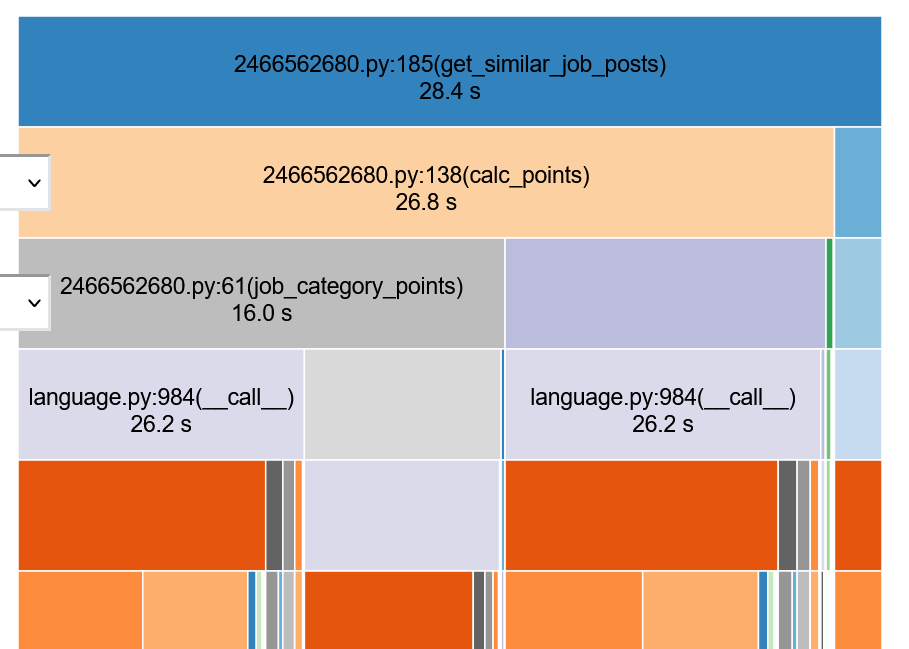
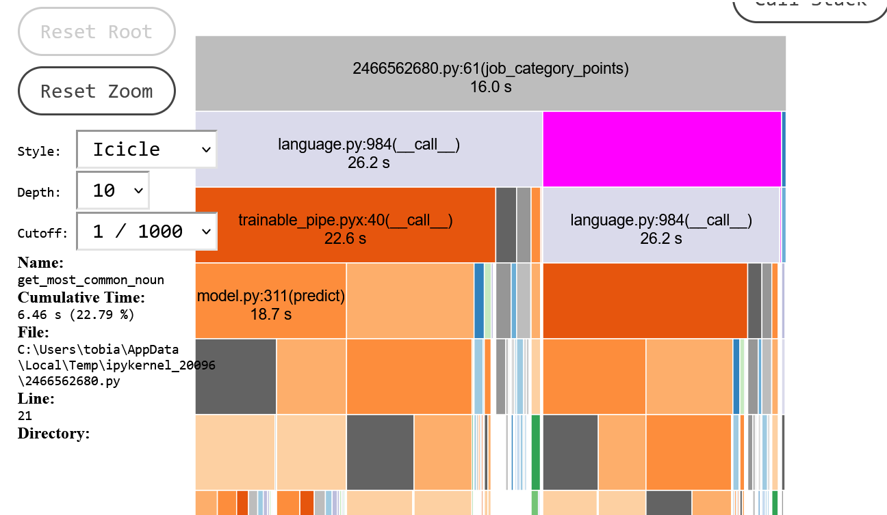

Auffällig ist die Laufzeit der Berechnung der Kategorie, wobei dort viel Laufzeit in das bestimmen des Hauptworts steckt (ca. 6 Sekunden).<br>
Wie viel Zeit das Weglassen dieses Prozesses bringt muss noch extern evaluiert werden. <br>
<br>
Sonst konnte ich keine weitere Auffäligkeit finden.

---

### Location Runtime Test
[</img>](#Table-of-Content)

In diesem Abschnitt wird die Laufzeit der Location getestet. Im Experiment 11 wurde schon evaluiert, dass das Berechnen der Location etwa je nach Datengröße bis zu 99% einnehmen kann. Hier soll noch einmal der Vergleich von der Ausführung der Anwendung ohne und mit getestet werden. Die Realität sieht ja meist anders aus, es wird trotzdem ein ähnliches Ergebnis erwartet.<br>
Anders als bei dem Experiment 11 wird die gesamt Zeit gemessen. Im Experiment 11 wurde die Zeit ja einzeln gemessen und dieser Aspekt nicht im Detail. 


```python
data = pd.read_excel("../data_scientist_united_states_job_postings_jobspikr.xlsx")
post = data.values.tolist()[33]
result = ""
```


```python
samples = data.sample(n=1000, replace=False)

for i in [0.0, 1.0]:
    start = time.time()
    posts = get_similar_job_posts(samples, post, title_w=2.0, category_w=1.0, \
                                                type_w=0.0, pos_w=i, printing=False, show_progress=False)
    duration = time.time() - start

    on = False
    if i == 0:
        on = True
    
    result += f"Location {on} -> {duration:.2f} seconds\n"
result
```

    
    WARNING: CALC LOCATION IS EXPENSIVE!
    
    


    'Location True -> 24.40 secondsLocation False -> 1012.82 seconds'


**Ergebnis:**

Wie erwartet braucht die Anwendung beim gleichen Anwendungsfall mit gleichen Faktoren mit der Berechnung der Location ca. 41 mal länger als ohne die berechnung der Location.

---

### Trimmed Category Calc 
[</img>](#Table-of-Content)

Hier soll die Laufzeit inbezug auf das Berechnen der Kategorie gestestet werden. Bei einem Nan Wert, wird aus der Job-Description das häufigste Wort herausgesucht. Diese Option wird nun an und ausgeschalten unter der Beobachtung der Laufzeit. 


```python
def job_category_points(nlp, category1, category2, description1, description2):
    # fix the category if it nothing
    if type(category1) == float:
        category1 = get_most_common_noun(description1, nlp)
        
    if type(category2) == float:
        category2 = get_most_common_noun(description2, nlp)
        
    # build doc
    doc1 = nlp(category1)
    doc2 = nlp(category2)
    
    # calc similarity
    sim = doc1.similarity(doc2)
    
    if sim >= 0.95:
        return 5
    elif sim >= 0.9:
        return 3
    elif sim >= 0.8:
        return 1
    else:
        return 0
```


```python
start = time.time()
get_similar_job_posts(samples, post, title_w=2.0, category_w=1.0, \
                                                type_w=0.0, pos_w=0.0, printing=False, show_progress=False)
duration = time.time()-start 
duration
```


    23.42689871788025


```python
def job_category_points(nlp, category1, category2, description1, description2):
    # if the category is nothing = return 0
    if type(category1) == float or type(category2) == float:
        return 0
        
    # build doc
    doc1 = nlp(category1)
    doc2 = nlp(category2)
    
    # calc similarity
    sim = doc1.similarity(doc2)
    
    if sim >= 0.95:
        return 5
    elif sim >= 0.9:
        return 3
    elif sim >= 0.8:
        return 1
    else:
        return 0
```


```python
start = time.time()
get_similar_job_posts(samples, post, title_w=2.0, category_w=1.0, \
                                                type_w=0.0, pos_w=0.0, printing=False, show_progress=False)
duration = time.time()-start 
duration
```


    17.844507217407227


**Ergebnis:**

Tatsächlich bringt das Weglassen der Berechnung des häufigsten Wortes bei keinem Wert ca. 6 Sekunden. Inwiefern sich das Ergebnis verschlechtert ist dabei unbekannt.

So muss ich mich zwischen diesen beiden Varianten entscheiden. Ich vermute das die Genauigkeit sinkt, jedoch nicht so drastisch.

---
